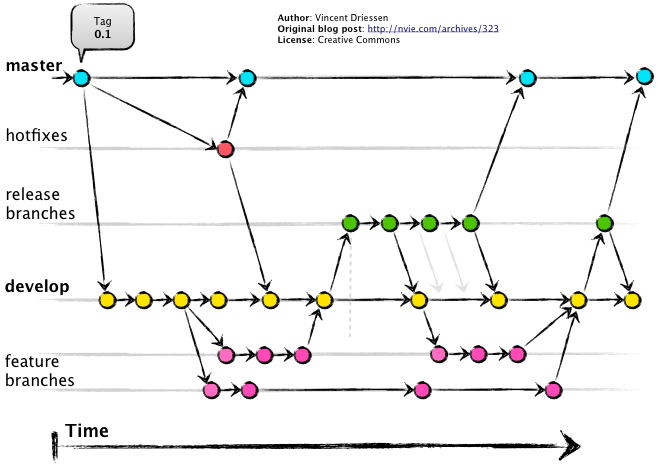

# Git, a distributed version control system


<br>

<small>
Copyright (c) 2017-2019 Euricom nv.
</small>

<!-- markdownlint-disable -->
<br>
<style type="text/css">
.reveal h1 {
    font-size: 3.0em;
}
.reveal h2 {
    font-size: 2.00em;
}
.reveal h3 {
    font-size: 1.00em;
}
.reveal p {
    font-size: 100%;
}
.reveal blockquote {
    font-size: 80%;
}
.reveal pre code {
    display: block;
    padding: 5px;
    overflow: auto;
    max-height: 800px;
    word-wrap: normal;
    line-height: 35px;
    font-size: 140%;
}
</style>

---

# Overview


---

# Basics

> What you all should know

---//

## New Repo

```bash
# either create a new directory and type
mkdir git-intro
cd git-intro
git init

# or let git create the new folder for you
git init git-intro
cd git-intro

```

---//

## Status

```bash
# get current repo status
$ git status
```

```bash
# output
On branch master
No commits yet

nothing to commit (create/copy files and use "git add" to track)
```

---//

## Add & Commit

Create our very first commit

```bash

# add a README.md
echo "# git-intro" >> README.md

# add the file to the index
git add README.md

# Commit the file (only in local HEAD)
git commit -m "Added Readme"
```

---//

## Log

```bash
# Show all commits
git log

# Show only last 2 commits
git log -2

# Condensed view
git log --pretty=oneline

# ASCII art, decorated
git log --graph --oneline --decorate --all

# See files changed
git log --name-status
```

---//

## Diff

Create our second commit

```bash
# Ignore node_modules directories
ECHO "node_modules/" > .gitignore

# Ignore macOS related finder leftovers
ECHO ".DS_Store" >> .gitignore

# Add everything to the index
git add .

# Lets review are changes
git difftool --cached

# Commit (vi oh no (I to insert, esc :wq to save and quit))
git commit
```

---//

## Overview


---//

## .gitignore

Exclude files

- build files
- temp files (logs, caches, dependencies, ...)
- secrets !!!!!

Setup global

```bash
# macos
git config --global core.excludesfile ~/.gitignore

# win
git config --global core.excludesfile %USERPROFILE%\.gitignore
```

---//

## .gitignore

Sample root .gitignore

```bash
# OS generated files
.DS_Store
.Trashes
Thumbs.db
```

Sample project .gitignore

```bash
# IDE local settings
.vscode/**
.idea

# Dependency directories
node_modules/**

# Logs
logs
*.log
npm-debug.log*

# generated files
dist/**
test-reports/**
```

---

# Team work

> Work together

---//

## Remote

Create a personal online repository

```bash
# Add the remote
git remote add origin \
   https://github.com/[yourusername]/git-intro.git

# Push changes to github
git push
>>> FAIL: The current branch master has no upstream branch
```

```bash
# connect local branch to remote
git push --set-upstream origin master

# simplified
git push -u origin master
```

---//

## Fetch & Status

Update a file on github and ...

Get updates

```bash
# Get the changes
git fetch

# Show tree status
git status
> On branch master
> Your branch and 'origin/master' have diverged,
> and have 1 and 1 different commits each, respectively.
> (use "git pull" to merge the remote branch into yours)
```

---//

## Checkout & pull

Get back the latest changes

```bash
# Update local repository
git fetch

# get changes into working directory
git checkout HEAD
git checkout HEAD~1  # 1 versions back

# pull == fetch & checkout
git pull
git pull --rebase
```

---//

## Checkout


---//

## Fetch, checkout & pull


---//

## Merge (pull) vs rebase


---//

## Stash

You can't pull with incomplete changes

```bash
# pull when you have local uncommitted changes
git pull --rebase
Updating bc3bb13..ea441f4
error: Your local changes to the following files would be overwritten by merge:
	README.md
Please commit your changes or stash them before you merge.
```

Shelve you changes

```bash
# Shelve incomplete changes
git stash
git stash save "my_stash"

# Working directory is clean
git status

# Update from remote
git pull --rebase

# Put stash back
git stash list
git stash apply  # or pop
```

---//

## Merge conflicts &#128531;

Update on remote and local same file and ...

```bash
# Get the changes
git pull
git pull --rebase  # or using rebase

# Merge the conflicts (manually or use tool)
git mergetool

# If using rebase - continue the rebase
git rebase --continue

# Show status
git status

# Conclude the merge
git commit
```

---//

## Undo changes

```bash
# Reset latest change
git reset HEAD~1 --hard

# Reset to commit
git reflog # to find the commit sha
git reset [commit-sha] --hard
```

---//

## git reset


---

# Branching

> Organize

---//

## Gitflow

A successful Git branching model



---//

## Feature branch

```bash
# create a feature branch
git checkout -b features/feat1

# Change the title of our repository readme
echo "# Introduction into Git" > README.md

# Add to index (do not forget to review changes)
git add .

# Commit
git commit -m 'Changed title'

# Push branch online
git push --set-upstream origin features/feat1
```

---//

## Switch and merge

```bash
# Switch
git checkout features/feat1
git checkout master
git checkout features/feat1

# Merge changes in master into our branch
git merge master

# Push to origin (branch already has upstream)
git push
```

---//

## Remove branch

```bash
# Delete the local branch
git branch -d features/feat1

# Delete the remote branch (be carefull)
git push origin :features/feat1
```

---

# Learn more?

### git help

```bash
git help {command}
```

### resources

- [online](https://git-scm.com/)
- https://github.github.com/training-kit/downloads/github-git-cheat-sheet/
- http://gitready.com/
