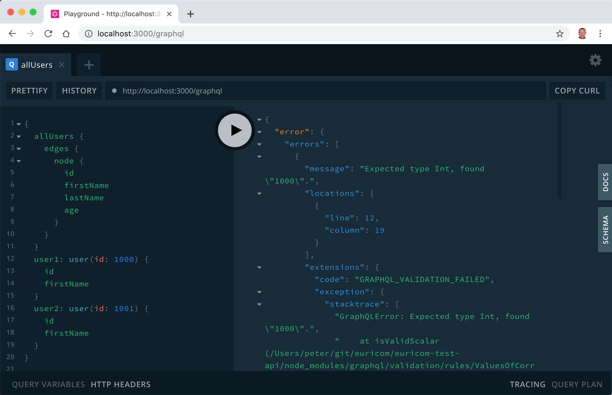

# GraphQL, the future of REST APIs


---

## Problems of REST API

- Starts simple and pure but outgrow itself quickly

  <!-- .element: class="fragment" data-fragment-index="1" -->

- Over fetching as API requirements grow

  <!-- .element: class="fragment" data-fragment-index="2" -->

- Multiple round trips to render single views

  <!-- .element: class="fragment" data-fragment-index="3" -->

- Documentation is none existing or outdated
  <!-- .element: class="fragment" data-fragment-index="4" -->

---

## GraphQL solves many of the REST problems

- There is no under or over fetching. You get what you ask.

  <!-- .element: class="fragment" data-fragment-index="1" -->

- No more multiple round trips

  <!-- .element: class="fragment" data-fragment-index="2" -->

- Versioning made easy.

  <!-- .element: class="fragment" data-fragment-index="3" -->

- It's strongly-typed, self-documenting & has introspection
  <!-- .element: class="fragment" data-fragment-index="4" -->

---

## It's more then a hype

- Used at facebook for more then 4 year, recently release as open source.
- Used by
  - Twitter
  - GitHub
  - Pintrest
  - Financial Times
  - Thomas Cook Group
  - and [many more](http://graphql.org/users/).
- Available in many languages and frameworks (JS, .NET, Ruby, ...)

---

# How it works

---

### A graphql query

```json
    query {
        me {
            name
        }
    }
```

> GraphQL queries look a lot like JSON objects without data.

```javascript
// JSON result
data: {
  me: {
    name: 'Peter';
  }
}
```

<!-- .element: class="fragment" data-fragment-index="1" -->

---

### Another graphql query

Get list of users

```json
query {
    users {
        name
        role
    }
}
```

```json
data: {
    users: [
        { name: "Peter", role: "admin" },
        { name: "Jan", role: "admin" }
    }
}
```

---


### Demo



Open https://euri-test-api-ohrakgrzhg.now.sh

(it can take a minute to wake up)

---

# The GraphQL query language

> Lets go in detail

---

### Query with field argument

```json
query {
    user(id: 1234) {        <-- field argument
        id
        name
    }
}
```

```json
// JSON result
data: {
    user: {
        id: 1234,
        name: "Peter"
    }
}
```

---

### Query with complex field (or join)

```
query {
    me {
        name
        profilePicture {
            width
            height
            url
        }
    }
}
```

```json
// JSON result
{
    "data": {
        "me": {
            "name": "Peter",
            "profilePicture" {
                "width": 50,
                "height": 50,
                "url": "https://cdn/some.jpg"
            }
        }
    }
}
```

---

### Every field can have an argument

```json
    query {
        me {
            name
            profilePicture(size: 3000) {
                width
                height
                url
            }
        }
    }
```

---

### Query with aliases

```json
query {
    me {
        name
        thumbnail: profilePicture(size: 50) {
            url
        }
        profilePicture(size: 3000) {
            width
            url
        }
    }
}
```

```json
// JSON result
{
    "data": {
        "me": {
            "name": "Peter",
            "thumbnail": {
                "url": "https://cdn/50.jpg"
            },
            "profilePicture": {
                "width": 3000,
                "url": "https://cdn/3000.jpg"
            }
        }
    }
}
```

---

### Query with variables

```
query {
    users(id: 1) {
        name
    }
}
```

```
query findUser($userId: String!) {
    users(id: $userId) {
        name
    }
}
```

<!-- .element: class="fragment" data-fragment-index="2" -->

```javascript
// variables
{
  userId: 1;
}
```

<!-- .element: class="fragment" data-fragment-index="3" -->

---

### Query with paging and filtering

```
query {
    me {
        name
        friends(orderby: IMPORTANCE, first: 1) {
            name
            events(first: 10) {
                name
            }
        }
    }
}
```

---

# GraphQL mutation

> Mutation is like an action in Redux

---

## Simple mutation

```
// query
query {
    article(id: 1234) {
        name
        status
    }
}
```

```
// mutation
mutation {
    deleteArticle(id: 1234) {
        status
    }
}
```

---

## Complex mutation

```
mutation newArticle {
    createArticle(article: {
        slug: "something-new",
        title: "Something New",
        status: live,
        relatedArticles: [
            { id: 1 }
        ]
    }) {
        id
        relatedArticles {
            slug
        }
    }
}
```

---

# GraphQL Type System

> We all love types, why not on our API's

---

## The GraphQL Schema

```
type User {
    name: String
    profilePicture(size: Int = 50): ProfilePicture
    friends(first: Int, orderby: FriendOrderEnum): [User]
    events(first: Int): [Event]
}

enum FriendOrderEnum {
    FIRST_NAME,
    IMPORTANCE
}
```

```
type ProfilePicture {
    height: Int,
    width: Int,
    url: String
}

type Event {
    name: String
    attendees(first: Int): [User]
}

type Query {
    user (id: Int): User
    users(first: Int): [User]
}
```

---

### We can query the types

```
query {
    __schema {
        queryType { name }
        types {
            name
            fields {
                name
                type {
                    kind
                    name
                    ofType { name }
                }
            }
        }
    }
}
```
---

# Exercise

Open https://euri-test-api-ohrakgrzhg.now.sh

1. Query all the tasks
2. Query a single task and use a variable
3. Add a new task (use mutation)
4. Complete a task
5. Query all products (all fields) & basket with product title in one query
6. Add an other product to the basket

---

## Help and Information

- [http://graphql.org/](http://graphql.org/)
- [graphqlweekly](https://graphqlweekly.com/)
- [learngraphql.com](https://learngraphql.com/)
- [apollo-stack](https://medium.com/apollo-stack)
- [awesome-graphql](https://github.com/chentsulin/awesome-graphql)
- [launchpad.graphql.com](https://launchpad.graphql.com)

---

## Apis

Public

- [Learn GraphQL](https://sandbox.learngraphql.com/)
- [Northwind](https://graphql-compose.herokuapp.com/northwind)
- [The Star Wars Graphql API](http://graphql-swapi.parseapp.com/)
- [The GitHub API](https://graphql-explorer.githubapp.com)
- [APIs-Gurus](https://github.com/APIs-guru/graphql-apis)
- [Euricom Test Api](https://euri-test-api-ohrakgrzhg.now.sh)

Fake APIs

- http://fake.graphql.guru/
- https://github.com/APIs-guru/graphql-faker

---

# Your next API in GraphQL?
