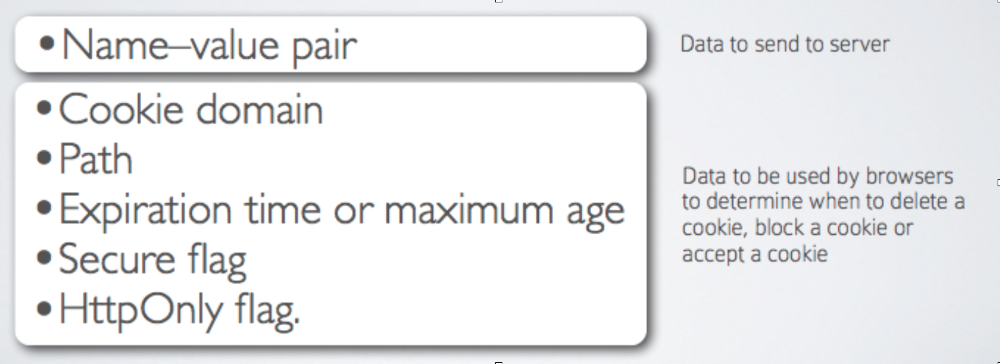

# HTTP/REST

## The Core of our API

<br>
<small>
Copyright (c) 2017-2019 Euricom nv.
</small>

<!-- markdownlint-disable -->
<br>
<style type="text/css">
.reveal h1 {
    font-size: 3.0em;
}
.reveal h2 {
    font-size: 2.00em;
}
.reveal h3 {
    font-size: 1.00em;
}
.reveal p {
    font-size: 70%;
}
.reveal li {
    font-size: 150%;
}
.reveal blockquote {
    font-size: 120%;
}
.reveal pre code {
    display: block;
    padding: 5px;
    overflow: auto;
    max-height: 800px;
    word-wrap: normal;
    font-size: 170%;
    line-height: 170%;
}
</style>

---

# HTTP

- Hypertext Transfer Protocol

  <!-- .element: class="fragment" data-fragment-index="1" -->

- HTTP provides a set of rules and standards that govern how information is transmitted on the World Wide Web.

  <!-- .element: class="fragment" data-fragment-index="2"-->

- The HTTP protocol is fundamental for WWW

  <!-- .element: class="fragment" data-fragment-index="3"-->

---//

## HTTP


---//

## HTTP


---

# URL

A URL (Uniform Resource Locator) is used to uniquely identify a resource over the web.

URL has the following syntax:

```
protocol://hostname:port/path
```

HTTP URL

```
http://mydomain/users
```

---//

# URL-anatomy


---//

## Url Parts

- **Protocol:** http, https, ftp, ...
- **Port:** Port number (80 = http)
- **Resource Path:** The local path to the resource on the server
- **Query:** Url-encoded values

---//

## URL samples

```
http://mydomain/users
https://mydomain/users?sort=name
http://localhost:8080/products
```

other

```
ftp://www.ftp.org/docs/test.txt
mailto:user@test101.com
news:soc.culture.Singapore
telnet://www.nowhere123.com/
mongodb://mongodb0.example.com:27017/admin
```

---

# HTTP protocol

Browser translate URL

```
http://www.nowhere123.com/doc/index.html
```

to request

```
GET /docs/index.html HTTP/1.1
Host: www.nowhere123.com
Accept: image/gif, image/jpeg, */*
Accept-Language: en-us
Accept-Encoding: gzip, deflate
User-Agent: Mozilla/4.0 (compatible; MSIE 6.0; Windows NT 5.1)
(blank line)
```

---//

## HTTP protocol

Server response with

```
HTTP/1.1 200 OK
Date: Sun, 18 Oct 2009 08:56:53 GMT
Server: Apache/2.2.14 (Win32)
Last-Modified: Sat, 20 Nov 2004 07:16:26 GMT
ETag: "10000000565a5-2c-3e94b66c2e680"
Content-Length: 44
Connection: close
Content-Type: text/html
X-Pad: avoid browser bug

<html>
  <body>
    <h1>My Home Page</h1>
  </body>
</html>
```

---

# HTTP Request

Request message sent by a client consists of

- **Request line** – request method (GET, POST, HEAD, ...), resource URI, and protocol version
- **Request headers** – additional parameters
- **Body** – optional data

```
<method> <resource> HTTP/<version>
<headers>
<empty line>
<body>
```

---//

# HTTP GET REQUEST

```
GET /academy/winter-2009-2010 HTTP/1.1
Host: mydomain.com
Accept: */*
Accept-Language: nl
Accept-Encoding: gzip, deflate
User-Agent: Mozilla/4.0(compatible;...)
Connection: Keep-Alive
Cache-Control: no-cache
<CRLF>
```

---//

# HTTP POST REQUEST

```
POST /webmail/login.php HTTP/1.1
Host: mydomain.com
Accept: */*
User-Agent: Mozilla/4.0(compatible;...)
Connection: Keep-Alive
Cache-Control: no-cache
Content-Length: 59
<CRLF>
LOGIN_USER=mente
DOMAIN_NAME=abv.bg
LOGIN_PASS=top*secret!
<CRLF>
```

---//

### HTTP Methods

- **GET:** The GET method requests a representation of the specified resource. Requests using GET should only retrieve data.

- **POST:** The POST method is used to submit an entity to the specified resource, often causing a change in state or side effects on the server.

  <!-- .element: class="fragment" data-fragment-index="1" -->

- **PUT:** The PUT method replaces all current representations of the target resource with the request payload.

  <!-- .element: class="fragment" data-fragment-index="2" -->

---//

- **DELETE:** The DELETE method deletes the specified resource.

- **PATCH:** The PATCH method is used to apply partial modifications to a resource.

  <!-- .element: class="fragment" data-fragment-index="1" -->

- **OTHERS:** HEAD, OPTIONS, TRACE, CONNECT

  <!-- .element: class="fragment" data-fragment-index="2" -->

---//

## More ...

Please see [MDN](https://developer.mozilla.org/en-US/docs/Web/HTTP/Headers)

---

# HTTP Response

Response message sent by the server

- **Status line** – protocol version, status code, status phrase
- **Response headers** – provide meta data
- **Body** – the contents of the response (the requested resource)

```
HTTP/<version> <code> <text>
<headers>
<CRLF>
<body – the requested resource>
```

---//

## HTTP Response

```
HTTP/1.1 404 Not Found
Date: Fri, 17 Jul 2010 16:09:18 GMT+2
Server: Apache/2.2.14 (Linux)
Connection: close
Content-Type: text/html
<CRLF>
<HTML><HEAD>
<TITLE>404 Not Found</TITLE>
</HEAD><BODY>
<H1>Not Found</H1>
The requested URL /img/logo.gif was not found on this server.<P>
<HR>
</BODY></HTML>
```

---//

## Status Codes

- **1XX** Informational (e.g., “100 Continue”)
- **2XX** Successful (e.g., “200 OK”)
- **3XX** Redirection (e.g., “301 Moved Permanent)
- **4XX** Client error (e.g., “404 Not Found”)
- **5XX** Server error (e.g., “500 Internal Server Error”)

---//

#### **2XX** Successful

- **200 OK** The request has succeeded
- **201 Created** The request has succeeded and a new resources has been created as a result of it
- **204 No Content** There is no content to send for this request

---//

#### **4XX** Client error

- **400 Bad Request** The request was malformed
- **401 Unauthorized** The request requires authentication
- **403 Forbidden** The client does not have access rights to the content
- **404 Not Found** The resource is not found
- **405 Method Not Allowed** The request method is cannot be used
- **409 Conflict** The request conflicts with the current state of the server

---//

#### **5XX** Server error responses

- **500 Internal Server Error** Server crash
- **501 Not Implemented** The server does not yet support the requested functionality.
- **503 Service Unavailable** The server is not ready to handle the request.

---

# Cookies

- Cookies are small pieces of data stored by the client on behalf of the server
- Included in all future HTTP requests
- Cookies are passed by headers


---//

## Cookie Content

A web browser is expected to be able to store at least 300 cookies of 4 kb each, and at least 20 cookies per server or domain.



---//

## Use of Cookies

- **Session Management** - Shopping Cart, Authentication
- **Personalization** - Language, Remember me, Preferences
- **Tracking & Analytics** - Ads, Browsing History, Analytics, Tracking

---

# REST

REST stands for REpresentational State Transfer, and it is an architectural style, or design pattern for API's.

- Based on the HTTP protocol
- State is typically presented with JSON
- In REST everything is a resource
- Resources are defined by URI
- Full stateless

---//

## Rest Protocol

Request

```
GET /products HTTP/1.1
Host: acme.com
Accept: application/json
```

Response

```
HTTP/1.1 200 OK
Content-Type: application/json

[
  {  id: 123, name: "Stapler", price: 4.12 }
]
```

---//

# REST Operations

```
http://www.acme.com/products
```

- `GET` to retrieve a list of products
- `POST` to create a new product

```
http://www.acme.com/products/1234
```

- `GET` to retrieve
- `PUT/PATCH` to update a product
- `DELETE` to, you guessed it, delete

---//

## Use RESTfull URL’s

```bash
# Retrieve a list of tickets
GET /tickets
# Retrieves a ticket
GET /tickets/12

# Creates a new ticket
POST /tickets
# Update ticket #12
PUT /tickets/12
# Partially updates ticket #12
PATCH /tickets/12

# Deletes ticket #12
DELETE /tickets/12
```

---//

## Filtering, sorting & searching

```bash
# Filtering
GET /tickets?state=open

# Sorting
GET /tickets?sort=-priority

# Searching
GET /tickets?q=return&state=open

# Aliases
GET /tickets/recently_closed
```

---//

## Deal with relations

```bash
# Retrieves list of messages for ticket #12
GET /tickets/12/messages

# Retrieves message #5 for ticket #12
GET /tickets/12/messages/5

# Creates a new message in ticket #12
POST /tickets/12/messages
```

---//

## Authentication

- Don’t use cookies or sessions
- Always use HTTPS
- Authorization header

```bash
# basic
Authorization: Basic cGV0ZXI6MTIz

# token based
Authorization : Bearer cn389ncoiwuencr...
```

---//

## Status Codes - Success

| Code | Text      | Desc                                                                                    |
| ---- | --------- | --------------------------------------------------------------------------------------- |
| 200  | OK        | Response to a successful GET, PUT, PATCH or DELETE                                      |
| 201  | Created   | Response to a POST that results in a creation                                           |
| 204  | NoContent | Response to a successful request that won't be returning a body (like a DELETE request) |

---//

## Status Codes - Errors

| Code | Text               | Desc                                                                                     |
| ---- | ------------------ | ---------------------------------------------------------------------------------------- |
| 400  | BadRequest         | The request is malformed, such as if the body does not parse or input validation         |
| 401  | Unauthorized       | When no or invalid authentication details are provided                                   |
| 403  | Forbidden          | When authentication succeeded but authenticated user doesn't have access to the resource |
| 404  | Not found          | When a non-existent resource is requested                                                |
| 405  | Method Not Allowed | When an HTTP method is being requested that isn't allowed                                |
| 409  | Conflict           | Used for business validation error                                                       |

---//

## Error details

body contains the error details

```json
{
    "code": 400,
    "message": "One or more validation failed",
    "errors: [
        { "field": "firstName", "message": "is required" }
    ]
}
```

---

# Exercices

```bash
# Ensure you have checked out the bootcamp source
git clone git@github.com:Euricom/training-bootcamp-frontend-2019Q3.git

# Navigate to the api folder and install deps
npm install

# Run our fake api server
npm run serve:user-api
```

> Use [PostMan](https://www.getpostman.com/downloads/) & open the [API](https://euri-test-api-phflgvcuay.now.sh) to complete the following exercises.

---//

## Exercices

```js
- Get a list of all users ordered by
  lastName desc 
- Get a paginated list of users where the
  pageSize is 5 and get the second page. As a
  bonus find out how the api communicates the
  total amount of users
- Get the user with the id 2
- Create a new user with the data of yourself
- Remove yourself again
- Get the basket with items description
```
