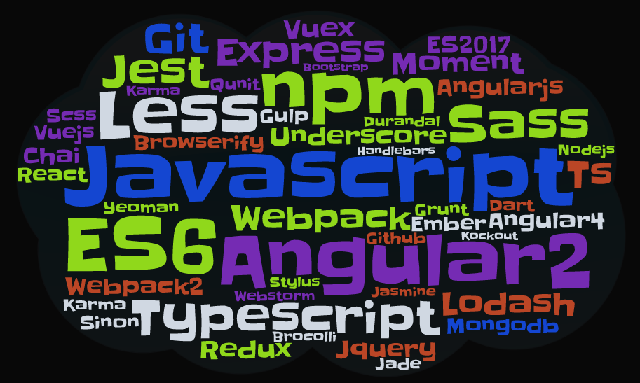
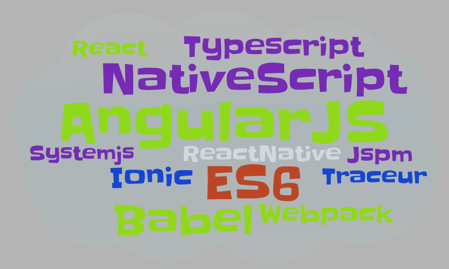
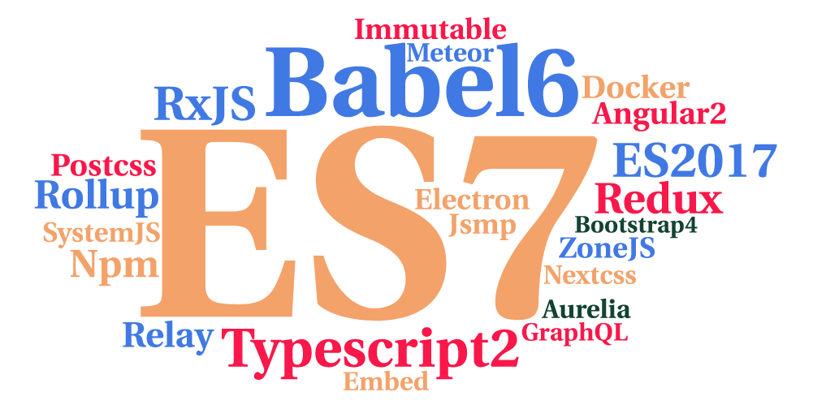
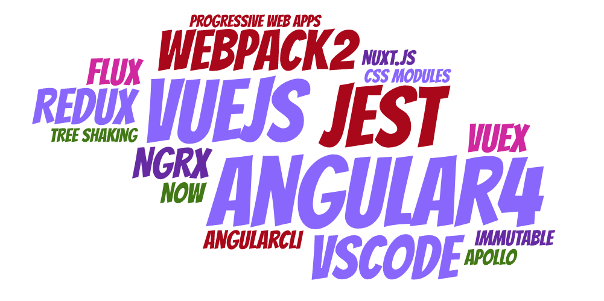
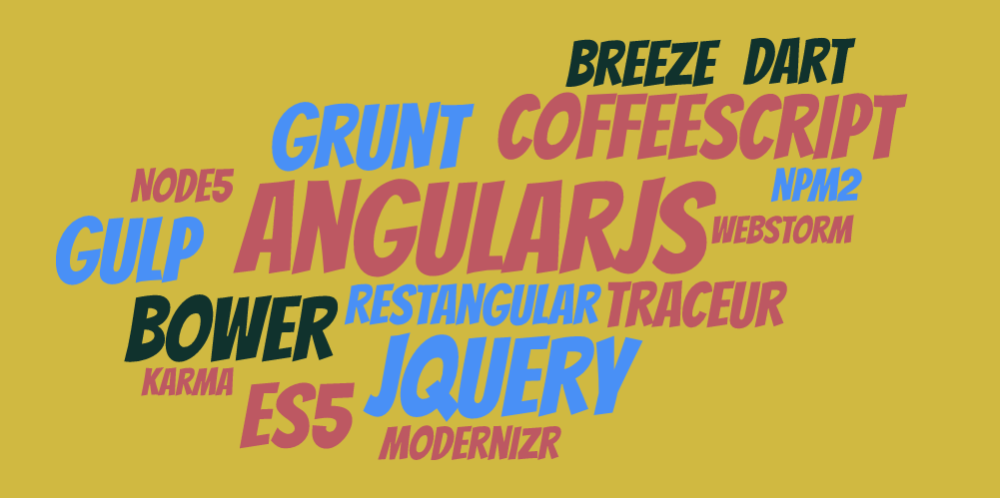
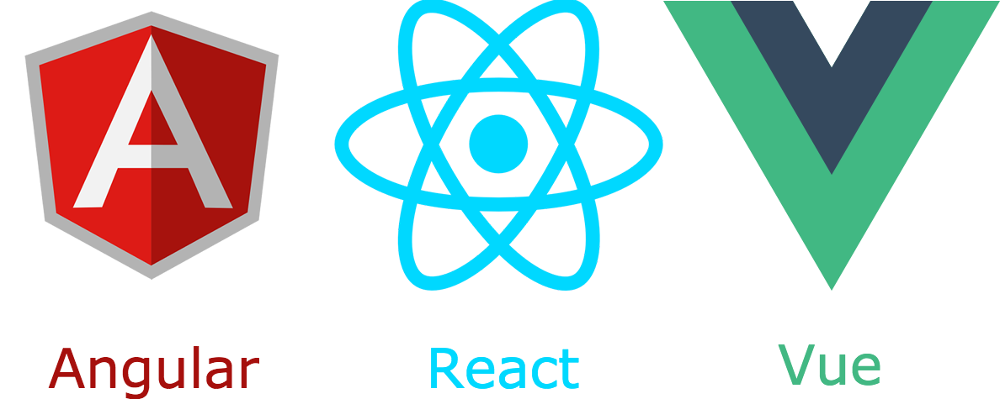
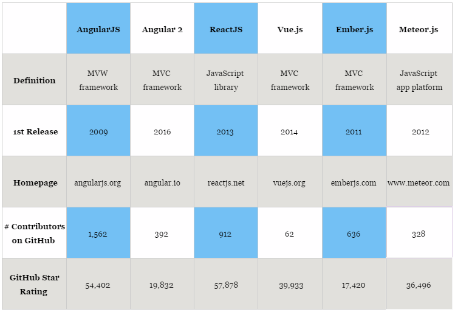
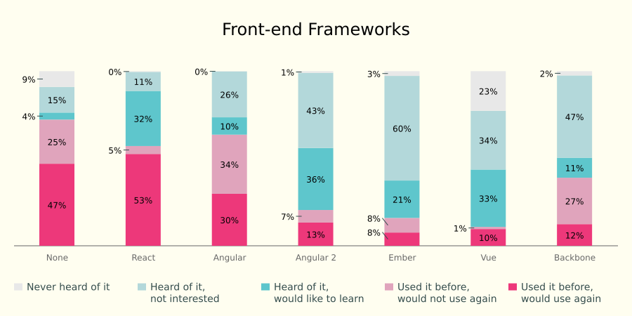
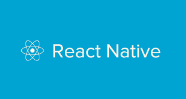

## The State Of JavaScript 2017
 

#### THIS IS WORK IN PROGRESS

<small>by Peter Cosemans</small>

<small>
Copyright (c) 2017-2019 Euricom nv.
</small>

---

# ARE YOU STILL WITH US...

 

----

## Born in 2015

 

----

## And arrived in 2016

 

----

## We are now 2017
 

----

## The twilight zone
### Dead or obsolete
 

---

## The web is reaching out

Did you know your favorite tool is build with html & javascript

> Powered by [Electron](https://electron.atom.io)

- Slack, Discord
- Visual Studio Code
- Atom
- ...
- [Others](https://electron.atom.io/apps/)

---

## Javascript Get's Bigger Every Year?

Atwood's Law

> Any application that can be written in JavaScript, will eventually be written in JavaScript

----

- Web Apps
- Backend - Node.js
<!-- .element: class="fragment" data-fragment-index="2" -->
- Dev Tools - WebPack, Jest, Npm, ...
<!-- .element: class="fragment" data-fragment-index="3" -->
- Desktop App's (Electron)
<!-- .element: class="fragment" data-fragment-index="4" -->
- Mobile Hybrid App's (Cordova, Ionic, ...)
<!-- .element: class="fragment" data-fragment-index="5" -->
- Mobile Native App's (NativeScript, ReactNative)
<!-- .element: class="fragment" data-fragment-index="6" -->
- Databases - NoSQL (MongoDB)
<!-- .element: class="fragment" data-fragment-index="7" -->
- Cloud - Scripting & Functions (AWS, Azure)
<!-- .element: class="fragment" data-fragment-index="8" -->
- IoT (Tessel, Jonny Five)
<!-- .element: class="fragment" data-fragment-index="9" -->

[Linux in JavaScript](https://bellard.org/jslinux/)
<!-- .element: class="fragment" data-fragment-index="10ls
" -->

---

## Technology radar

- Techniques
    + [Reactive architecture](http://www.reactivemanifesto.org/)
    + State containers (Redux, NgRx, Vuex ... Elm)
    + Rethinking the DOM (Virtual, Shadow)
    + Functional Programming (Pure, Immutability)
    + Server Side Rendering (SSR)
    + [Web Components](https://www.webcomponents.org/) (Polymer, Slim.js)
    + [Progressive Web Apps](http://blog.ionic.io/what-is-a-progressive-web-app/)
    + [Microservice Architecture](http://microservices.io/patterns/microservices.html) (Docker)
    + [Serverless Architecture](https://aws.amazon.com/serverless/) (Functions)

---

## Technology radar

- Platforms
    + Multi platform development (node)
    + Cordova (mobile)
    + Electron (desktop)
    + Docker
    + GraphQL (the next generation REST API)
    + AWS Lambda / Azure functions (FAAS)

----

## Technology radar

- Tools
    + TypeScript / Babel (Transpiling)
    + TSLint / ESLint, Prettier (Linting)
    + Yarn/Npm 5.x
    + Visual Studio Code (IDE)
    + Webpack (Bundeling)
    + Jest (Unit Testing)
    + ...

- Languages & Frameworks
    + Stronger Javascript (ES6+, TS)
    + React, Angular & VueJS
    + Redux, NgRX, Vuex
    + CSS in JS

---

## JavaScript Fatigue

> Write down all the frameworks/build tools/libraries you can think of for 30 seconds straight and then stop.

---

## Frameworks
> We can't live without them

----

## Front-End Frameworks

The big three

Others: AngularJS, Aurelia, Ember, Backbone, Meteor, Knockout, CanJS

----

## Front-End Frameworks Stats

### June 2017

- React: 69.820
- VueJS: 57.900
- AngularJS: 56.200
- Angular: 25.303

----

## Front-End Frameworks Stats

----

## Mobile

> Cordova

- Ionic 2/3 (Angular)
- OnsenUI (Angular, React, VueJS)

 

> Native

- NativeScript
- ReactNative

---

## Javascript

It's not your jquery javascript anymore! Javascript is growing faster then ever before.

> ES6+

- Master your JavaScript, know your ES6+
- Transpilation is the standard (Babel, TypeScript)
- CommonJS, ES Modules, NPM

> Typing

- Typing is strong but it's not everywhere
- TypeScript vs FlowJS

> Obsolete

- forget about CoffeeScript

----

## Javascript Flavors

<image src="./images/Javascript_flovors.png"></image>

---

## The live after CSS

Just like JavaScript, CSS is a mess

> Already common use

- SASS, LESS, Stylus
- Flexbox

> New and upcoming

- PostCSS, CSS Next
- CSS Grids
- Scoped CSS (Angular & VueJS)
- CSS in JS
    + style components
    + CSS Modules
    + Radium, aphrodite, glamor, JSS, ...

---

## Linting & style

Don't start a javascript project without a linter!

> Styleguides

- [AirBnb](https://github.com/airbnb/javascript)
- [Standard](https://standardjs.com/)
- [An unofficial TypeScript StyleGuide](https://basarat.gitbooks.io/typescript/docs/styleguide/styleguide.html)

> Linters

- [ESLint](http://eslint.org/) (ES6+)
- [TSLint](https://palantir.github.io/tslint/) (Typescript)
- [Stylelint](https://stylelint.io/) (CSS, LESS, SASS)

> Formatters

- [ESLint](http://eslint.org/) (ES6+)
- [Prettier](https://github.com/prettier/prettier)

---

## Don't forget testing!

> So many frameworks :(

* Mocha
* Karma
* Jasmine
* Ava, Tape, QUnit
* Sinon, Chai, TestDoubles, ...

> Jest

New and upcoming.
Delightful JavaScript Testing.

---

## Api Layers

<image src="./images/api_layers.png"></image>

* GraphQL looks promising.
* REST APIs are still the standard by a large margin.

---

# JavaScript

<image src="./images/iamsorry_javascript.jpg" width="800px"></image>

---

# Resources

- [JavaScript Conquered the Web. Now It’s Taking Over the Desktop](https://www.wired.com/2016/05/javascript-conquered-web-now-taking-desktop/)
- [JavaScript really is overtaking the world](https://medium.com/fed-or-dead/javascript-really-is-overtaking-the-world-5b59b5af41ed)
