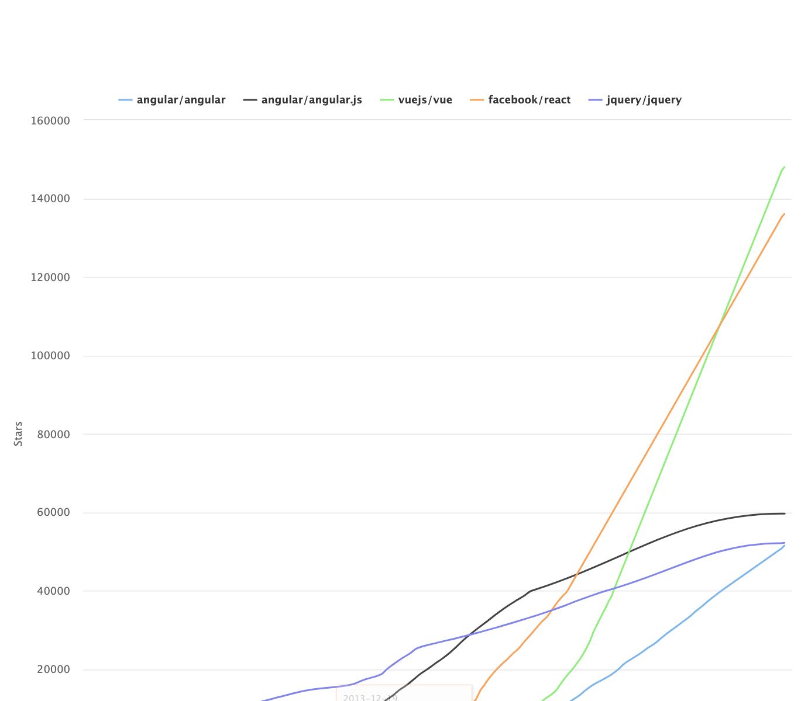

### Trends in JavaScript

 

<small>
Copyright (c) 2017-2019 Euricom nv.
</small>

<!-- markdownlint-disable -->
 

---

# Languages

---//

### CSharp

---//

### Javascript

---//

### Python

---//

### Overall Javascript Flavors

[State Of JavaScript](https://2018.stateofjs.com/)

---//

### Typescript

---

# Frontend

---//

### Overall Front-end Framework

---//

### Regular used Framework

[https://www.jetbrains.com](https://www.jetbrains.com/lp/devecosystem-2019)

---//

### Frameworks Npm Downloads

---//

### Frameworks GitHub Stars

---//

### BestofJS

[bestofjs.org](https://bestofjs.org/)

---

# Testing

---//

### Overall Testing Result

[State Of JavaScript](https://2018.stateofjs.com/)

---//

### Testing NPM Downloads

---//

### Testing E2E NPM Downloads

---

# Data

---//

### Overall Data Layer Framework

[State Of JavaScript](https://2018.stateofjs.com/)

---

# CSS

---//

### Style sheet languages

[https://www.jetbrains.com](https://www.jetbrains.com/lp/devecosystem-2019)

---//

### Still a lot of Uncertainty in CSS Land

[2019.stateofcss.com](https://2019.stateofcss.com/technologies/)

---

# Resources

- [State Of JavaScript](https://2018.stateofjs.com/)
- [State Of Css](https://2019.stateofcss.com)
- [bestofjs.org](https://bestofjs.org/)
- [Jetbrains Dev Eco System](https://www.jetbrains.com/lp/devecosystem-2019)
- [Stackoverflow Survey](https://insights.stackoverflow.com/survey/2018/)
