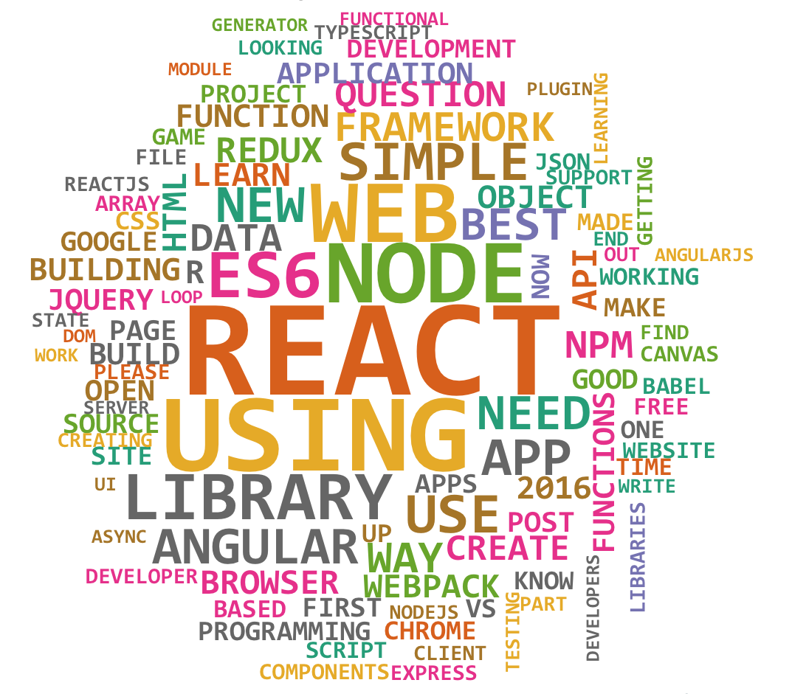

## The Javascript Developer


<br>

<small>
Copyright (c) 2017-2019 Euricom nv.
</small>

<!-- markdownlint-disable -->
<br>
<style type="text/css">
.reveal h1 {
    font-size: 3.0em;
}
.reveal h2 {
    font-size: 2.00em;
}
.reveal h3 {
    font-size: 1.00em;
}
.reveal p {
    font-size: 100%;
}
.reveal blockquote {
    font-size: 80%;
}
.reveal ul {
    font-size: 120%;
}
.reveal pre code {
    display: block;
    padding: 5px;
    overflow: auto;
    max-height: 800px;
    word-wrap: normal;
    line-height: 35px;
    font-size: 140%;
}
</style>

---

# Once upon a time

> There was a developer

---//

## Live was simple

- 1984
  - Z80, DOS, Assembler, QBasic, DBase
- 1990

---//

## Windows was born

- 1990
  - Win32, C++, VB1
  - Win32, MFC, ATL, C++, VB6, ASP
- 2000

---//

## Microsoft creates dotNET

- 2002
  - 2002 - dotNET 1.0, C#, VB.NET, ASP.NET, WinForms
  - 2008 - dotNET 3.5, C#, WCF
  - 2012 - dotNET 4.0, C#, MVC, JQuery
- 2014

---//

# AngularJS, a new era

- 2014
  - 2014 - AngularJS, Javascript (ES5) and C#
  - 2015 - AngularJS, ES5, NodeJS and a little bit of C#
  - 2016 - Angular2, ES6, TS, NodeJS
  - 2017 - Angular4, VueJS, ES6+, TS
- 2018

---//

# Javascript became a platform

- 2018
  - 2018 - Angular6, VueJS, React, TypeScript
  - 2019 - React, GraphQL, TypeScript & NodeJS
- Present

---//

## That developer was me

> 'Peter'

---

# JavaScript anxiety

> Can you keep up

---//

### Sinking in the sea of modern JavaScrip


---//

## Javascript was so simple

```html
<script>
  $(document).ready(function(){
      $("p").click(function(){
          $(this).slideUp();
      });
  });
  </s
</script>
```

---//

## But now



---//

### Why it there so much stuff


---

# Keep-Calm

> We can handle this

---//

## Javascript just evolved

- Now, you need to build all the things
- ES6 was a bit release but now its incremental
- There is always a simple path

  - CreateReactApp
  - Vue CLI

- There is not a new framework every week

  - React is 5 years old
  - Vue is 4 year old
  - Angular is 3 year old

---//

## Anything has a lifecycle

- jQuery was everywhere, now is rarely used
- in 2013 Backbone.js was huge, now it disappeared
- CoffeeScript, removed from the face of earth
- Ember.js, Angular.js and Meteor rocked, now replaced
- SystemsJS, Bower, RequireJS seems good but never made it

> Each cycle for those major frameworks usually lasts quite a few years

---

## Find your balance.


---//

## Lifetime school

There’s no way one can learn all the stuff that’s going on in frontend development. This is a lifetime school. There’s absolutely now way to graduate.

---//

## Learn the basic fundamentals, and pick your own journey

---//

## It will be a challenge

Developing on the Web Platform requires a commitment to learn something new often, even just to find out what’s possible.

> Sometimes learning in 20% of the time the 80% of the things you will need is enough, without diving too much into the edge cases.

---

## The journey has just begun


It’s fascinating thinking about the JavaScript we’ll write in 10 or 20 years from now.
