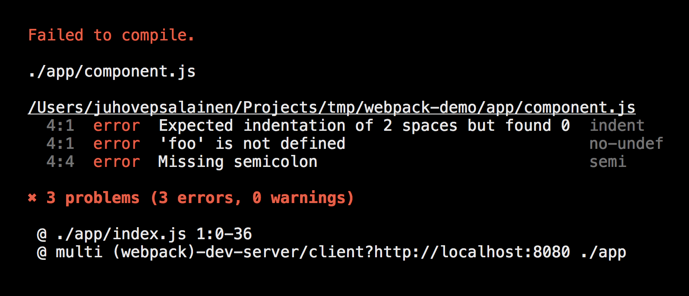

# ES6 and beyond

<br>
<small>by Peter Cosemans</small>

---

# ES5, ES6, ES2016, ES2017, ES.Next

> What's going on with JavaScript versioning

----

## Terms of terminology

- ECMAScript
- ECMAScript 5 (ES5) - 2009
- ECMAScript 6 (ES6/ES2015) - 2015
- ECMAScript 2016 (ES7) - 2016
- ECMAScript 2017 - 2017
- ES.Next
- TC39

Note:
- ECMAScript: A language standardized by ECMA International.
- JavaScript: The commonly used name for implementations of the ECMAScript standard
- ECMAScript 5 (ES5): The 5th edition of ECMAScript, standardized in 2009
- ECMAScript 6 (ES6/ES2015): The 6th edition of ECMAScript, standardized in 2015.
- ECMAScript 2016: The 7th edition of ECMAScript (ES7)
- ECMAScript 2017: The 8th edition of ECMAScript (ES8)

----

## ES6+ Today

<br>

- Edge, Chrome, Firefox and Safari: +96%
- Node 8.x: +98%

> [http://kangax.github.io/compat-table/es6/](http://kangax.github.io/compat-table/es6/)

---

# Babel
> Use the latest and greatest of ES

----

## Babel - Node

How can I use the latest ES feature on Node 6.x?

```bash
yarn add babel-preset-node6 --dev
yarn add babel-preset-stage-2 --dev
```

```js
    // .babelrc
    {
        "presets": ["node6", "stage-2"],
        "plugins": [
            ...
        ]
    }

    // index.js (this file is ES5 with commonJS)
    require('babel-core/register');
    require('./server');

    // server.js (fully ES6+)
    import app from './express';
```
```js
    // startup
    node index.js
```

For the production build, make sure you transpile to ES5

    babel -d ./build ./server -s --ignore *.test.js"

Note:

> This is also possible with TypeScript 2.0+

----

## Babel - Browser

How can I use the latest ES feature on older browsers?

```json
    // .babelrc
    {
        "presets": [
            ["env", {
              "targets": {
                "browsers": ["last 2 versions", "safari >= 8"]
              }
            }]
        ]
    }
```

```js
    // webpack.config.js
    module.exports = {
        entry: './main.js',
        output: { path: __dirname, filename: 'bundle.js' },
        module: {
            loaders: [
                {
                    test: /.js?$/,
                    loader: 'babel-loader',
                    exclude: /node_modules/,
                }
            ]
        },
    };
```

---

# Linting & Style

> Don't start a javascript project without a linter!

----

## ESLint

The pluggable linting utility for JavaScript and JSX

<br>

----

## IDE/Editor Support

Any good JS editor support's linting

- Visual Studio Code
- WebStorm
- Atom

<br>

----

## ESLint - Setup

```bash
# install
npm install eslint                      # linter engine
npm install eslint-config-airbnb-base   # linter configuration (airbnb)
```

.eslintrc

```json
{
  "extends": [
    "airbnb-base",
  ],
  "globals": {},
  "env": {
    "es6": true,
    "node": true
  },
  "rules": {
    "no-console": [0, ""], // allow console.log
  }
}
```

package.json

```json
scripts: {
    "lint": "eslint \"**/*.js\""
}
```

<small>This setup follow the airbnb styleguide: https://github.com/zalmoxisus/javascript</small>


----

## Other...

### ESLint configurations

- eslint-config-airbnb
- eslint-config-standard
- eslint-config-google
- eslint-config-idiomatic
- ...

### Linters

- JSLint (Outdated)
- JSHint (Outdated)
- TSLint (Typescript)
- StyleLint (CSS, Sass, Less)

----

<image src="./images/prettier.png"><image>

Prettier is an opinionated code formatter. It format this

```js
foo(reallyLongArg(), omgSoManyParameters(), IShouldRefactorThis(), isThereSeriouslyAnotherOne());
```

to

```js
foo(
  reallyLongArg(),
  omgSoManyParameters(),
  IShouldRefactorThis(),
  isThereSeriouslyAnotherOne()
);
```

Resources

- [Prettier Official WebSite](https://prettier.io/)
- [VSCode Plugin](https://marketplace.visualstudio.com/items?itemName=remimarsal.prettier-now)

---

# The Basic Features of ES6

> What you probably already know.

----

## The let keyword

```js
    // ES5 - function scoping
    var message = 'hi';
    function greet() {
        var message = 'bye';
    }
    greet();                  --> Output ?
```

```js
    // ES5 - block scoping
    var message = 'hi';
    {
        var message = 'bye';
    }
    console.log(message)      --> output: ?
```
<!-- .element: class="fragment" data-fragment-index="1" -->

```js
    // ES6 - block scoping with let
    let message = 'hi';
    {
        let message = 'bye';
    }
    console.log(message)      --> output: ?
```
<!-- .element: class="fragment" data-fragment-index="2" -->

----

## The const keyword

```js
    // ES5
    var message = 'hi';
    return message;

    // ES6
    const message = 'hi'
    message = 'hello'           <-- ERROR
```

> const is not immutable!

<!-- .element: class="fragment" data-fragment-index="2" -->

```js
    const names = [];
    names.push( "Jordan" );     <-- No Error
    console.log( names );
```

<!-- .element: class="fragment" data-fragment-index="3" -->

'const' defines a constant Reference, Not a Value

<!-- .element: class="fragment" data-fragment-index="3" -->

----

## Property value shorthand

```js
    // ES3/ES5
    function getCar(make, model, value) {
        return {
            make: make,
            model: model,
            value: value
        };
    }
```

vs

```js
    // ES6
    // With property value shorthand syntax, you can omit the property
    // value if key matches variable name.
    function getCar(make, model, value) {
        return {
            make,
            model,
            value
        };
    }
```

----

## Method definition shorthand

```js
    // ES5
    function getCar(make, model, value) {
        return {
            depreciate: function() {
                this.value -= 2500;
            }
        };
    }
```

vs

```js
    // ES6
    // Method definition shorthand syntax omits `function` keyword & colon
    function getCar(make, model, value) {
        return {
            depreciate() {
                this.value -= 2500;
            }
        };
    }
```

----

## The arrow function

Simpler syntax

```js
    var createGreeting = function(message, name) {
        return message + name;
    }

    // version 1
    const arrowGreeting = (message, name) => {
        return message + name;
    }

    // version 2
    const arrowGreeting = (message, name) => message + name;
```

----

## The arrow function

This reference

```js
    const service = {
      foo: 'peter',
      delayLog(timeout) {
        setTimeout(function() {
          console.log(this.foo)
        }.bind(this), timeout)
      }
    }
    service.delayAction(500)
```

Easier with arrow function
<!-- .element: class="fragment" data-fragment-index="2" -->

```js
    const service = {
      foo: 'peter',
      delayAction(timeout) {
        delayLog(() => {
          console.log(this.foo)
        }, timeout)
      }
    }
```
<!-- .element: class="fragment" data-fragment-index="2" -->

----

## When Not to use an Arrow Function

Event Handlers

```js
class player{
  constructor(name){
    this.name = name;
    this.elm = document.createElement('div');
    this.elm.addEventListener('click', this.sayHello);
  }
  sayHello(){
    console.log(this.name + ' say: "hello!"'); // 'undefined say 'hello!"';
  }
}
```

Object Methods

```js
const person = {
    points: 23,
    score: () => {
        this.points++;                         // no error but doesn't work
    }
}
```

----

## When Not to use an Arrow Function

Prototype methods

```js
class Car {
    constructor(make, colour) {
        this.make = make;
        this.colour = colour;
    }
}

Car.prototype.summarize = () => {
    return `This car is a ${this.make} in the colour ${this.colour}`;
};
```

----

## Import / Export

ES Modules

```js
    // service.js
    export const MAX_LENGTH = 1000;
    export class Car() {
        ...
    }
    const config = {
        ...
    }
    export default config;
```

```js
    import config from './service';
    import { MAX_LENGTH, Car } from './service'

    import * as lib from './service';
    console.log(lib.MAX_LENGTH)
    const car = new lib.Car();

    import config, { MAX_LENGTH, Car } from './service'

```

Bye, bye IIFE ( Immediately-Invoked Function Expression )

ALWAYS user npm, NEVER use Bower again.

----

## The class

```js
    // ES6
    class Car {
        constructor(make, model, value) {
            this.make = make;
            this.model = model;
            this.value = value;
        }

        depreciate() {
            this.value -= 2500;
        }
    }
```

```js
    // ES5 constructor function
    function Car(make, model, value) {
        this.make = make;
        this.model = model;
        this.value = value;
    }

    Car.prototype.depreciate = function() {
        this.value -= 2500;
    }
```

----

## Classes don't hoist

```js
    // this works
    var foo = new Foo(1, 2);
    function Foo(x, y) {
       this.x = x;
       this.y = y;
    }

    // ReferenceError
    var foo = new Foo(1, 2);
    class Foo {
       constructor(x, y) {
          this.x = x;
          this.y = y;
       }
    }
```

----

## The TypeScript class

```js
    // TypeScript
    class Car {
        model: String

        constructor(private make: String, private value: Number, model: String) {
            this.model = model;
        }

        depreciate() {
            this.value -= 2500;
        }
    }
```

<small>Class properties will be supported in ES8</small>

----

## Don't overuse classes!

```js
    export class Utils {
        trim(text) {
        }
        parseDate(dateString) {
        }
    }

    import { Util } from './util'
    var utils = new Util();
    utils.trim(' abc    ');
```

The class don't hold state, better to use functions

```js
    // better
    export const trim = (text) => {
        ...
    }
    export const parseDate = (dateString) => {
        ...
    }

    import { trim } from './util'
    trim(' abc    ');
```

----

## String interpollation

Multiline with interpollation

```js
    const message = 'world'
    const template = `
        <div>
            <span>Hello ${message}</span>
        </div>
    `;
```

```js
    const message = `1 and 1 make ${1 + 1}`;
    console.log(message);
```

Inside (${ and }) is treated as a JavaScript expression

> No more string concatenation!

----

## Default Argument Values

```js
    var myFunction = function(a, b, c){
        a = a || 10;
        b = b || 5;
        c = c || 8;
        return a*b*c;
    };
```

```js
    var myFunction = function(a=10, b=5, c=8){
        return a*b*c;
    };
```

```js
    const INITIAL_STATE = { ... }
    var myFunction = function(state = INITIAL_STATE, action){
        ...
    };
```

----

## Computed property keys

```js
    // ES3/ES5
    function getCar(make, model, value) {
        var car = {};
        car['make' + make] = true;
        return car;
    }

    var o = getCar('Bmw', '5', 50000);
    o.makeBmw === true;
```

vs

```js
    // ES6
    // Computed values now work with object literals
    function getCar(make, model, value) {
        return {
            ['make' + make]: true
        };
    }
```

----

## Property accessors

```js
function getCar(make, model, value) {
    return {
        _value: value,
        get value() {
            return this._value;
        },
        set value(value) {
            if (value < 0)
                throw new Error('invalid value');
            this._value = value;
        }
    }
}

let car = getCar('Volvo', 'V70', 30000);
console.log(car.value);     // OUTPUT: 30000
car.value = -1;             // <- ERROR
```

<small>A less known ECMAScript 5 feature</small>

----

## Property accessors in class

```js
    class Car {
        constructor(make, value) {
            this.make = make;
            this._value = value;
        }

        get value() {
            return this._value;
        }

        set value(value) {
            if (value < 0)
                throw new Error('invalid value');
            this._value = value;
        }
    }
```

----

## Computed property accessor names

```js
    var expr = "foo";

    var obj = {
        get [expr]() { return "bar"; }
    };

    console.log(obj.foo); // "bar"
```

----

## Looping over array and object properties

```js
const list = ['john', 'zoo', 'bar'];

// ES5
for (var i = 0, len = list.length; i < len; i++) {
  console.log(list[i]);
}

// this is very slow in big arrays
list.forEach(function(item) {
    console.log(item);
})

```

```js

// ES6+
for (let item of list) {
    console.log(item);
}

// ES6+ loop over properties of an object
const obj = { name: 'peter', age: 12 }
for (let key in obj) {
    if (obj.hasOwnProperty(key)) {
        console.log(key, obj[key])
    };
}
```

---

# More advanced ES6

> What you should know.

----

## Rest operator

```js
    // ES5: remember this one
    function join() {
        var arg = Array.prototype.slice.call(arguments);
        var separator = arg[0];
        arg.shift();
        return arg.join(separator);
    }
    console.log(join('//', 'one', 'two', 'three'));

```

```js
    // ES6: easy
    function join(separator, ...values) {
        return values.join(separator);
    }
```

----

## Spread operator

```js
    function volume(width, length, height) {
        return width * length * height;
    };

    console.log(volume(...[2, 8, 5]));
```

Modify an immutable array

```js
    // mutable change
    function addElement(array, element) {
        array.push(element);
        return array;
    }

    // immutable change, pure function (redux!)
    function addElement(array, element) {
        return [
            ...array,
            element
        ]
    }
```

----

## Spread operator

Clone an array

```js
    // old way
    const newArray = oldArray.splice(0);
```

```js
    //es6 way
    const newArray = [...oldArray];
```

Combine two arrays

```js
    var x = [1, 2];
    var y = [3, 4];
    x.push(...y);  // x is [1, 2, 3, 4]
```

----

## Promises

Forget callbacks, use promises.

```js
    function timeout(duration = 0) {
        return new Promise((resolve, reject) => {
            setTimeout(resolve, duration);
        })
    }
```

```js
    var p = timeout(1000)
        .then(() => {
            return timeout(2000);
        })
        .then(() => {
            throw new Error("hmm");
        })
        .catch(err => {
            return Promise.all([timeout(100), timeout(200)]);
        })
```

```js
    // wait for multiple promises
    Promise.all([p1, p2, p3]).then(values => {
        console.log(values); // [3, 1337, "foo"]
    });
```

> Don't mix callbacks and promises, go promises all the way

----

## Object Destructuring

```js
    var myConfig = {
        url: 'www.google.com/api',
        data: 'some value',
        methodType: 'POST'
    };

    // ES5
    function makeAjaxRequest(config){
        var url = config.url;
        var method = config.methodType;
        var data = config.data;
        console.log(url, method, data );
    }
```

```js
    // ES6
    function makeAjaxRequest(config){
        var { url, methodType, data } = config;
        console.log(url, methodType, data );
    }
```

----

## Array Destructuring

```js
    // Array destructuring: uses an iterator to get to the elements of a source
    let [x, ...y] = 'abc';   // x='a'; y=['b', 'c']
```

Combines desctructering with spread operator

```js
    // ES5 - Result of multiple promises
    Promise.all([promiseGetUsers, promiseGetCustomers])
        .then((result) => {
            var users = result[0];
            var customers = result[1];
            console.log(users, customers);
        });

    // ES6: Array destructuring result
    Promise.all([promiseGetUsers, promiseGetCustomers])
        .then(([users, customers]) => {
            console.log(users, customers);
        });
```
Less lines to write, less confusion

---

# ES.next features

> This is good to know (and to use today!)

----

### Class Fields

```js
    class MyClass {
        myProp = 42;
        static myStaticProp = 21;
        constructor() {}
    }
```

<small>Stage 2<br>Babel plugins:[transform-class-properties], TS 1.5+ </small>

> Yes more typescript like

----

## Object spread operator

```js
    const myObject = { id: 12345, name: 'abc' }

    // my immutable object change
    const newObject = {
        ...myObject
        id: 54321
    }
```

<small>Stage 3<br>Babel plugins:[transform-object-rest-spread], TS 2.0+ </small>

> Great for immutable objects!

----

## Async / Await

```js
    // an async promise based function
    const fetchSomething = () => new Promise((resolve) => {
        setTimeout(() => resolve('future value'), 500);
    });
```

```js
    // ES6
    function asyncFunction() {
        return fetchSomething().then(result => {
            return (result + ' 2');
        });
    });

    // ES8
    async function asyncFunction() {
        const result = await fetchSomething(); // returns promise
        return result + ' 2';
    }
```

<small>ES8<br>Babel plugins:[transform-async-to-generator]</small>

> Makes unit tests much more easier

Note: It is supported by TypeScript 1.8+

----

## Decorators

```js
    // A simple decorator
    @annotation
    class MyClass { }

    function annotation(target) {
       target.annotated = true;  // Add a property on target
    }
```

```js
    // A decorator with argument
    @displayName('Auto')
    class Car { }

    function displayName(target, name) {
       target.displayName = name;
    }
```

<small>Stage 2<br>Babel plugins:[transform-decorators-legacy], TS 1.5+ </small><br>

> Angular in ES6: use ["es2015", "angular2"]

----

## Trailing Function Commas

```js

    // Trailing commas are ignored in object literals and arrays
    const myObject = {
        id: 1234,
        name: 'peter',
    }
    const cities = {
        'antwerp',
        'mechelen',
        'brussel',
    }
```

```js
    // ES8 - makes it possible on function arguments
    function doThis(
        commandName,
        isMandatory,
    )
```

<small>ES8<br>Babel plugins:[syntax-trailing-function-commas], TS 2.0 </small>

> Cleaner diff in your git repo

---

# Exotic ES6

> Now you know

----

### Generators

The basics

```js
    function *foo() {
        yield 1;
        yield 2;
        yield 3;
        yield 4;
        yield 5;
    }
```

```js
    // get an iterator
    var it = foo();

    // get the result
    it.foo();     // 1
    it.foo();     // 2
    it.foo();     // 3
    ...

    // loop over
    for(const i of it) {
        console.log(i)
    }
```

----

### Generators

More practical example

```js
    const activeUsers = filter(users, function(user) {
        return user.isActive
    });
    const ages = map(activeUsers, function(user) {
        return user.age
    });
```

```js
    function *map(items, transform) {
      for (item of items)
        yield transform(item);
    }
    function *filter(items, predicate) {
      for (item of items)
        if (predicate(item))
          yield item;
    }
```

```js
    for (const user of activeUsers) {
        console.log(user);
    }
```

----

## Symbols

Properties of an object can be either a string (as in ES5)
or symbol (new in ES6)

```js
    var key = Symbol("key");
    const myObject = {
        [key]: 'abc'
    }
```

Can be used as private variable

```js
    var key = Symbol("key");

    class MyClass {
        constructor(privateData) {
            this[key] = privateData;
        }
    }

    var x = new MyClass('hello')
    console.log(JSON.stringify(x))    > Output: {}
```

----

## String interpollation

Tagged templates

```js
    const id = 1;
    const query = graphql `
        query {
            user(id: ${id})
        }
    `

    function grahql(literals, ...placeholders) {
      console.log('literals', literals);
      console.log('placeholder', placeholders);
      console.log('raw', literals.raw[0]);
    }
```

You get the opportunity to pre process the template string literals plus the values.

---

# Objects, Arrays, String
> Common functions

----

## Object functions

Common used object functions

```js
const a = { name: 'peter' };
const b = Object.assign({}, a, { age: 12 });   // { name: 'peter', age: 12 }

const b = { ...a, age: 99 };                   // { name: 'peter', age: 99 }

Object.keys({ name: 'peter', age: 12 });       // [ 'name', 'age' ]

NaN == NaN;                         // false
isNan(NaN);                         // true
Object.is(NaN, NaN);                // true

Object.create(Object.prototype);    // {}
```

----

## Array functions

Common used array functions

```js
[1, 2].push(1);                      // [1, 2, 3] > Mutable change!
const a = [1, 2]
const b = [ ...a, 3]                 // [1, 2, 3] > Immutable change

[1, 2, 3, 4].slice(1, 2);            // [2, 3]
[1, 2, 3, 4].map(item => item * 2);  // [2, 4, 6, 8]
[1, 2, 3, 4].reduce((sum, item) => sum = sum + item), 0;  // 10

[4, 2, 1, 3].sort((a, b) => a - b);  // [1, 2, 3, 4]

[
    {name: 'john', age: 12},
    {name: 'jane', age: 19},
].find(item => item.age > 18)        // { name: 'jane', age: 19}
```

Only use when you have to

```js
array.splice
```

----

## String functions

```js
'abc '.trim(); // 'abr'
'hello world'.includes('world'); // true
'hello world'.startWith('hello'); // true

'hello world'.indexOf('world'); // 6 (ES5 version of includes)
```

---

## Resources

- [You-Dont-Know-JS Book series](https://github.com/getify/You-Dont-Know-JS)
- [Frontendmasters - Kyle Simpson](https://frontendmasters.com/courses/)
- [JavaScript Weekly](http://javascriptweekly.com/)
- [TOP 10 JAVASCRIPT TRAPS FOR A C# DEVELOPER](http://prasadhonrao.com/top-10-javascript-traps-for-a-csharp-developer/)

---

# May the JS-Force be with you
