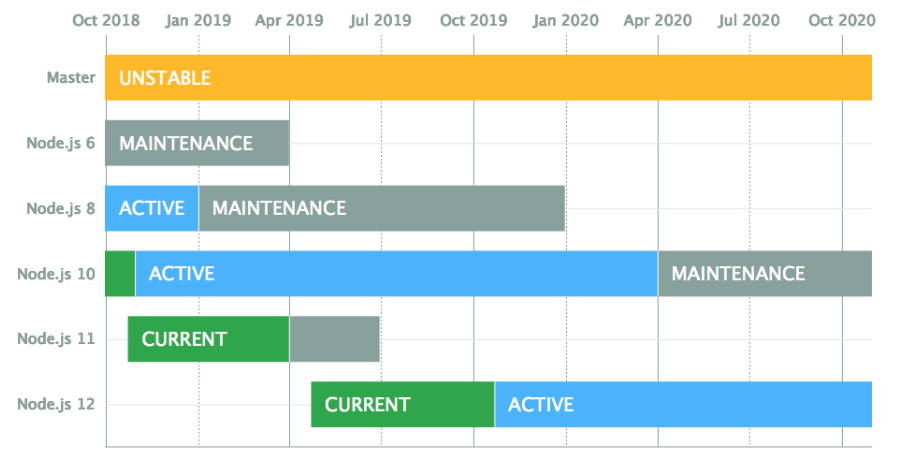
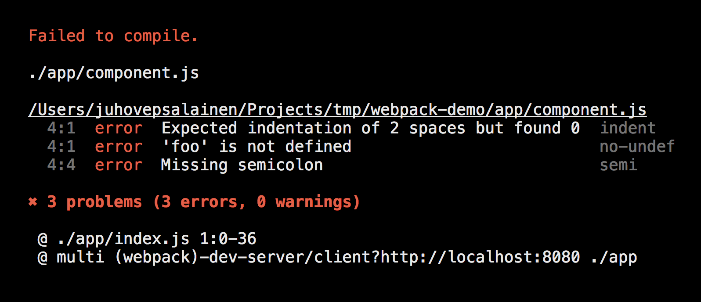

## JavaScript Tooling and Editor

<br>
<small>
Copyright (c) 2017-2019 Euricom nv.
</small>

<!-- markdownlint-disable -->
<br>
<style type="text/css">
.reveal h1 {
    font-size: 3.0em;
}
.reveal h2 {
    font-size: 2.00em;
}
.reveal h3 {
    font-size: 1.00em;
}
.reveal p {
    font-size: 70%;
}
.reveal blockquote {
    font-size: 80%;
}
.reveal pre code {
    display: block;
    padding: 5px;
    overflow: auto;
    max-height: 800px;
    word-wrap: normal;
    font-size: 120%;
}
</style>

---

# It's not your old JavaScript anymore

> Tooling will help us

<!-- prettier-ignore -->
***

## Tooling

- **_NodeJS_** - Cross-platform JavaScript runtime environment.
- **_Npm_** - JavaScript module package manager
- **_WebPack_** - Task runner and module bundler.
- **_Babel_** - ES6+ to JavaScript transpiler
- **_Prettier_** - An opinionated code formatter
- **_Linting_** - Analyse your code for potential errors

---

# Markdown

> The text format for developers

<!-- prettier-ignore -->
***

## Markdown

All slides and documentation is in markdown

```markdown
# Header 1

## Header 2

Unordered

- Create a list by starting a line with `+`, `-`, or `*`
- Sub-lists are made by indenting 2 spaces

Ordered

1.  Lorem ipsum dolor sit amet
2.  Consectetur adipiscing elit
3.  Integer molestie lorem at massa
```

See Also [here](https://guides.github.com/features/mastering-markdown/) and [here](https://github.com/adam-p/markdown-here/wiki/Markdown-Cheatsheet)

<!-- prettier-ignore -->
***

# Markdown

| Tool                                     | platform  |
| ---------------------------------------- | --------- |
| [VSCode](https://code.visualstudio.com/) | win/macos |
| [MarkdownPad](http://markdownpad.com)    | win       |
| [Caret](https://caret.io/)               | macos     |
| [HackMD](https://hackmd.io/)             | online    |
| [StackEdit](https://stackedit.io/editor) | online    |
| Many others...                           |           |

---

# NodeJS

> Your Javascript engine for the desktop

<!-- prettier-ignore -->
***

## NodeJS

### Active LTS or Current

To Install
[https://nodejs.org/en/](https://nodejs.org/en/)

<br>

[https://github.com/nodejs/Release#release-schedule](https://github.com/nodejs/Release#release-schedule)

<!-- prettier-ignore -->
***

## NodeJS

Check you node version

```bash
# verify your node version
> node --version
v8.12.0
```

```bash
# verify your npm version
> npm --version
v8.12.0
```

<!-- prettier-ignore -->
***

## Switch node version

### Using 'n'

```bash
# install
npm install n -g
brew install n    # alternative

# use
n 6.9.4
n latest
n
    node/6.2.0
    node/6.5.0
    node/6.7.0
  ο node/6.9.4
    node/7.4.0
n ls
```

All versions share a common global

<!-- prettier-ignore -->
***

## Switch node version

### Using 'nvm'

```bash
# list local available version (and aliases)
nvm list  # or nvm ls

# list remote version
nvm ls-remote --lts
nvm ls-remote

# install specific version
nvm install lts/dubnium
nvm install stable  #latest version
nvm install v11.10.0

# use specific version
nvm use v12.9.0
```

Versions are fully separated

---

# Node Package Manager

> Get that node module

<!-- prettier-ignore -->
***

## Node Package Manager

The JavaScript way of packaging and deploying code (modules)

```bash
# versions
$ node --version      # node version
$ npm --version       # npm version

# to create a package.json
$ npm init

# to install a module
$ npm install jquery

# to install all modules defined in the package.json
$ npm install

# to remove a module
$ npm uninstall jquery --save
```

<!-- prettier-ignore -->
***

## Npm Commands

Other usefull commands

```bash
# create a package.json
npm init
npm init --force

# install as dev dependency
npm install eslint --save-dev

# list local/global install packages
npm list --depth=0
npm list --depth=0 --global

# show package info
npm info jquery
npm info jquery --json  # all details
npm info jquery versions --json # versions

# clear cache
npm cache clean

# show configs
npm config list

# upgrade npm to latest version
npm install -g npm@latest
```

<!-- prettier-ignore -->
***

## Npm Config

```bash
$ npm config list       # show config
$ npm config list -l    # show full config
$ npm config get cache  # show single config item
$ npm config set cache
```

Location of npm config file

```bash
# local config
$ npm config get userconfig

# global config (by default not available)
$ npm config get globalconfig
```

<!-- prettier-ignore -->
***

## Npm Registry

All modules are installed from npm registry

```bash
$ npm config get registry
$ npm config set registry <registry url>
```

Specify a different source

```bash
npm install # install all dependencies in package.json

npm install [<@scope>/]<pkg>
npm install [<@scope>/]<pkg>@<tag>
npm install [<@scope>/]<pkg>@<version>
npm install [<@scope>/]<pkg>@<version range>
npm install <folder>
npm install <tarball file>
npm install <tarball url>
npm install <git:// url>
npm install <github username>/<github project>
```

<!-- prettier-ignore -->
***

## Npm scripts

You can run small CLI script via npm/yarn

```json
{
    "name": "temp",
    "version": "1.0.0",
    "scripts": {
      "create": "mkdir -p dist/js",
      "cleanup": "rimraf dist"
    },
    "devDependencies": {
      "rimraf": "^3.0.0"
    }
    ...
}
```

To run

```bash
$ npm run init
> tools@1.0.0 init /Users/peter/git/temp/tools
> mkdir -p dist/js
```

<!-- prettier-ignore -->
***

## Npx

Executor for local and ad-hoc npm binaries

```bash
# add a local package
npm install cowsay

# run local package
npx cowsay May the force be with you

# run remote package (this will install, run and uninstall)
npx https://gist.github.com/zkat/4bc19503fe9e9309e2bfaa2c58074d32
```

> Now you don't have to install tools globally or create a script line.

<!-- prettier-ignore -->
***

## Yarn

Yarn (fast, reliable and secure) alternative to npm

| npm                           | yarn                     |
| ----------------------------- | ------------------------ |
| npm install                   | yarn                     |
| npm install jquery            | yarn add jquery          |
| npm install eslint --save-dev | yarn add jquery --dev    |
| npm run create                | yarn create              |
| npm audit                     | yarn audit               |
|                               | yarn outdated            |
|                               | yarn why                 |
| use npm-check                 | yarn upgrade-interactive |

---

# WebPack

> A modern bundler for javascript.

<!-- prettier-ignore -->
***

## Quick start

A mini application

src/calc.js

```js
module.exports = {
  add(x, y) {
    return x + y;
  },
};
```

src/index.js

```js
const calc = require('./calc');
console.log(calc.add(1, 2));
```

index.html

```html
<html>
  <body>
    <div id="root"></div>
    <script src="bundle.js"></script>
  </body>
</html>
```

<!-- prettier-ignore -->
***

## Webpack Setup

Install

```bash
npm install webpack webpack-cli --save-dev
```

webpack.config.js

```js
module.exports = {
  entry: './src/index.js',
  mode: 'development',
  devtool: 'source-maps',
  output: { path: __dirname, filename: 'bundle.js' },
};
```

Run

```bash
# development build
npx webpack

# production build
npx webpack --mode production
```

---

# Babel

> Use the latest and greatest of ESNext

<!-- prettier-ignore -->
***

## Setup

[Using Babel (official website)](https://babeljs.io/docs/setup/)

Install

```bash
# install as npm module
npm install @babel/cli @babel/core @babel/preset-env --save-dev
```

Configure: .babelrc<br>
Babel needs preset to know how to build.

```json
{
  "presets": ["@babel/preset-env"]
}
```

See [@babel/preset-env](https://github.com/babel/babel/tree/master/packages/babel-preset-env) for more information

<!-- prettier-ignore -->
***

## Build Javascript

src/index.js

```js
const person = {
  name: 'jan',
  age: 12,
};

// object spread not supported by node 6
const otherPerson = { ...person, age: 20 };
console.log(otherPerson);
```

@babel/preset-env will transpile for the current node version
lets switch to an older version

```bash
$ nvm install lts/Boron
...
Now using node v6.17.1 (npm v3.10.10)
```

build the javascript

```bash
npx babel ./src -d ./build
```

see the result in ./build

<!-- prettier-ignore -->
***

## Configure node version

.babelrc

```json
{
  "presets": [
    [
      "@babel/preset-env",
      {
        "targets": {
          "node": "6.10"
        }
      }
    ]
  ]
}
```

When you are running node 11, its building to node 6

<!-- prettier-ignore -->
***

## Using nodemon

```bash
# install dependencies
npm install nodemon @babel/node --dev
```

add startup script in package.json

```json
"scripts": {
  "build": "babel ./src -d ./build",
  "start": "nodemon --exec babel-node src/index.js",
},
```

and run it

```bash
# start the application, watch and rerun
npm run start
```

<!-- prettier-ignore -->
***

## Babel Plugins

With plugins you can add additional features to babel.
Lets add a pre-release feature (numeric-separator).

```bash
# install plugin
yarn add @babel/plugin-proposal-numeric-separator --dev
```

.babelrc

```json
{
  "presets": ["@babel/preset-env"],
  "plugins": ["@babel/plugin-proposal-numeric-separator"]
}
```

index.js

```js
// Numeric Separator (stage 3)
const bigNumber = 123_234_234;
console.log(bigNumber);
```

<!-- prettier-ignore -->
***

## Final Config

.babelrc

```json
{
  "presets": [
    [
      "@babel/preset-env",
      {
        "targets": {
          "node": true
        }
      }
    ]
  ],
  "plugins": ["@babel/plugin-proposal-numeric-separator"]
}
```

<!-- prettier-ignore -->
***

## Final Config

package.json

```json
{
  "scripts": {
    "build": "babel ./src -d ./build",
    "start": "nodemon --exec babel-node src/index.js",
    "start:prod": "./build/index.js"
  },
  "dependencies": {},
  "devDependencies": {
    "@babel/cli": "^7.5.5",
    "@babel/core": "^7.5.5",
    "@babel/node": "^7.5.5",
    "@babel/plugin-proposal-numeric-separator": "^7.2.0",
    "@babel/preset-env": "^7.5.5",
    "nodemon": "^1.19.1"
  }
}
```

<!-- prettier-ignore -->
***

## Add to webpack

```bash
# install as npm module
npm install babel-loader --save-dev
```

```js
// update webpack.config.js
module.exports = {
  // ...
  module: {
    rules: [
      {
        test: /\.(js|jsx)$/,
        loader: 'babel-loader',
        exclude: /node_modules/,
      },
    ],
  },
};
```

<!-- prettier-ignore -->
***

## Add to webpack

specify which browser to support (package.json)

```json
{
  "dependencies": {
    ...
  },
  "browserslist": "> 0.25%, not dead"
}
```

See more: https://babeljs.io/docs/en/babel-preset-env

Enjoy the latest ESNext features :)

---

# Format your code

> A formatter can help you writing clean/consistent code

<!-- prettier-ignore -->
***

# Prettier

Use [https://prettier.io/](Prettier) to format your code.

<!-- prettier-ignore -->
***

## VSCode - Plugin

Install VSCode plugin<br>

<br>

[Prettier - Code formatter](https://marketplace.visualstudio.com/items?itemName=esbenp.prettier-vscode)

VSCode Setting

```
"editor.formatOnSave": true,
```

<!-- prettier-ignore -->
***

## Config

Config file: `.prettierrc`

```
{
  "trailingComma": "all",
  "singleQuote": true,
  "tabWidth": 2,
  "printWidth": 80,
  "useTabs": false,
  "semi": true
}
```

Install dependency

```
npm install prettier -D
```

script (package.json)

```
scripts: {
    "format": "prettier --write 'src/**/*.js'"
}
```

<!-- prettier-ignore -->
***

## Config

Exclude files

```bash
# .prettierignore
package.json
package-lock.json
bundle.js
```

Run prettier on all files

```
scripts: {
    "format": "prettier --write ''**/*.{js,json,html}''"
}
```

---

# Linting

> Don't start without a linter

<!-- prettier-ignore -->
***

## Use a linter

Static code analyses to improve your code.

<br>

Available to JavaScript (ESLint), TypeScript (TSLint) and CSS (StyleLint)

<!-- prettier-ignore -->
***

## IDE/Editor Support

Any good JS editor support's linting: Visual Studio Code, WebStorm, Atom, ...

<br>

<!-- prettier-ignore -->
***

## ESLint

> The pluggable linting utility for JavaScript and JSX

<!-- prettier-ignore -->
***

### ESLint - Setup

```bash
# install eslint
npm install eslint --save-dev
```

.eslintrc

```json
{
  "extends": ["eslint:recommended"],
  "parserOptions": {
    "ecmaVersion": 2018
  },
  "rules": {
    "valid-typeof": "error"
  }
}
```

Add npm script (package.json)

```json
scripts: {
  "lint": "eslint \"./src/**/*.js\""
}
```

<!-- prettier-ignore -->
***

### ESLint - Run

Some bad code

<!-- prettier-ignore -->
```js
const name = "Freddy";
typeof name === "strng";

if (!"serviceWorker" in navigator) {
  // you have an old browser :-(
}

const greeting = "hello";
console.log("${greeting} world!")

[(1, 2, 3)].forEach(x => console.log(x));
```

Run eslint

```js
npm run lint
```

<small>This setup follow the airbnb styleguide: https://github.com/zalmoxisus/javascript</small>

<!-- prettier-ignore -->
***

### ESLint - Run

```
npm run lint

/Users/.../src/index.js
   2:17  error  Invalid typeof comparison value                             valid-typeof
   4:5   error  Unexpected negating the left operand of 'in' operator       no-unsafe-negation
   4:25  error  'navigator' is not defined                                  no-undef
   8:7   error  'greeting' is assigned a value but never used               no-unused-vars
   9:1   error  Unexpected console statement                                no-console
   9:1   error  'console' is not defined                                    no-undef
  12:3   error  Unexpected newline between object and [ of property access  no-unexpected-multiline
  12:28  error  Unexpected console statement                                no-console
  12:28  error  'console' is not defined                                    no-undef

```

<!-- prettier-ignore -->
***

### Add the environment

Add the eslint environment (.eslintrc)

```json
  "env": {
    "browser": true,
    "node": true
  },
```

<!-- prettier-ignore -->
***

## ESlint - VSCode


[ESLint Plugin](https://marketplace.visualstudio.com/items?itemName=dbaeumer.vscode-eslint)

<!-- prettier-ignore -->
***

### ESLint - Airbnb config

Install dependencies

```bash
npm install eslint-config-airbnb-base -D
npm install eslint-plugin-import -D
```

config

```json
{
  "extends": ["airbnb-base"],
  ...
}
```

<!-- prettier-ignore -->
***

### ESLint - Disable styling rules

When using Prettier you can disable all formatting rules

```bash
# install additional eslint config
$ npm install eslint-config-prettier --save-dev
```

.eslintrc

```json
{
  "extends": [
      "airbnb-base",
      "prettier"
  ],
  ...
}
```

No more linting errors for formatting.

<!-- prettier-ignore -->
***

### Support for ES6+ features

```js
// stage-2 feature
const number = 123_121_2342;
console.log(number);
```

```bash
# install babel parser for eslint
npm install babel-eslint --save-dev
```

configure it (.eslintrc)

```json
{
    "parser": "babel-eslint",
    ...
}
```

Supporting all of nice babel stuff

<!-- prettier-ignore -->
***

## Other...

- ESLint configurations
  - eslint-config-airbnb
  - eslint-config-standard
  - eslint-config-google
  - ...
- Linters
  - JSLint & JSHint (Outdated, don't use)
  - TSLint (Typescript)
  - StyleLint (CSS, Sass, Less)

---

## Starters

Pre-defined projects for easy startup. Where to find?

```
<root>/starters/js-node
<root>/starters/js-node-jest
<root>/starters/js-webpack
```

Ready to:

- Run any React/ES6+ in browser
- Linting with AirBnb config
- Editorconfig for consistent tabs/spacing
- Usefull VSCode setup

---

# Ready to write some JavaScript
