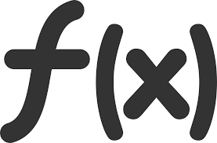

## Functional Javascript

<br>
<small>
Copyright (c) 2017-2019 Euricom nv.
</small>

<!-- markdownlint-disable -->
<br>
<style type="text/css">
.reveal h1 {
    font-size: 3.0em;
}
.reveal h2 {
    font-size: 2.00em;
}
.reveal h3 {
    font-size: 1.00em;
}
.reveal p {
    font-size: 70%;
}
.reveal blockquote {
    font-size: 120%;
}
.reveal pre code {
    display: block;
    padding: 5px;
    overflow: auto;
    max-height: 800px;
    word-wrap: normal;
    line-height: 35px;
    font-size: 120%;
}
</style>

---

# Functional Programming

> Function all over the place

---

# A pure function

> Pure? How can a function be pure?

---//

## A pure function

> The function always returns the same result for the same arguments.

and

> The function does NOT produce any observable side effects.

---//

## Side effects

- Making a HTTP request
- Mutating external data
- Mutating arguments
- DOM Query/Manipulation
- Math.random()
- Getting the current time

---//

## Examples

### Pure function

```js
function sum(a, b) {
  return a + b;
}
```

```js
function getLength(array) {
  return array.length;
}
```

---//

## Examples

### Impure function

```js
// inc() is impure because it changes count outside its scope
const count = 1;
function inc(v) {
  count += v;
}
```

```js
// Use of a random/non consistent value
function getTime() {
  return new Date().getTime();
}
```

```js
function add(x, y) {
  updateDatabase(); // Side Effect
  return x + y;
}
```

```js
class MyClass {
  #count: 1;
  #inc(v) {
    this.count += v;
  }
}
```

---//

# The Big Deal

- **'Predictable'**: Using a function and knowing exactly what it does feels so good.
- **'Portable'**: Pure functions can be reused easily as they do not hold any form of state
- **'Cacheable'**: It becomes easy to cache results
- **'Testable'**: Last but not least, pure functions are easy and a pleasure to test

---

# Immutability

> No mutants allowed

---//

## Immutable

Immutable change - don't change, create a new one

```
let number = 10;
let obj = { name: 'peter' };
const refObj = obj;

// don't change, replace
number = 12;
obj = { name: 'john' }
```

---//

## Immutable

With objects

```js
// copy object and update
obj = {
  name: obj.name,
  id: 12
}

// using Object.assign
obj = Object.assign(obj, {
  id: 12
})

// using ES6 spread operator
obj = {
  ...obj,
  id: 12
})
```

---//

### Pure function

A pure function with immutable change

```js
const obj = { name: 'john' };

// BAD
function updatedName(obj, newName) {
  obj.name = newName;
  return obj;
}

// GOOD
function updatedName(obj, name) {
  // a pure function never change
  // the input arguments
  return {
    ...obj, // spread operator is your friend
    name,
  };
}

const updatedObj = updatedName(obj, 'peter');
```

---//

## Immutable changes

```js
// object
const obj = { name: 'bob' };
const newObj = { ...obj, name: 'peter' };

// array push
const array = [1, 2, 3];
const newArray = [...array, 12]; // [1, 2, 3, 4]

// array remove by id
const array = [{ id: 1, name: 'bob' }, { id: 2, name: 'peter' }];
const newArray = array.filter(item => item.id != 1);
```

---//

## Immutable changes

```js
// array remove index (start, deleteCount)
const array = [1, 2, 3, 4];
const newArray = [...arr.slice(0, start), ...arr.slice(start + deleteCount)];

// array change entry
const newArray = array.map(item => {
  if (item.id === 2) {
    return { ...item, name: Peter };
  }
  return item;
});

// array sort
const newArray = [...arr].sort(compareFunction);
```

---

# Array functions

> makes your live easier

---//

## Array handling

Our array

```js
const companies = [
  { id: 1, name: 'Acme', category: 'finance', employees: 5 },
  { id: 4, name: 'Globe', category: 'tech', employees: 1010 },
  { id: 2, name: 'Soylent', category: 'food', employees: 120 },
];
```

Useful Array functions

`forEach`, `map`, `reduce`, `filter`, `sort`, `find`, `some`, `any`

---//

## Array - for loops

Good old for loop (don't use it)

```js
for (let i = 0; i < companies.length; i++) {
  console.log(item);
}
```

Prefer

```js
// forEach (loop over all items)
companies.forEach(item => {
  console.log(item);
});
```

or

```js
// ES6 version
for (let item of companies)
  console.log(item)
})
```

---//

## Array - Mapping

Good old for loop

```js
const companyNames = [];
for (let i = 0; i < companies.length; i++) {
  names.push(companies[i].name);
}
```

Preferred

```js
const companyNames = companies.map(item => {
  return item.name;
}

// or even shorter
const companyNames = companies.map(item => item.name)
```

---//

## Array - for loops

Other example (transform property)

```js
const transformed = companies.map(item => {
  return {
    id: item.id.toString(),
    name: item.name;
  }
})
```

---//

### Array - Calculation (sum, group, ...)

Old style

```js
const totEmployees = 0;
for (let i = 0; i < companies.length; i++) {
  totEmployees += companies.employees;
}
```

Prefer

```js
// reduce
const totEmployees = companies.reduce((acc, item) => {
  return acc + item.employees;
}, 0);
```

---//

### Array - Filter, Find and Sort

```js
// filter
const bigCompanies = companies.filter(item => {
  return item.employees > 1000;
});

// filter: short version
const bigCompanies = companies.filter(item => item.employees > 1000);

// find
const acme = companies.find(item => item.name === 'Acme');

// sort
const sortedCompanies = companies.sort((a, b) => a.name > b.name);
```

<small>[JavaScript Higher Order Functions & Arrays Youtube](https://www.youtube.com/watch?time_continue=495&v=rRgD1yVwIvE)</small>

---//

## Examples of use

Chain functions

<!-- prettier-ignore -->
```js
const sortedNames = companies.map(item => item.name)
                             .sort((a, b) => a > b);
```

Add item to array

<!-- prettier-ignore -->
```js
const name = 'Wolfoods';
const newId = companies.reduce((acc, item) => 
                Math.max(acc, item.id), 0) + 1;
companies.push({
  id: newId,
  name,
});
```

---//

## Examples of use

Remove an item from an array (don't use splice)

<!-- prettier-ignore -->
```js
const idToRemove = 999;
companies = companies.filter(item => 
              item.id === idToRemove);
```

Find and update an item

```js
const company = companies.find(item => item.id === 1);
company.name = 'Other name';
```

---

# Resources

- https://ultimatecourses.com/blog/pure-versus-impure-functions
