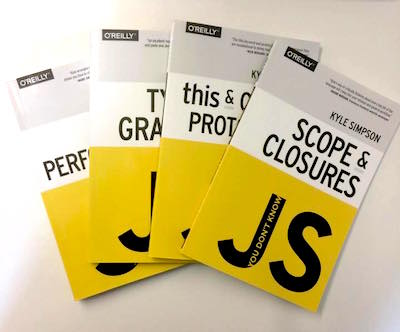
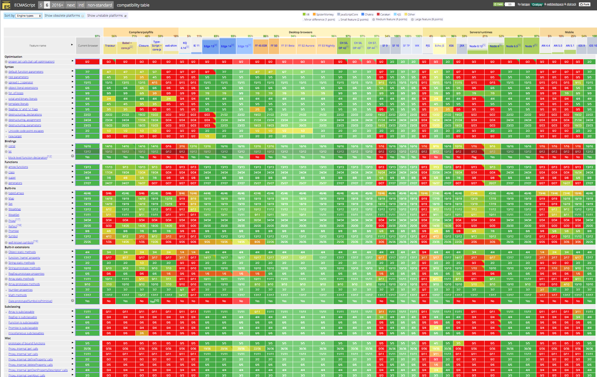

## Javascript Fundamentals

<br>
<small>
Copyright (c) 2017-2019 Euricom nv.
</small>

<!-- markdownlint-disable -->
<br>
<style type="text/css">
.reveal h1 {
    font-size: 3.0em;
}
.reveal h2 {
    font-size: 2.00em;
}
.reveal h3 {
    font-size: 1.00em;
}
.reveal p {
    font-size: 70%;
}
.reveal blockquote {
    font-size: 80%;
}
.reveal pre code {
    display: block;
    padding: 5px;
    overflow: auto;
    max-height: 800px;
    word-wrap: normal;
    font-size: 90%;
}
</style>

---

## Learn Javascript

<br>

> https://github.com/getify/You-Dont-Know-JS

---

# JavaScript History

> Javascript is older then you think

<!-- prettier-ignore -->
***

## When it all started

- 1994: Netscape Navigator is released
- 1995: [Brendan Eich](https://en.wikipedia.org/wiki/Brendan_Eich) joined Netscape, initialy to add 'Scheme' language to the browser.
- 1995: Sun puts pressure on Netscape to add Java to the browser.
  - To complex, not for amateur programmer
  - Brendan helps Netscape decide
  - Brendan starts a new language
    - In 10 days! (Code Name: Mocha)

<!-- prettier-ignore -->
***

## Ecmascript

- 1995 (sept): Mocha was renamed to LiveScript
- 1995 (dec): LiveScript was later renamed to JavaScript
- 1996: People start using Javascript
- 1996: Microsoft is coming with IE. Netscape in problem.
- 1997: Netscape reaches out to Ecma. JS was standardized: Ecmascript

<!-- prettier-ignore -->
***

## Life is Good

- 1999: Ecmascript 3
  - More people implementing ES spec
  - More people/companies get involved (Apple, Yahoo, Adobe, ...)

<!-- prettier-ignore -->
***

## Internet Explorer

- 1999 - 2005
  - IE Crushes NetScape
  - 2003 Netscape ends
  - IE Glory Days

<!-- prettier-ignore -->
***

## IE4 Conflicting ideas

- 2005: Talks start for ES4
  - Crockford: Remove bad parts
  - MS: Keep it backwards compatible
  - Adobe: Add classes and flex stuff
  - Crock/MS/Yahoo (ES3.1) vs Adobe/Opera/Mozilla (ES4)

<!-- prettier-ignore -->
***

## Harmony

- 2008
  - TC39 agree to postpone ES4 and to implement ES3.1 (and rename to ES5)
  - Committee is working together now. New features set: Harmony
- 2009: ES5 is official
- 2015: TC39 has finalized ES6
  - Renamed ES6 to ES2015
  - Browser starting the implementation of ES2015

<!-- prettier-ignore -->
***

## Today

- TC39 works on features for ES2019
- Browsers are inplementing ES2019 and beyond

---

## Documentation

> Where are the manual's

<!-- prettier-ignore -->
***

## Javascript Help

- [The MDN JavaScript reference](https://developer.mozilla.org/en-US/docs/Web/JavaScript/Reference)
- [DevDocs](http://devdocs.io/javascript)
- [JavaScript Weekly](http://javascriptweekly.com/)

---

# ES5, ES6, ES2016, ES.Next, TypeScript

> What's going on with JavaScript versioning

<!-- prettier-ignore -->
***

## Terms of terminology

- ECMAScript
- ECMAScript 5 (ES5) - 2009
- ECMAScript 6 (ES6/ES2015) - 2015
- ECMAScript 2016 (ES7)
- ECMAScript 2017
- ES.Next
- TC39

Note:

- ECMAScript: A language standardized by ECMA International.
- JavaScript: The commonly used name for implementations of the ECMAScript standard
- ECMAScript 5 (ES5): The 5th edition of ECMAScript, standardized in 2009
- ECMAScript 6 (ES6/ES2015): The 6th edition of ECMAScript, standardized in 2015.
- ECMAScript 2016: The 7th edition of ECMAScript

<!-- prettier-ignore -->
***

## TC39

The Ecma TC39 committee is responsible for evolving the ECMAScript programming language and authoring the specification. The committee operates by consensus and has discretion to alter the specification as it sees fit.

<!-- prettier-ignore -->
***

## The TC39 Process

- Stage 0: Initial input - Strawman
- Stage 1: Proposal (spec, polyfill, demo)
- Stage 2: Draft (ready for testing)
- Stage 3: Candidate (almost there, last bits)
- Stage 4: Finished (ready)

[TC39 Github Proposals](https://github.com/tc39/proposals)

<!-- prettier-ignore -->
***

## ES Today

<br>

- Edge, Chrome, Firefox and Safari: +95%
- Node 8.x: +98%

> [http://kangax.github.io/compat-table/es6/](http://kangax.github.io/compat-table/es6/)

---

# NodeJS <br>(quick start)

> Your Javascript engine for the desktop

<!-- prettier-ignore -->
***

## Your first app

Your JS file

```js
// main.js
console.log('Hello nodeJS');
```

To run

```bash
# run the app
node main.js
> Hello nodeJS
```

<!-- prettier-ignore -->
***

## Auto (re)run

To auto restart after file change

```bash
# install nodemon
npm install nodemon -g

# run app with nodemon
nodemon main.js
[nodemon] 1.19.1
[nodemon] to restart at any time, enter `rs`
[nodemon] watching: *.*
[nodemon] starting `node main.js`
Hello node
[nodemon] clean exit - waiting for changes before restart
```

<!-- prettier-ignore -->
***

## NodeJS != Browser

Node doesn't have:

```
  + window object
  + location object
  + document object
```

Node is/has:

```
  + global object (== window object)
  + headless (no DOM)
  + process object (to get info about the process)
  + __dirname & __filename object

  + module object (to export a module)
  + everything is a module (every file)
  + require function (to load other modules)
```

<!-- prettier-ignore -->
***

## NodeJS == Browser

In common with browser:

```
   + console object
   + setInterval & setTimeout function
```

---

# Scope and Closure

> Where to look for things.

<!-- prettier-ignore -->
***

### Lexical scoping with function scope.

Do you know the answer?

```
    var foo = 'bar';
    function bar() {
        var foo = 'baz';

        function baz(foo) {
            foo = 'bam';
            bam = 'yay';
        }

        baz();
    }

    bar();
    name;           // ?????
    foo;            // ?????
    bam;            // ?????
    baz();          // ?????
```

<!-- prettier-ignore -->
***

Answer!

```
    var foo = 'bar';
    function bar() {
        var foo = 'baz';

        function baz(foo) {
            foo = 'bam';
            bam = 'yay';
        }

        baz();
    }

    bar();
    name;           // undefined
    foo;            // 'bar'
    bam;            // 'yay'
    baz();          // Uncaught ReferenceError: baz is not defined
```

> The answer is defined by the hoisting behavior of Javascript.

<!-- prettier-ignore -->
***

## Variable Hoisting

```javascript
a; // ???
b; // ???
var a = b;
var b = 2;
b; // 2
a; // ???
```

Result

<!-- .element: class="fragment" data-fragment-index="1" -->

```javascript
var a = undefined:  // compiler hoised these
var b = undefined:  // compiler hoised these
a;              // undefined
b;              // undefined
a = b;
b = 2;
b;              // 2
a;              // undefined
```

<!-- .element: class="fragment" data-fragment-index="1" -->

<!-- prettier-ignore -->
***

### Strict Mode

The syntax, for declaring [strict mode](https://developer.mozilla.org/en-US/docs/Web/JavaScript/Reference/Strict_mode), was designed to be compatible with older versions of JavaScript.

```
"use strict";
var a = '1234';
console.log(b);         // error
```

Not Allowed to:

- Using a variable/object without declaring it
- Deleting a variable
- With statement
- Keywords: interface, private, yield, ...
- ...

**_Guideline_**: always 'use strict' when using Javascript

<!-- prettier-ignore -->
***

## Block Scoping

```js
var foo = 2;
if (true) {
  var bar = 1;
}
console.log(foo + bar); // output: throws error, 2, 3 of undefined
```

```js
for(var i = 0; i < 10; i++) {
    ...
}
console.log(i)           // output: throws error, 10, 11, undefined
```

> No block scoping when using var!

<!-- prettier-ignore -->
***

## Use `let` and `const`

```js
let foo = 2
if (true) {
    let bar = 1
}
for(let i = 0 i < 10 i++) {
    ...
}
console.log(foo + bar)   // error
console.log(i)           // error
```

In ES6+/Typescript always prefer `const` and `let` over `var`.

<!-- prettier-ignore -->
***

## Declared / undeclared

What if I use it before it is declared?

```javascript
console.log(name); // WHAT HAPPENS HERE?
var name = 'marc';
```

Result

<!-- .element: class="fragment" data-fragment-index="1" -->

```javascript
console.log(name); // undefined
name = 'marc';
```

<!-- .element: class="fragment" data-fragment-index="1" -->

```javascript
'use strict';
console.log(name); // Error!
name = 'marc';
```

<!-- .element: class="fragment" data-fragment-index="1" -->

<!-- prettier-ignore -->
***

## What about

Multiple vars

```javascript
var a = 0;
var a = 1;
console.log(a); // error, 0, 1?
```

> Remember our for loop (BlockScoping slide 5) ;)

<!-- prettier-ignore -->
***

## What about

Try/catch block

```javascript
var foo;
try {
  foo.length;
} catch (err) {
  console.log(err);
}
console.log(err); // ?
```

> Try/catch has block scoping!

<!-- .element: class="fragment" data-fragment-index="1" -->

<!-- prettier-ignore -->
***

## Function Hoisting

Functions hoist too, but not always

```js
// SOME CODE GOES HERE

// Function Declaration
function foo(){
    ...
}

// Function Expression
var bar = function(){
    ...
};
```

<!-- prettier-ignore -->
***

## Function Hoisting

Is hoisted as:

```js
var bar = undefined:    // compiler hoised these
function foo(){
   // ...
}

// SOME CODE GOES HERE

// function name hoisted, but variable assignment
// doesn't happen until the code gets here
var bar = function(){
    // ...
};
```

<!-- prettier-ignore -->
***

## Function Hoisting

Functions hoist first (and last wins!)

```js
foo();
var foo = 2;

function foo() {
  console.log('bar');
}

function foo() {
  console.log('foo');
}
```

<!-- prettier-ignore -->
***

## Arrow Functions

The modern way of defining a function

```js
// Function Expression (ES5)
const bar = function(arg){
    ...
};

// Arrow function expression (ES6)
const bar = (arg) => {

}
```

<!-- prettier-ignore -->
***

## Arrow Functions

Simpler syntax

```js
const createGreeting = function(message, name) {
  return message + name;
};

// version 1
const arrowGreeting = (message, name) => {
  return message + name;
};

// version 2
const arrowGreeting = (message, name) => message + name;
```

<!-- prettier-ignore -->
***

## Arrow Functions

Simpler syntax

```js
const createGreeting = function(message, name) {
  return {
    message,
    name
  };
};

// multi line return
const createGreeting = (message, name) => ({
  message,
  name
});
```

<!-- prettier-ignore -->
***

## Nested functions & Lexical Scope

Function baz has access to variable bar in higher (lexical) scope.

```js
function foo() {
  const bar = 'bar';
  function baz() {
    console.log(bar);
  }
  baz();
}
foo();
```

<!-- prettier-ignore -->
***

## Closure

A Closure is when a function "remember" its lexical scope even when the function is executed outside that lexical scope.

```javascript
function foo() {
  const bar = 'bar';
  return function() {
    console.log(bar);
  };
}

function bam() {
  const fn = foo();
  fn();
}

bam(); // 'bar'
```

<!-- prettier-ignore -->
***

## Closure

Another example

```javascript
function foo() {
  const bar = 'bar';
  $('#btn').click(function(evt) {
    console.log(bar);
  });
}

foo();

// What is the output when clicking on the button?
```

<!-- prettier-ignore -->
***

## Closure - Exercise

What is the output of the following function?

```javascript
for (var i = 0; i <= 5; i++) {
  setTimeout(function() {
    console.log('i: ' + i);
  }, i * 1000);
}
```

Answer:

<!-- .element: class="fragment" data-fragment-index="1" -->

```
i: 6
i: 6
i: 6
i: 6
i: 6
i: 6
```

<!-- .element: class="fragment" data-fragment-index="1" -->

How to fix this?

<!-- .element: class="fragment" data-fragment-index="2" -->

<!-- prettier-ignore -->
***

### IIFE

Immediately-Invoked Function Expression (IIFE)

```javascript
function doSomething() {
  // ...
  // simulate block scoping
  (function() {
    var a = 0;
    // ...
  })();
  // ...
}
```

```javascript
Is used to isolate from global scope

var myModule = (function($, global) {
    var myVar = '';
    function doThis() {
        ...
    }
})(jquery, window);
```

<!-- prettier-ignore -->
***

### The Revealing Module Pattern

```javascript
var myRevealingModule = (function() {
  var privateVar = 'Ben Cherry';

  function privateFunction() {
    console.log('Name:' + privateVar);
  }

  function publicSetName(strName) {
    privateVar = strName;
  }

  function publicGetName() {
    privateFunction();
  }

  return {
    setName: publicSetName,
    getName: publicGetName
  };
})();

myRevealingModule.setName('Paul Kinlan');
```

See also [JavaScript Design Patterns](https://addyosmani.com/resources/essentialjsdesignpatterns/book/)

<!-- prettier-ignore -->
***

### Javascript modules systems

- IIFE (Revealing Module Pattern)
- CommonJS (Node module pattern)
- AMD (Asynchronous Module Definition)
- UMD (Combination of IIFE, CommonJS, AMD)
- ES Modules (ECMAScript Modules)

More on this later!

<!-- prettier-ignore -->
***

# Exercise

> Build a calculator module and use it the browser

- Use index.html, main.js & calc.js
- Isolate the calculator with an iife

<!-- prettier-ignore -->
***

- HTML Tips

```html
<input type="text" id="val1" />
<input type="text" id="val2" />
<button id="myBtn">Add</button>
```

```javascript
// response to button click
document.getElementById("myBtn").addEventListener("click", function() {
    const val1 = document.getElementById('val1').value;
    const val2 = document.getElementById('val2').value;
    const result = calc.sum(val1, val2);
    console.log(result);
}
```

> Refactor the calculator and use it in nodeJS

- Use commonJS or UMD for the calculator module
- Access the calculator via command line

```bash
node main.js 1 2
```

---

# this

> One of the most powerful JavaScript keywords is this. Unfortunately it is hard to use if you don't exactly know how it works.

<!-- prettier-ignore -->
***

## this

Every function has a reference to its current executing context, called `this`

```javascript
function doThis() {
  console.log(this.name); // output?
}

doThis();
```

`this` is defined by 5 rules (in reverse order):

- implicit or default binding
- explicit binding
- hard binding
- arrow function
- new keyword

> 'this' in Javascript is different from 'this' in C# or Java

<!-- prettier-ignore -->
***

## This - Default and implicit binding

```javascript
function foo() {
  console.log(this.bar);
}

const bar = 'bar1';
const o2 = { bar: 'bar2', foo: foo };
const o3 = { bar: 'bar3', foo: foo };

foo(); // ???
o2.foo(); // ???
o3.foo(); // ???
```

<!-- prettier-ignore -->
***

The 'this' points to the object where it is called from (its context), if there is no object fallback to the global (window in browser).

```javascript
foo(); // 'bar1' default binding (none strict)
o2.foo(); // 'bar2' explicit binding
o3.foo(); // 'bar3' explicit binding
```

<!-- .element: class="fragment" data-fragment-index="1" -->

<!-- prettier-ignore -->
***

### Default and implicit binding

```javascript
const o1 = {
  bar: 'bar1',
  foo: function() {
    console.log(this.bar);
  }
};

const o2 = { bar: 'bar2', foo: o1.foo };
const bar = 'bar3';
const foo = o1.foo;

o1.foo(); // ???
o2.foo(); // ???
foo(); // ???
```

Result

<!-- .element: class="fragment" data-fragment-index="1" -->

```javascript
o1.foo(); // 'bar1'
o2.foo(); // 'bar2'
foo(); // 'bar3'
```

<!-- .element: class="fragment" data-fragment-index="1" -->

<!-- prettier-ignore -->
***

## This - Explicit binding

```javascript
function foo(arg1, arg2) {
  console.log(this.bar, arg1, arg2);
}

const bar = 'bar1';
const obj = { bar: 'bar2' };
const a = [5, 6, 7];

foo(1, 2); // 'bar1', 1, 2

// Call the function and explicit pass the this.
foo.call(obj, 1, 2); // 'bar2', 1, 2
foo.apply(obj, a); // 'bar2', 5, 6
```

<!-- prettier-ignore -->
***

## This - Hard binding

```javascript
function foo(ba, lam) {
  console.log(this.bam + ' ' + ba + ' ' + lam);
}

const obj = { bam: 'bam' };
const foo2 = foo.bind(obj, 'ba');

foo2('lam'); // 'bam ba lam'
```

<!-- prettier-ignore -->
***

### This - Hard binding

Typically used in this context

```javascript
const car = {
  name: 'Bmw',
  start() {
    setTimeout(
      function() {
        console.log(this.name + ' started');
      }.bind(this),
      1000
    );
  }
};

car.start(); // output: Bmw started
```

<!-- prettier-ignore -->
***

### This - `new` keyword

```javascript
// constructor function (mark the pascal casing)
function User(name) {
  this.name = name;
}
const user = new User('peter');
user.name; // 'peter'
```

<!-- prettier-ignore -->
***

Following is happening:

- A new object is created
- (The `__proto__` property is set to the function prototype)
- The `this` point to the newly created object
- The constructor function is executed
- The newly created object is returned (except when the constructor returns none null)

<!-- prettier-ignore -->
***

### Arrow function

```js
const car = {
    name: 'Bmw'
    start() {
        setTimeout(() => {    // arrow function
            console.log(this.name + ' started')
        }, 1000)
    }
}
```

It's hard binding to the outer scope

<!-- prettier-ignore -->
***

## This - Summary

So to know the value of `this`:

- Is the function an arrow function?
- Was the function called with `new`?
- Was the function called with `call` or `apply` specifying an explicit `this`?
- Was the function called via a containing/owing object (context)?
- Default: global object or undefined (strict mode)

<!-- prettier-ignore -->
***

# Exercise

```js
var fullname = 'John Doe';

const obj = {
  fullname: 'Colin Ihrig',
  prop: {
    fullname: 'Aurelio De Rosa',
    getFullname: function() {
      return this.fullname;
    }
  }
};

const test = obj.prop.getFullname;
console.log(test());
```

Make the console.log() prints 'Aurelio De Rosa'.<br>
Don't change the obj!

---

# Prototypes

> Prototype is a fundamental concept that every JavaScript developer must understand

<!-- prettier-ignore -->
***

## A whole new object

To create the simplest new object in JavaScript, you can use Object.create:

```javascript
var person = Object.create(null); // this creates an empty objects
```

In JavaScript, objects are pairs of keys and values

```javascript
person['name'] = 'john';
person['age'] = 12;
```

You can also use the dot form

```javascript
person.name = 'john';
person.age = 12;
```

<!-- prettier-ignore -->
***

## Prototypes

In fact, JavaScript objects also have one additional attribute: a pointer to another object. We call this pointer the object's prototype: `__proto__`

```javascript
const dev = Object.create(null);
dev.role = 'dev';
dev.code = function() {
  console.log('writing code');
};

const peter = Object.create(dev);
console.log(peter.role); // 'dev'
peter.code(); // 'writing code'

console.log(Object.getPrototypeOf(peter)); // returns the dev object
```

<!-- prettier-ignore -->
***

## Prototypes

`__proto__` points the actual object that is used in the lookup chain to resolve properties, methods, etc.

```javascript
console.log(peter.__proto__); // undefined or points to Object ?

const isSame = Object.getPrototypeOf(peter) === peter.__proto__;
console.log(isSame); // true or false ?
```

<!-- prettier-ignore -->
***

## Object Literals

JavaScript provides a literal syntax for creating an object and assigning properties to it at one time.

```javascript
const person = {
  firstName: 'Paul',
  lastName: 'Irish'
};
```

This syntax is approximately sugar for:

```javascript
const person = Object.create(Object.prototype);
person.firstName = 'Paul';
person.lastName = 'Irish';
```

The default `Object.prototype` dictionary comes with a number of the methods we have come to expect objects to contain

```javascript
person.toString(); // "[object Object]"
```

<!-- prettier-ignore -->
***

## New keyword

- A new object is created
- The `__proto__` property is set to the function prototype
- The `this` point to the newly created object
- The constructor function is executed
- The newly created object is returned (except when the constructor returns none null)

```javascript
function Person(name) {
  this.name = name;
}
const person = new Person('Paul');
```

---

## Prototype Linking


<!-- prettier-ignore -->
***
-----------HERE-------------
### Prototype Linking Example

```javascript
function Person(name) {
  this.name = name;
  this.shoutYourName = function() {
    return 'Shouting ' + this.name;
  };
}
Person.prototype.identity = function() {
  return 'I am ' + this.name;
};
```

```javascript
var john = new Person('John');
var luna = new Person('Luna');
john.speak = function() {
  alert('Hello, ' + this.identity() + '.');
};

john.identify(); // 'I am John'
john.speak(); // Error!
john.constructor === Person;
john.constructor === luna.constructor;
john.__proto__ == Person.prototype;
john.__proto__ == luna.__proto__;
```

> Function.`prototype` is the object where `__proto__` points to when you create an object with new

<!-- prettier-ignore -->
***

## ES6 Classes vs prototype

```ts
class Person {
  name: string;
  constructor(name) {
    this.name = name;
  }

  identity() {
    return 'I am' + this.name;
  }

  static create(name) {
    return new Person(name);
  }
}
```

<!-- prettier-ignore -->
***

## ES6 Classes vs prototype

Will be transpiled as follows (output https://www.typescriptlang.org/play/)

```javascript
var Person = (function() {
  function Person(name) {
    this.name = name;
  }
  Person.prototype.identity = function() {
    return 'I am' + this.name;
  };
  Person.create = function(name) {
    return new Person(name);
  };
  return Person;
})();
```

---

# Awful Parts

> Why of why

<!-- prettier-ignore -->
***

## null, undefined, undeclared

null & undefined

```js
let val; // undefined: declared but not value
let val = undefined; // undefined
let val = null; // null value
```

undeclared

```
console.log(unknown)
```

ReferenceError: unknown is not defined

<!-- prettier-ignore -->
***

## Comparison Operators

```
console.log(3 == "3");          // true
console.log(1 == true);         // true
console.log('' == false);       // true
console.log('23' == true);      // true
console.log('true' == true);    // true
console.log('false' == false);  // false

console.log(3 === "3");         // false
```

See [http://dorey.github.io/JavaScript-Equality-Table/](http://dorey.github.io/JavaScript-Equality-Table/)

> Always use 3 equals unless you have a good reason to use 2.

<!-- prettier-ignore -->
***

## Truthy

```js
// what about following conditions check
if (value) {
    ...
}
```

Truthy

```
true
{}
[]
"some string"
3.14
new Date()
```

<!-- prettier-ignore -->
***

## Falsy

```
false
0 (zero)
"" (empty string)
null
undefined
NaN (a special Number value meaning Not-a-Number!)
```

<!-- prettier-ignore -->
***

## typeof

All clear

```js
typeof 89; // 'number'
typeof true; // 'boolean'
typeof 'some text'; // 'string'
typeof { name: '123' }; // 'object'
typeof function() {}; // 'function'

let val;
typeof val; // 'undefined'
```

<!-- prettier-ignore -->
***

## typeof

not so clear

```js
typeof null; // 'object'
typeof []; // 'object'
```

correct way of testing for an object

```js
if (myValue && typeof myValue === 'object') {
  // my_value is an object or an array!
}
```

<!-- prettier-ignore -->
***

## parseInt

```js
parseInt('16'); // 16
parseInt('16 tons'); // 16

parseInt('08'); // 0 (on some browsers)
parseInt('09'); // 0 (on some browsers)
```

Better to use

```js
parseInt('08', 10); // 8
Number('08') + '08'; // 8 // 8
```

<!-- prettier-ignore -->
***

## Floating point

```js
console.log(0.1 + 0.2 == 0.3); // false!
```

Better to use

```js
// convert to integer
console.log(0.1 * 100 + 0.2 * 100 == 0.3 * 100); // true!
```

<!-- prettier-ignore -->
***

## NaN

```js
+'0' + 'oops'; // 0 // NaN
Number('oops'); // NaN
0 / 0; // NaN

typeof NaN === 'number'; // true
NaN === NaN; // false
NaN !== NaN; // true
```

better to use

```js
const a = 0 / 0;
isNaN(NaN); // true
Object.is(a, NaN); // true
```

---

# Resources

- [You-Dont-Know-JS Book series](https://github.com/getify/You-Dont-Know-JS)
- [Frontendmasters - Advanced JavaScript - Kyle Simpson](https://frontendmasters.com/courses/advanced-javascript/)
- [JavaScript Weekly](http://javascriptweekly.com/)
- [45 Useful JavaScript Tips, Tricks and Best Practices](https://modernweb.com/45-useful-javascript-tips-tricks-and-best-practices/)
- [What is AMD, CommonJS, and UMD?](http://davidbcalhoun.com/2014/what-is-amd-commonjs-and-umd/)

---

# May the JS-Force be with you
