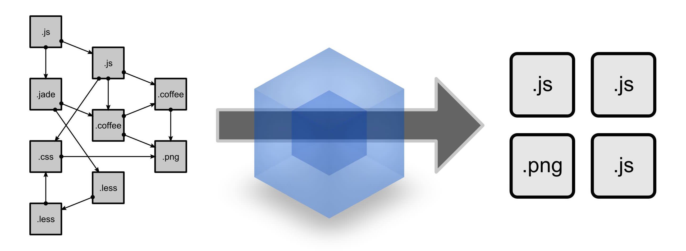

## Introduction to WebPack

<br>
<small>
Copyright (c) 2017-2019 Euricom nv.
</small>

<!-- markdownlint-disable -->
<br>
<style type="text/css">
.reveal h1 {
    font-size: 3.0em;
}
.reveal h2 {
    font-size: 2.00em;
}
.reveal h3 {
    font-size: 1.00em;
}
.reveal p {
    font-size: 70%;
}
.reveal blockquote {
    font-size: 80%;
}
.reveal pre code {
    display: block;
    padding: 5px;
    overflow: auto;
    max-height: 800px;
    word-wrap: normal;
    font-size: 90%;
}
</style>

---

# Basic Setup

> Webpack is easier then you think

<!-- prettier-ignore -->
***

## Install webpack

Install webpack locally

```bash
$ npm i --save-dev webpack webpack-cli
# yarn add webpack webpack-cli --dev
```

Use

```bash
$ npx webpack --version
4.36.1
```

<!-- prettier-ignore -->
***

## My App

userService.js

```js
// a commonJS module
function userService() {
  this.getById = function(id) {
    return { id: 123, name: 'peter' };
  };
  this.getAll = function() {
    return [{ id: 123, name: 'peter' }, { id: 222, name: 'robbert' }];
  };
}
module.exports = new userService();
```

main.js

```js
const userService = require('./userService');
const users = userService.getAll();
users.forEach(function(user) {
  console.log(user.id, user.name);
});
```

<!-- prettier-ignore -->
***

## My App

index.html

```html
<!DOCTYPE html>
<html lang="en">
  <head>
    <meta charset="UTF-8" />
    <title>Webpack 101</title>
  </head>
  <body>
    <h1>Webpack 101</h1>
    <script src="dist/bundle.js"></script>
  </body>
</html>
```

<!-- prettier-ignore -->
***

## Config

A minimal config file

```js
// webpack.config.js
const path = require('path');

module.exports = (env, args) => {
  const devMode = args.mode !== 'production';

  return {
    entry: './main.js',
    output: {
      filename: 'bundle.js',
      path: path.resolve(__dirname, 'dist'),
      publicPath: '/'
    }
  };
};
```

<!-- prettier-ignore -->
***

## Bundle it

Via command line (when installed globally)

```bash
npx webpack --mode development   # for building once for development
npx webpack --mode production    # for production (minification)
```

> See [https://webpack.js.org/configuration/mode/](https://webpack.js.org/configuration/mode/) for more info

Via npm script

```json
// package.json
"scripts": {
    "build": "webpack --mode development",
    "build:prod": "webpack --mode production"
}
```

<!-- prettier-ignore -->
***

### Run the app

Open your app with [serve](https://www.npmjs.com/package/serve) or [live-server](https://www.npmjs.com/package/live-server)

```
# Install serve
npm i -g serve

$ serve ./dist/ -l 8080
 Serving!
   - Local:            http://localhost:8080
   - On Your Network:  http://10.0.1.32:8080
```

<!-- prettier-ignore -->
***

### Native Support for ESM

```js
// ./userService.js
function UserService() {
  this.getById = function(id) {
    return { id: 123, name: 'peter' };
  };
  this.getAll = function() {
    return [{ id: 123, name: 'peter' }, { id: 222, name: 'robbert' }];
  };
}

export default new UserService();
```

```js
// ./main.js
import userService from './userService';
var users = userService.getAll();
users.forEach(function(user) {
  console.log(user.id, user.name);
});
```

> It just works

<!-- prettier-ignore -->
***

## Add jquery

Install

```bash
npm i --save jquery # yarn add jquery
```

Add some html

```html
<ul id="list" />
```

and use it

```js
// main.js
import $ from 'jquery';
import userService from './userService';
var users = userService.getAll();
users.forEach(function(user) {
  $('#list').append(`<li>${user.name}</li>`);
});
```

<!-- prettier-ignore -->
***

## Add jquery

When running webpack we can see jquery is bundled with our own code.

```
$ npx webpack --display-modules
Hash: cb268c59b64d8a4edada
Version: webpack 4.36.1
Time: 288ms
Built at: 2019-07-16 2:16:00 PM
    Asset     Size  Chunks             Chunk Names
bundle.js  315 KiB    main  [emitted]  main
Entrypoint main = bundle.js
[./main.js] 186 bytes {main} [built]
[./node_modules/jquery/dist/jquery.js] 274 KiB {main} [built]
[./userService.js] 260 bytes {main} [built]
```

---

# Dev Server

> No need to start your own web server

The Webpack-dev-server combines automatic refresh (after bundle rebuild), faster bundeling and hot module replacement.

<!-- prettier-ignore -->
***

## Setup

```bash
# install
$ npm i --save-dev webpack-dev-server
# yarn add webpack-dev-server --dev
```

```json
// package.json
{
  "scripts": {
    "build": "webpack --mode development",
    "build:prod": "webpack --mode production",
    "serve": "webpack-dev-server --open"
  }
}
```

<!-- prettier-ignore -->
***

## Run

```bash
npm run serve

> webpack-dev-server --open

ℹ ｢wds｣: Project is running at http://localhost:8080/
ℹ ｢wds｣: webpack output is served from /
ℹ ｢wds｣: Content not from webpack is served from /Users/tommarien/git/temp
ℹ ｢wdm｣: wait until bundle finished: /
ℹ ｢wdm｣: Hash: 92f69b0f972f8ddf052a
Version: webpack 4.36.1
Time: 584ms
Built at: 2019-07-16 2:20:59 PM
    Asset     Size  Chunks             Chunk Names
bundle.js  671 KiB    main  [emitted]  main
Entrypoint main = bundle.js
[0] multi (webpack)-dev-server/client?http://localhost ./main.js 40 bytes {main} [built]
[./main.js] 186 bytes {main} [built]
[./node_modules/jquery/dist/jquery.js] 274 KiB {main} [built]
    + 20 hidden modules
ℹ ｢wdm｣: Compiled successfully.

```

Webpack-dev-server will build and serve the app.
Mark that no bundle file is created. All is done in memory.

<!-- prettier-ignore -->
***

## Config

```js
// webpack.config.js
const path = require('path');

module.exports = (env, args) => {
  const devMode = args.mode !== 'production';

  return {
    entry: './main.js',
    output: {},
    devServer: {
      historyApiFallback: true, // support for html5 mode
      noInfo: true, // limit output
      proxy: {
        // proxy all url from /api to ...
        '/api': {
          target: 'https://other-server.example.com'
        }
      }
    }
  };
};
```

Additional config is provided via the webpack.config.js

---

# Rules

> Webpack can bundle any kind of file.

Webpack 'Rules' determine how the different types of modules (files) within a project will be handled.

<!-- prettier-ignore -->
***

## Rules

Rules configuration

```js
// webpack.config.js
const path = require('path');

module.exports = (env, args) => {
  const devMode = args.mode !== 'production';

  return {
    entry: './main.js',
    output: {},
    module: {
      rules: [] // <- add your rules here
    }
  };
};
```

<!-- prettier-ignore -->
***

## Add babel support

Install

```bash
# Install babel7
npm i --save-dev @babel/core @babel/preset-env

# Install webpack babel loader
npm i --save-dev babel-loader
```

Configure babel

```json
// .babelrc
{
  "presets": ["@babel/preset-env"]
}
```

<!-- prettier-ignore -->
***

## Add babel support

Configure babel-loader in webpack

```js
// webpack.config.js
const path = require('path');

module.exports = (env, args) => {
  const devMode = args.mode !== 'production';

  return {
    entry: './main.js',
    output: {},
    module: {
      rules: [
        {
          test: /\.js$/, // apply babel-loader for any js file
          loader: 'babel-loader',
          exclude: /node_modules/ // except in node_modules
        }
      ]
    }
  };
};
```

> For more information see [babel-loader](https://github.com/babel/babel-loader)

<!-- prettier-ignore -->
***

## Add CSS support

Install some more loaders:

```bash
# install loaders
npm i --save-dev style-loader css-loader
```

Add the css rule in your webpack.config.js

```js
{
  test: /\.css$/,
  loader: 'style-loader!css-loader'
}
```

Add a style sheet

```css
/* style.css */
body {
  background: tomato;
}
```

<!-- prettier-ignore -->
***

## Add CSS support

And require the file in your main.js

```js
// in your modules just require the stylesheet
// This has the side effect that a <style>-tag is added to the DOM.
require('./style.css');
```

or

```js
import './style.css';
```

> Re-run webpack and “ta-da”!

<!-- prettier-ignore -->
***

## Add SASS support

Install loader (and dependencies):

```bash
# install sass itself and the loader
npm i --save-dev sass-loader node-sass
```

Adapt the rule in your webpack.config.js

```js
{
  test:  /\.(sa|sc|c)ss$/,
  loader: 'style-loader!css-loader!sass-loader'
}
```

<!-- prettier-ignore -->
***

## Add SASS support

rename your css to scss

```bash
mv style.css style.scss
```

require (or import) your scss file

```js
require('./style.scss');
```

and write some sass code

```scss
$primary-color: tomato;

body {
  background: $primary-color;
}
```

<!-- prettier-ignore -->
***

## Add fonts, images & other files

Install font

```bash
npm i --save font-awesome
```

Install webpack loaders

```bash
# the file-loader emits files
npm i --save-dev file-loader

 # the url-loader uses DataUrls
npm i --save-dev url-loader
```

<!-- prettier-ignore -->
***

### Add fonts, images & other files

Config in webpack

```js
module.exports = (env, args) => {
  const devMode = args.mode !== 'production';

  return {
    entry: './main.js',
    output: {},
    module: {
      rules: [
        // ...
        {
          test: /\.(ttf|otf|eot|svg|woff(2)?)(\?[a-z0-9]+)?$/,
          loader: 'file-loader'
        },
        {
          test: /\.(png|jpg|svg)(\?v=\d+\.\d+\.\d+)?$/,
          loader: 'url-loader?limit=4000'
        }
      ]
    }
  };
};
```

<!-- prettier-ignore -->
***

## Add fonts

Require (import) the css in your main file

```js
import 'font-awesome/css/font-awesome.css';
```

Add an icon in your html

```html
<h1>Webpack 101</h1>
<i class="fa fa-font-awesome fa-5x"></i>
```

And your icon is on your page!

> Mark that webpack has renamed the font file and modified the css.

---

# Plugins

> Optional pre and post processing

<!-- prettier-ignore -->
***

## Plugins

Global extensions on top of the WebPack functionality

Plugin configuration

```js
// webpack.config.js
module.exports = (env, args) => {
  const devMode = args.mode !== 'production';

  return {
    entry: './main.js',
    output: {},
    module: {
      rules: []
    },
    plugins: [] // <- add your plugins here
  };
};
```

<!-- prettier-ignore -->
***

### Add predefined variables

Inject the variable into our javascript code:

```js
// webpack.config.js
const { DefinePlugin } = require('webpack');
const packageJson = require('./package.json');

module.exports = (env, args) => {
  const devMode = args.mode !== 'production';

  return {
    entry: './main.js',
    output: {},
    module: {
      rules: []
    },
    plugins: [
      new DefinePlugin({
        VERSION: JSON.stringify(packageJson.version)
      })
    ]
  };
};
```

<!-- prettier-ignore -->
***

### Add predefined variables

From now on you can use the predefined variable in your code:

```js
console.log('Version:', VERSION);

// Coming from the webpack mode preset ;)
console.log('Environment:', process.env.NODE_ENV);
```

> Attention: These variables are injected into webpack at compile-time not at runtime !

<!-- prettier-ignore -->
***

## Clean Webpack Plugin

Ensure we have a clean dist folder everytime we build

```bash
npm i --save-dev clean-webpack-plugin
```

```js
// webpack.config.js
const { CleanWebpackPlugin } = require('clean-webpack-plugin');

module.exports = (env, args) => {
  const devMode = args.mode !== 'production';

  return {
    entry: './main.js',
    output: {},
    module: {
      rules: []
    },
    plugins: [new CleanWebpackPlugin()]
  };
};
```

<!-- prettier-ignore -->
***

## Html Webpack Plugin

```bash
npm i --save-dev html-webpack-plugin
```

```js
// webpack.config.js
const { CleanWebpackPlugin } = require('clean-webpack-plugin');
const HtmlWebpackPlugin = require('html-webpack-plugin');

module.exports = (env, args) => {
  const devMode = args.mode !== 'production';

  return {
    entry: './main.js',
    output: {},
    module: {
      rules: []
    },
    plugins: [
      new CleanWebpackPlugin(),
      new HtmlWebpackPlugin({
        template: 'index.html'
      })
    ]
  };
};
```

<!-- prettier-ignore -->
***

## Html Webpack Plugin

Now remove the hardcoded bundle.js script

```html
// index.html
<!DOCTYPE html>
<html lang="en">
  <head>
    <meta charset="UTF-8" />
    <title>Webpack 101</title>
  </head>

  <body>
    <h1>Webpack 101</h1>
    <i class="fa fa-font-awesome fa-5x"></i>
    <ul id="list" />
  </body>
</html>
```

<!-- prettier-ignore -->
***

## Html Webpack Plugin

And remove the hardcoded filename

```js
// webpack.config.js
module.exports = (env, args) => {
  const devMode = args.mode !== 'production';

  return {
    entry: './main.js',
    output: {
      filename: devMode ? '[name].js' : '[name].[contenthash].js',
      path: path.resolve(__dirname, 'dist'),
      publicPath: '/'
    }
  };
};
```

> Rerun build or build:prod and check your index.html in your dist

<!-- prettier-ignore -->
***

## Extract CSS

```bash
npm i --save-dev mini-css-extract-plugin
```

```js
const MiniCssExtractPlugin = require('mini-css-extract-plugin');

module.exports = (env, args) => {
  const devMode = args.mode !== 'production';

  return {
    entry: './main.js',
    output: {},
    module: {
      rules: []
    },
    plugins: [
      new MiniCssExtractPlugin({
        // Options similar to the same options in webpackOptions.output
        // both options are optional
        filename: devMode ? '[name].css' : '[name].[contenthash].css',
        chunkFilename: devMode ? '[id].css' : '[id].[contenthash].css'
      })
    ]
  };
};
```

<!-- prettier-ignore -->
***

## Extract CSS - Replace StyleLoader

```js
const MiniCssExtractPlugin = require('mini-css-extract-plugin');

module.exports = (env, args) => {
  const devMode = args.mode !== 'production';

  return {
    // ...
    module: {
      rules: [
        {
          test: /\.(sa|sc|c)ss$/,
          use: [
            {
              loader: MiniCssExtractPlugin.loader,
              options: {
                hmr: devMode
              }
            },
            'css-loader',
            'sass-loader'
          ]
        }
      ]
    }
  };
};
```

<!-- prettier-ignore -->
***

## Many more plugins

- Utility
  - webpack.NoErrorsPlugin
  - ...
- Optimize
  - CopyWebpackPlugin
  - BundleAnalyzerPlugin
  - ...

---

# Optimization

> Make the bundles as small as possible ;)

<!-- prettier-ignore -->
***

## Production build

```bash
# build in production mode
> webpack --mode production

Hash: fb0e356904a3e6815730
Version: webpack 4.36.1
Time: 1300ms
Built at: 2019-07-22 1:12:36 PM
                        Asset       Size  Chunks             Chunk Names
                   index.html  361 bytes          [emitted]
main.1a63d372150498d5fee3.css  991 bytes       0  [emitted]  main
 main.d07678198354a1145eaa.js   87.8 KiB       0  [emitted]  main
Entrypoint main = main.1a63d372150498d5fee3.css main.d07678198354a1145eaa.js

```

main.js = 87.8Kib, main.css = 991 bytes

### Webpack will automatically optimize the JS but NOT the CSS.

<!-- prettier-ignore -->
***

## Optimize CSS

```bash
# install plugin
npm i --save-dev optimize-css-assets-webpack-plugin
```

```js
const OptimizeCSSAssetsPlugin = require('optimize-css-assets-webpack-plugin');

module.exports = (env, args) => {
  const devMode = args.mode !== 'production';

  return {
    entry: './main.js',
    output: {},
    module: {},
    plugins: [
      // ...
      devMode ? undefined : new OptimizeCssAssetsPlugin()
    ].filter(Boolean)
  };
};
```

See more at [optimize-css-assets-webpack-plugin](https://github.com/NMFR/optimize-css-assets-webpack-plugin)

<!-- prettier-ignore -->
***

## Result

```bash
> webpack --mode production

Hash: fb0e356904a3e6815730
Version: webpack 4.36.1
Time: 1356ms
Built at: 2019-07-22 1:33:59 PM
                        Asset       Size  Chunks             Chunk Names
                   index.html  361 bytes          [emitted]
main.1a63d372150498d5fee3.css  796 bytes       0  [emitted]  main
 main.d07678198354a1145eaa.js   87.8 KiB       0  [emitted]  main
Entrypoint main = main.1a63d372150498d5fee3.css main.d07678198354a1145eaa.js
```

---

# More advanced

> There is more ;)

<!-- prettier-ignore -->
***

## DevTool

Choose a developer tool to enhance debugging.

```js
module.exports = (env, args) => {
  const devMode = args.mode !== 'production';

  return {
    entry: './main.js',
    devtool: devMode ? 'cheap-module-source-map' : 'source-map',
    output: {},
    module: {}
    //..
  };
};
```

See https://webpack.js.org/configuration/devtool

<!-- prettier-ignore -->
***

## Build for other environments

Resolve other extension

```js
// config/webpack.common.js
module.exports = {
  entry: 'main.js',
  resolve: {
    extensions: ['.js', '.jsx', '.json']
  }
};
```

> See https://webpack.js.org/configuration/resolve

<!-- prettier-ignore -->
***

## Build for other environments

Use

```
npm i --save-dev cross-env
```

```bash
# OSX
NODE_ENV=production webpack

# Windows
set NODE_ENV=production && webpack

# Multi platform
cross-env NODE_ENV=production webpack
```

```json
// package.json
...
"scripts": {
    "build": "cross-env NODE_ENV=production webpack",
}
```

---

## Resources

Books

- [SURVIVEJS — WEBPACK](https://survivejs.com/webpack/)

Articles

- [Webpack — The Confusing Parts](https://medium.com/@rajaraodv/webpack-the-confusing-parts-58712f8fcad9)
- [Webpack your bags](https://blog.madewithlove.be/post/webpack-your-bags/)

Tools

[webpack-merge](https://github.com/survivejs/webpack-merge)
