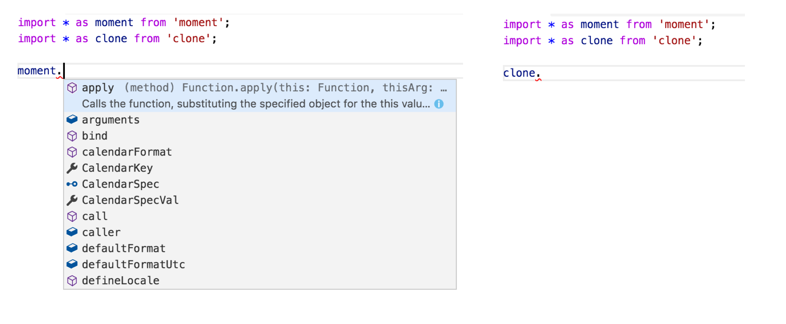

# Typescript
<br>
<small>by Peter Cosemans</small>

<small>
Copyright (c) 2017 Euricom nv.
</small>

---

# Quickstart
> The basic setup

https://github.com/Microsoft/TypeScript/wiki/Roadmap#23-may-2017

----

## Install

Install

```bash
$ npm install typescript -g
```

Configure

``` bash
$ tsc --init          -> creates the tsconfig.json
```

```json
// https://www.typescriptlang.org/docs/handbook/compiler-options.html
{
    "compilerOptions": {
        "module": "commonjs",
        "target": "es5",
        "strict": false,
        "noImplicitAny": false,
    },
    "exclude": [
       "node_modules"
    ]
}
```

main.ts

```ts
const message = 'hello world'
console.log(message);
```

Compile

```bash
$ tsc main.ts        # creates the main.js file
```

----

## More config

To support ES6+ you need to specify the library to support.

Used for:

- Object.assign & Object.is
- Map / Set
- ...

```json
{
    "compilerOptions": {
        ...
        "lib": ["es2017", "dom"]
    }
}
```

See also:
https://www.typescriptlang.org/docs/handbook/compiler-options.html

----

## Run typescript without compile

Install

```bash
# install ts-node
$ npm install ts-node -g
```

Run it

```bash
ts-node main.ts
```

Relaunch on code change

```bash
$ npm install nodemon -g
$ nodemon --exec ts-node main.ts
```

Add as npm script

```package.json
{
    "name": "temp",
    "version": "1.0.0",
    "scripts": {
        "serve": "nodemon --exec ts-node ./main.ts"
    },
    ...
}
```

> Don't use ts-node in production

----

## TypeScript in the browser

```json
    // tsconfig.json
    {
        "compilerOptions": {
            "emitDecoratorMetadata": true,
            "experimentalDecorators": true,
            "moduleResolution": "node",
            "target": "es5",
            ...
        }
    }
```

```js
    // webpack.config.js
    module.exports = {
        entry: './main.js',
        output: { path: __dirname, filename: 'bundle.js' },
        module: {
            loaders: [
                {
                    test: /.ts?$/,
                    loader: 'ts-loader',
                }
            ]
        },
    };
```

The TypeScript version defined which features you can use.

----

## Don't forget the polyfills

For Map, Set, Object.xxx, ...
<br><small>If you target older browsers (IE, PhantomJS, ...)</small>

```js
    // index.js
    import 'core-js';
    // or babel/polyfill
    // or es6-shim
```

```js
    // polyfills.ts (from angular2)
    import 'core-js/es6/symbol';
    import 'core-js/es6/object';
    import 'core-js/es6/function';
    import 'core-js/es6/parse-int';
    import 'core-js/es6/parse-float';
    import 'core-js/es6/number';
    import 'core-js/es6/math';
    import 'core-js/es6/string';
    import 'core-js/es6/date';
    import 'core-js/es6/array';
    ...
    import 'core-js/es7/reflect';
    import 'zone.js/dist/zone';
```

---

## Linting your code

Install tslint (https://palantir.github.io/tslint/)

```bash
$ yarn add tslint@4.5.x --dev
$ yarn add tslint-config-shopify --dev

# or
$ yarn add tslint@4.5.x tslint-config-shopify --dev
```

Config: tslint.json

```json
// tslint.json
{
    "extends": "tslint-config-shopify",
    "rules": {
        "no-console": [false, "log", "error"]
    }
}
```

Add npm script

```json
"scripts": {
    ...
    "lint": "tslint --project tsconfig.json --type-check"
}
```

----

## Linting your code

Other tslint configs

- https://github.com/blakeembrey/tslint-config-standard

Angular tslint configs

- http://codelyzer.com/
- https://github.com/valor-software/tslint-config-valorsoft

----

## ts-node template

```
.../topics/javascript/template/ts-node
```

Template ready to:

- Run any typescript code in nodeJS
- Editorconfig for consistent tabs/spacing
- TSLint typescript with [shopify styleguide](https://github.com/Shopify/javascript)

----

### Roadmap / features

*** https://github.com/Microsoft/TypeScript/wiki/Roadmap ***

v2.1 (preferred or higher)

- Async/Await (ES7)
- Object spread operator (ES7)
- Untyped (implicit-any) imports

v2.0

- Trailing Commas in Function Param Lists (ES7)
- @types support (previously tsc & typings)
- Non-nullable types

> Don't use Typescript 1.x anymore

---

# Features

> More about differences to ES6+

---

### Classes

ES6

```
class Person {
    constructor(name) {
        this.name = name;
    }
}
```

Typescript

```js

class Person {
    name: string;
    constructor(name: string) {
        this.name = name;
    }
}
```

Typescript (short syntax)

```js
class Person {
    constructor(private name: string) {
    }

    sayName() {
        console.log(`my name is: ${this.name}`)
    }
}
```

---

## TypeScript Type System
> TypeScript is javascript + typings

----

### Basic Annotations

The following example demonstrates type annotations can be used for variables, function parameters and function return values.

    var num: number = 123;
    function identity(num: number): number {
        return num;
    }

----

### Simple Types

The JavaScript primitive types are well represented in the TypeScript type system. This means string, number, boolean as demonstrated below:

```
    var num: number;
    var str: string;
    var bool: boolean;
    var stringArray: string[];
    var power: any;

    num = 123;
    num = 123.456;
    num = '123'; // Error
```

```
    str = '123';
    str = 123; // Error

    power = '123';
    power = 123;

    bool = true;
    bool = false;
    bool = 'false'; // Error

    stringArray = ['123', '456']
```

----

### Interfaces

    interface Name {
        first: string;
        second: string;
    }

    var name: Name;
    name = {
        first: 'John',
        second: 'Doe'
    };

or

    var name: Name = {
        first: 'John',
        second: 'Doe'
    };

----

### Special types

```js
    // Use :void to signify that a function does not have a return type.
    function log(message): void {
        ...
    }

    // Union Type: one of multiple types
    function formatCommandline(command: string[]|string) {
        ...
    }

    // Generics: Like in C#
    function reverse<T>(items: T[]): T[] {
        ...
    }
```

----

### 3th party libraries types

Try to use 3th party libraries

```bash
#install moment & clone modules
npm install clone moment --save
```

And use it

    import * as clone from 'clone'
    import * as moment from 'moment'

Notice we have autocompletion on `moment` but not with `clone`



----

### Typing files

Moment provide typing files: `moment.d.ts`. Contains all types provided by `moment.js`

    ./node_modules/moment/moment.d.ts

`Clone` doesn't provide these, but we can install them separately

    npm install @types/clone --save-dev

Now you have the full type information available. See also: http://microsoft.github.io/TypeSearch/

> Before Typescript 2.1 typing where always required!

----

### Define your own typings

declarations.d.ts

```js
    // modules without @types (not required anymore on TS 2.1+)
    declare module 'uuid-js';
    declare module 'invariant';
```

```js
    // enumify
    declare module 'enumify' {
        class Enum {
            public static enumValueOf(any): Enum;
            public static initEnum(any): any;
            public static enumValues: any;

            public name: string
        }
    }
```

```
    // the global window
    interface Window {
        fetch:(url: string, options?: {}) => Promise<any>
        process: any
    }
```

---

# Resources

- [Rangle.IO Typescript](https://angular-2-training-book.rangle.io/handout/features/typescript.html)
- [TypeScript Weekly](https://www.typescript-weekly.com/)
- [TOP 10 JAVASCRIPT TRAPS FOR A C# DEVELOPER](http://prasadhonrao.com/top-10-javascript-traps-for-a-csharp-developer/)
