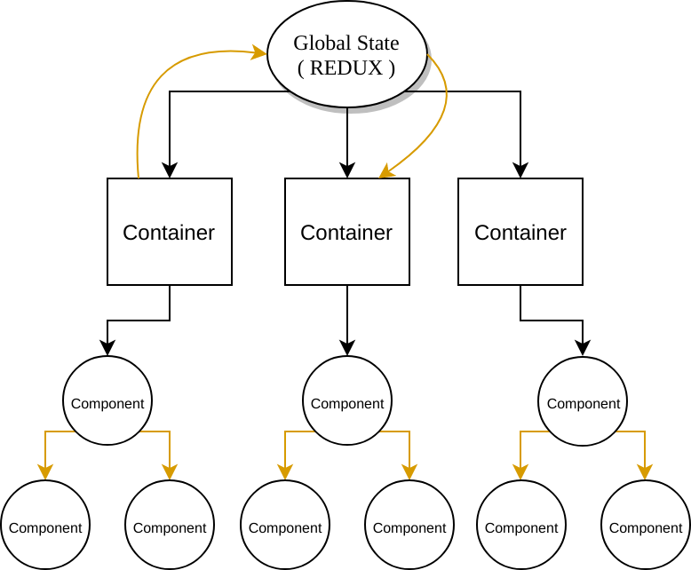
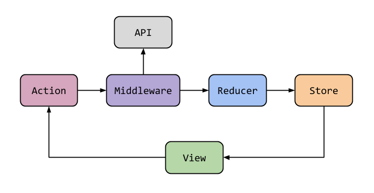

## React Redux

<br>

<small>
Copyright (c) 2018-2019 Euricom nv.
</small>

---

### React State

<br>

🤔 Which different ways to manage state do you know?

---//

#### Local (Component) state

```jsx
import React, { useCallback, useState } from 'react';

function Counter() {
  const [counter, setCounter] = useState(0);

  const increment = useCallback(() => {
    setCounter(current => current + 1);
  }, []);

  return (
    <>
      <span>{counter}</span>
      <button type="button" onClick={increment}>
        +
      </button>
    </>
  );
}

export default Counter;
```

---//

#### Container state

```jsx
import React, { useState, useEffect } from 'react';

import * as userApi from '../../api/users';
import UserList from './user-list';

function UserContainer() {
  //👉 State is uplifted to container component
  const [users, setUsers] = useState([]);

  useEffect(() => {
    async function fetchUsers() {
      const userResources = await userApi.listPaged(1, 20);

      setUsers(userResources);
    }

    fetchUsers();
  }, []);

  // The rendering is done in another component
  return <UserList users={users} />;
}

export default UserContainer;
```

---//

#### Contextual (Provided) State

```jsx
import React, { useState, useContext } from 'react';

const ThemeContext = React.createContext();

function ThemedApp() {
  const [color, setColor] = useState('light');

  return (
    <ThemeContext.Provider value={color}>
      <button type="button" onClick={() => setColor('dark')}>
        Switch to dark
      </button>
      <AppBar />
    </ThemeContext.Provider>
  );
}

function AppBar() {
  const themeColor = useContext(ThemeContext);

  return <span>{themeColor}</span>;
}

export default ThemedApp;
```

---//

#### Global State

🤔What if you wanted to share state across the entire application?

<br>

<!-- .element: class="fragment" data-fragment-index="1" -->

---

### Redux



---//

#### Redux - Getting Started

```bash
# Install redux
npm i --save redux

# Later on you probably want react bindings & developer tools
npm i react-redux
npm i --save-dev redux-devtools
```

---//

#### [Actions](https://redux.js.org/basics/actions#actions)

Actions are payloads of information that send data from your application to your store (using [`store.dispatch()`](https://redux.js.org/api/store#dispatchaction)).

```js
// 💡Types should typically be defined as string constants.
// Usually stored in a separate module actionTypes.js
const INCREMENT = 'INCREMENT';

// 💡An action is a plain Javascript object
const action = {
  type: INCREMENT // ⚠️ All actions MUST have a type
};
```

---//

#### [Flux Standard Action](https://github.com/redux-utilities/flux-standard-action)

👉 Other than `type`, redux leaves the structure of an action up to you.

- An action MUST be a plain JavaScript object and have a `type` property.
- An action MAY have an `error`, a `meta` and/or a `payload` property
- An action MUST NOT include properties other than type, payload, error, and meta

---//

#### [Action Creators](https://redux.js.org/basics/actions#action-creators)

Action creators are exactly that—functions that create actions.

```js
const ADD_TODO = 'ADD_TODO';

// 💡In Redux, action creators simply return an action
export function addTodo(todo) {
  return {
    type: ADD_TODO,
    payload: todo
  };
}
```

---//

#### [Reducers](https://redux.js.org/basics/reducers)

Reducers specify how the application's state changes in response to actions sent to the store.

```js
// 💡 A reducer is a pure function
// that takes the previous state and an action,
// and returns the next state.
const reducer = (previousState, action) => newState;
```

<small>
💡Remember that actions only describe what happened, but don't describe how the application's state changes.
<small>

---//

#### [Reducers](https://redux.js.org/basics/reducers)

It's called a reducer because it's the type of function you would pass to [`Array.prototype.reduce(reducer, ?initialValue)`](https://developer.mozilla.org/en-US/docs/Web/JavaScript/Reference/Global_Objects/Array/Reduce).

It's very important that the reducer stays pure, **never**:

- Mutate its arguments
- Perform side effects (API calls and routing transitions)
- Call non-pure functions, e.g. `Date.now()` or `Math.random()`.

---//

#### Reducers - `switch`

```js
const REVEAL: 'REVEAL';

const initialState = { visible: false };

// 👉 Using ES6 defaults arguments syntax
function visibilityReducer(state = initialState, action) {
  switch (action) {
    case REVEAL:
      return {
        visible: true,
      };
    default:
      // Return the previous state for any unknown action.
      return state;
  }
}
```
