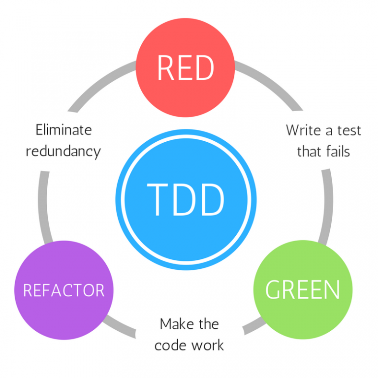

## React Router

<br>

> Declarative routing for React

<small>
Copyright (c) 2018-2019 Euricom nv.
</small>

---

### Getting Started

```bash
npm i --save react-router react-router-dom
```

```jsx
// ./app.jsx
import React from 'react';
import { BrowserRouter as Router } from 'react-router-dom';

const Home = () => <h1>Home</h1>;

function App() {
  return (
    <Router>
      <Route path="/" component={Home} />
    </Router>
  );
}

export default App;
```

---//

#### Route - render methods

There are 3 ways to render something with a route:

```jsx
// As a component prop (⚠️ inlining)
<Route path="/" component={Home} />

// As a render prop
<Route path="/" render={Home} />

// As children
<Route path="/"><Home /></Route>
```

> Both component and render will only be called when the route matches, children will in any case!

---//

#### Route - props

All 3 methods will passed the same 3 route props

- [match](https://reacttraining.com/react-router/web/api/match)
- [location](https://reacttraining.com/react-router/web/api/location)
- [history](https://reacttraining.com/react-router/web/api/history)

```js
const Home = ({ ...props }) => console.log(props) || <h1>Home</h1>;
```

---//

#### Route - path

Any valid URL path or array of paths that [path-to-regexp](https://github.com/pillarjs/path-to-regexp/tree/v1.7.0) understands.

```jsx
const ProductDetail = ({ id }) => <h1>Detail {id}</h1>;

function App() {
  return (
    <Router>
      <Route path="/" component={Home} />
      <Route
        path="/product/:id([0-9]+)"
        render={({ match }) => <ProductDetail id={match.params.id} />}
      />
    </Router>
  );
}

export default App;
```

⚠️ All params are string's!

---//

#### Route - exact

Oops, both routes matched when navigating to /product/11 🚫

> ✅ Add the **exact** modifier

```jsx
<Route path="/" exact component={Home} />
```

---//

#### Route - Query

🤔 What about query parameters?

```jsx
// Add the following component
const Score = ({ achieved = 0, maximum = 0 }) => (
  <h1>
    Scored {achieved} out of {maximum}
  </h1>
);

// Add the following route
<Route
  path="/score"
  render={({ location: { search } }) => {
    console.log(search);

    return <Score />;
  }}
/>;
```

---//

#### Route - Query

We have access to the routes query string via the search property of the [location](https://reacttraining.com/react-router/web/api/location) route prop

```bash
# Output in console
?achieved=1&maximum=5
```

❓How can we parse this query string?

---//

#### Route - Parsing qs

- using a npm package
  - [query-string](https://www.npmjs.com/package/query-string)
  - [querystringify](https://www.npmjs.com/package/querystringify)
- using the [URLSearchParams](https://developer.mozilla.org/en-US/docs/Web/API/URLSearchParams) interface

---//

#### Route - Parsing qs

```jsx
// Adapt the score route
<Route
  path="/score"
  render={({ location: { search } }) => {
    const query = new URLSearchParams(search);

    const achieved = query.get('achieved');
    const maximum = query.get('maximum');

    return <Score achieved={achieved} maximum={maximum} />;
  }}
/>
```

---//

#### Route - nesting

```jsx
import React from 'react';
import { BrowserRouter as Router, Route } from 'react-router-dom';

const Home = ({ ...props }) => console.log(props) || <h1>Home</h1>;
const Product = () => <h1>List</h1>;
const ProductDetail = ({ id }) => <h1>Detail {id}</h1>;

function App() {
  return (
    <Router>
      <Route path="/" exact component={Home} />
      <Route
        path="/product"
        render={({ match: { url } }) => (
          <>
            <Route path={`${url}/`} component={Product} exact />
            <Route
              path={`${url}/:id([0-9]+)`}
              render={({ match }) => <ProductDetail id={match.params.id} />}
            />
          </>
        )}
      />
    </Router>
  );
}

export default App;
```

---

### Switch

Renders the first <code>&lt;Route&gt;</code> (or <code>&lt;Redirect&gt;</code>) that matches that location

> **Switch** is unique in that it renders a route exclusively. In contrast, every <code>&lt;Route&gt;</code> that matches the location renders inclusively.

---//

#### Switch

```jsx
import React from 'react';
import { BrowserRouter as Router, Route, Switch } from 'react-router-dom';

const Home = ({ ...props }) => console.log(props) || <h1>Home</h1>;

const Product = () => <h1>List</h1>;
const ProductDetail = ({ id }) => <h1>Detail {id}</h1>;
const NotFound = () => <h1>NotFound</h1>;

function App() {
  return (
    <Router>
      <Switch>
        <Route path="/" component={Home} exact />
        <Route path="/product" exact component={Product} />
        <Route
          path="/product/:id([0-9]+)"
          render={({ match }) => <ProductDetail id={match.params.id} />}
        />
        <Route component={NotFound} />
      </Switch>
    </Router>
  );
}
```

---

### <code>withRouter</code>

🤔 What if we want the same 3 route props outside of a <code>&lt;Route&gt;</code>, or not directly nested under one of the 3 render methods?

```jsx
const ShowLocation = ({ location = {} }) => (
  <span>{location.pathname || 'unknown'}</span>
);
```

---//

#### <code>withRouter</code> ✅

```jsx
import React from 'react';
import { BrowserRouter as Router, Route, Switch } from 'react-router-dom';

const Home = ({ ...props }) => <h1>Home</h1>;

const ShowLocation = ({ location = {} }) => (
  <span>{location.pathname || 'unknown'}</span>
);

function App() {
  return (
    <Router>
      <Switch>
        <Route path="/" component={Home} exact />
        <Route path="/show" component={ShowLocation} />
      </Switch>
    </Router>
  );
}
```

---//

#### <code>withRouter</code> 🚫

```jsx
import React from 'react';
import { BrowserRouter as Router, Route, Switch } from 'react-router-dom';

const Home = ({ ...props }) => <h1>Home</h1>;

const ShowLocation = ({ location = {} }) => (
  <span>{location.pathname || 'unknown'}</span>
);

function App() {
  return (
    <Router>
      <ShowLocation />
      <Switch>
        <Route path="/" component={Home} exact />
        <Route path="/show" component={ShowLocation} />
      </Switch>
    </Router>
  );
}
```

---//

#### <code>withRouter</code> ✅

```jsx
import React from 'react';
import {
  BrowserRouter as Router,
  Route,
  Switch,
  withRouter
} from 'react-router-dom';

const ShowLocation = withRouter(({ location = {} }) => (
  <span>{location.pathname || 'unknown'}</span>
));

const Home = ({ ...props }) => <h1>Home</h1>;

function App() {
  return (
    <Router>
      <ShowLocation />
      <Switch>
        <Route path="/" component={Home} exact />
      </Switch>
    </Router>
  );
}
```

---//

#### <code>withRouter</code>

💡 You can get access to the history object’s properties and the closest <code>&lt;Route&gt;</code>'s match via the <code>withRouter</code> higher-order component. <code>withRouter</code> will pass updated match, location, and history props to the wrapped component whenever it renders.

---

### Navigating


<small>⚰️ Anton Yelchin (19 june, 2016)</small>

---//

#### Navigating - anchor

```jsx
import React, { useEffect } from 'react';
import { BrowserRouter as Router, Route, Switch } from 'react-router-dom';

// Module components
const Home = () => <h1>Home</h1>;
const Product = () => <h1>Product</h1>;

// Our App
function App() {
  useEffect(() => {
    console.log('mounted');
  }, []);

  return (
    <Router>
      <a href="/product">Product</a>
      <Switch>
        <Route path="/" component={Home} exact />
        <Route path="/product" component={Product} />
      </Switch>
    </Router>
  );
}
```

---//

#### Navigating - anchor

Console output (with option Preserve Log checked):

```bash
mounted # <== Initial mount (useEffect triggers)
Navigated to http://localhost:8080/product # <== We clicked the link
mounted # <== Another mount 🚫
```

> Also we noticed the ⚡ due to full reload of the app

---//

#### Navigating - Link

```jsx
// Add Link
import { /**..., */ Link } from 'react-router-dom';

// Change the <a>
<Link to="/product">Product</Link>;
```

Console output ✅:

```bash
mounted # <== Initial mount (useEffect triggers)
```

Html output:

```html
<a href="/product">Product</a>
```

---//

#### Navigating - [Link](https://reacttraining.com/react-router/web/api/Link) 💡

Provides declarative, accessible navigation around your application

- to (string): A string representation of the location to link to
- to (object): An object that can have any of the following properties (pathname, search, hash or state)
- replace (bool): When true, clicking the link will replace the current entry in the history
- others: title, target, etc will added to underlying anchor

---//

#### Navigating - NavLink

```jsx
// Change Link to NavLink
import { /**..., */ NavLink } from 'react-router-dom';

// Change the <Link>
<NavLink to="/product">Product</NavLink>;
```

Html output (/):

```html
<a href="/product">Product</a>
```

Html output (/product):

```html
<a href="/product" class="active">Product</a>
```

---//

#### Navigating - [NavLink](https://reacttraining.com/react-router/web/api/NavLink) 💡

A special version of the <code>&lt;Link&gt;</code> that will add styling attributes to the rendered element when it matches the current URL.

- activeClassName (string): The class to give the element when it is active (active=default)
- activeStyle (object): The styles to apply to the element when it is active.
  ---//

#### Navigating - Programmatically

```jsx
// we need withRouter again
import { /**..., */ withRouter } from 'react-router-dom';

// the component
const ProductLinkButton = withRouter(({ history }) => {
  const onClicked = () => {
    history.push('/product');
  };

  return (
    <button type="button" className="btn btn-primary" onClick={onClicked}>
      Product
    </button>
  );
});
```

---

### Prompt

🤔 What if we wanted to ask the user a confirmation before a navigation action occurs?

```jsx
import { /**..., */ Link, Prompt } from 'react-router-dom';

// Our product module
const Product = () => (
  <d>
    <h1>Product</h1>
    <Link to="/">Back Home</Link>
    <Prompt message="Are you sure?" />
  </d>
);

// Our app
function App() {
  return (
    <Router>
      <Switch>
        <Route path="/" component={Home} exact />
        <Route path="/product" component={Product} />
      </Switch>
    </Router>
  );
}
```

---//

#### [Prompt](https://reacttraining.com/react-router/core/api/Prompt)

Used to prompt the user before navigating away from a page. When your application enters a state that should prevent the user from navigating away (like a form is half-filled out), render a <code>&lt;Prompt&gt;</code>.

- message (string): The message to prompt the user with when they try to navigate away.
- when (bool): Instead of conditionally rendering a <code>&lt;Prompt&gt;</code> behind a guard, you can always render it but pass when={true} or when={false} to prevent or allow navigation accordingly.

---

### Redirect

🤔 What if we wanted to reroute the user depending on some logic?

```jsx
import { Redirect } from 'react-router';

// Just render the redirect component conditionally
<Redirect to="/dashboard" />;
```

---//

#### [Redirect](https://reacttraining.com/react-router/core/api/Redirect) 💡

Rendering a <code>&lt;Redirect&gt;</code> will navigate to a new location. The new location will override the current location in the history stack, like server-side redirects (HTTP 3xx) do.

- to (string): The URL to redirect to.
- push (bool): When true, redirecting will push a new entry onto the history instead of replacing the current one.

---

### React Testing Library?

```bash
npm i --save-dev history
```

```jsx
// ./test/react-testing-helpers (⚠️ <=> https://testing-library.com/docs/example-react-router)
import React from 'react';
import { createMemoryHistory } from 'history';
import { Router } from 'react-router-dom';
import { render } from '@testing-library/react';

export function renderWithRouter(
  ui,
  {
    route = '/',
    history = createMemoryHistory({
      initialEntries: [route]
    })
  } = {}
) {
  return {
    ...render(ui, {
      wrapper: props => <Router {...props} history={history} />
    }),
    // adding `history` to the returned utilities to allow us
    // to reference it in our tests (just try to avoid using
    // this to test implementation details).
    history
  };
}
```

---

### Resources

> See https://reacttraining.com/react-router/web/guides/quick-start

---

### Exercises



---//

#### Exercises - Code of Conduct

- Use the force (TDD)
- Use a module centric folder structure
  - all main page components under modules/\${module}
  - all components not shared between modules under modules/{module}/components
  - all components used within components under components/{root} or modules/{module}/components/{root}

---//

#### Exercise 1 - Layout app

- Create following module components: Home(/), Login(/login), pages/notFound.jsx.
- The components are not tested for the time being and contain a h1 with the title
- Verify for all the routes that your app uses the correct module component

💡Hints

<!-- .element: class="fragment" data-fragment-index="1" -->

- Default export <=> named export.
- Remember that components can be mocked too !

<!-- .element: class="fragment" data-fragment-index="1" -->

```js
jest.mock('./path/component', () => () => <div />);
```

<!-- .element: class="fragment" data-fragment-index="1" -->
