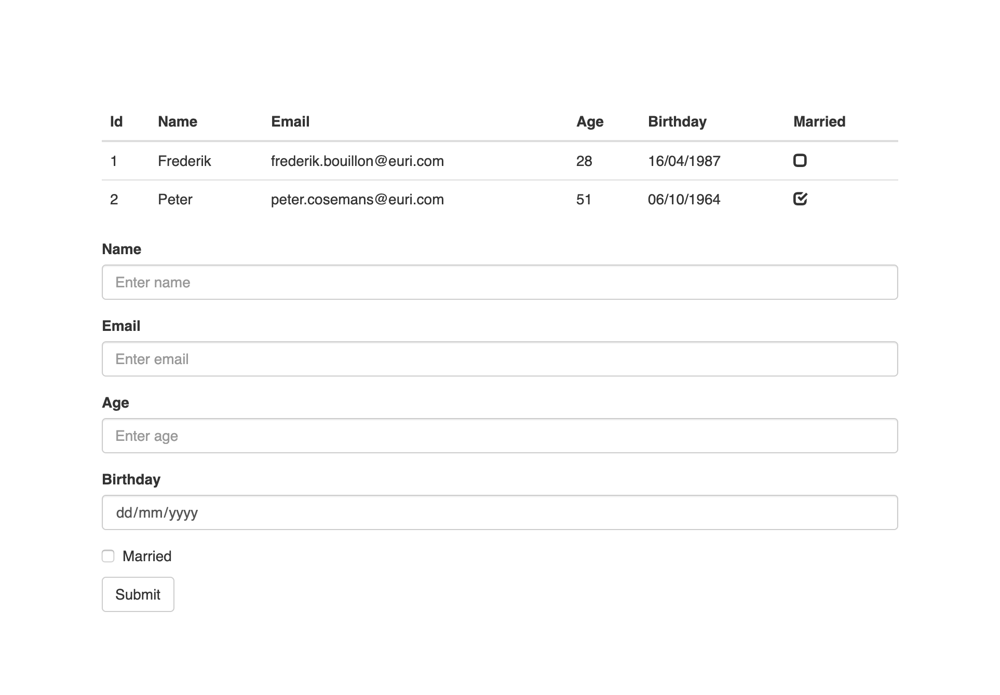

# Exercises
## 1. personApp in React


1. Create a new file (personTable.js) to render the table with the following default data.

    Edit App.css
    ```
    .App {
    margin: 100px;
    }
    ```
    Add bootstrap in index.html
    ```
    <link rel="stylesheet" href="https://stackpath.bootstrapcdn.com/bootstrap/3.4.1/css/bootstrap.min.css"
        integrity="sha384-HSMxcRTRxnN+Bdg0JdbxYKrThecOKuH5zCYotlSAcp1+c8xmyTe9GYg1l9a69psu" crossorigin="anonymous">
    ```
    Default data:
    ```
    persons: [
        {
            id: 1,
            name: "Frederik",
            email: "frederik.bouillon@euri.com",
            age: 28,
            birthday: "16/04/1987",
            married: false
        },
        {
            id: 2,
            name: "Peter",
            email: "peter.cosemans@euri.com",
            age: 51,
            birthday: "06/10/1964",
            married: true
        }
    ]
    ```
    Table structure (optional -> render table headers dynamically):
    ```
    <table className="table">
        <thead>
            headings -> <th style={{ textTransform: 'capitalize' }}>{...}</th>
        </thead>
        <tbody>
            persons
        </tbody>
    </table>
    ```
    Checkboxes
    ```
    <span className="glyphicon glyphicon-unchecked"></span>
    <span className="glyphicon glyphicon-check"></span>
    ```
2. Create a new file (personForm.js) to add a new person. After a new person is added the form should be emptied

    Styled form:
    ```
    <form>
        <div className="form-group">
            <label htmlFor="name">Name</label>
            <input type="text" className="form-control" id="name" placeholder="Enter name" value={...} onChange={...} />
        </div>
        ...
        <button type="submit" className="btn btn-default" onClick={...}>Submit</button>
    </form>
    ```
    To prevent the submit button from submitting the page
    ```
    e.preventDefault()
    ```
    Code for generating a user ID:
    ```
    _generateUserId: function(users) {
        if (users.length > 0) {
            var lastUser = users[users.length - 1];
            return lastUser.id + 1;
        }
        return 1;
    }
    ```


------

## 2. userApp propTypes
Add propTypes to our components from our userApp.


## 3. Lifecycle events
Add all the different lifecycle events to our userApp. Let them all console.log their name and try to trigger them all.
