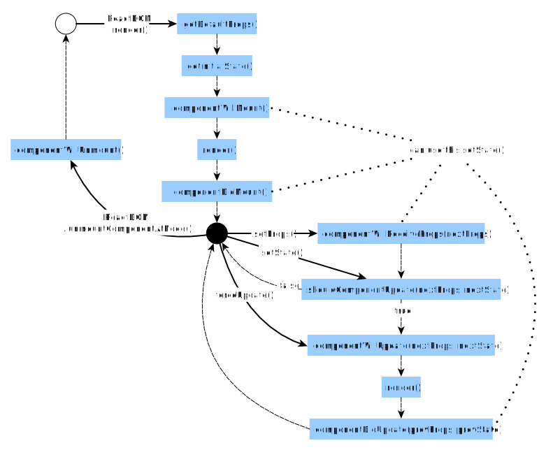

## React Lifecycle Methods
You can think of React lifecycle methods as the series of events that happen from the birth of a React component to its death.

Every component in React goes through a lifecycle of events. I like to think of them as going through a cycle of birth, growth, and death.

* Mounting – Birth of your component
* Update – Growth of your component
* Unmount – Death of your component

Now that we understand the series of lifecycle events let’s learn more about how they work.

## Common React Lifecycle Methods
### render()
The render() method is the most used lifecycle method. You will see it in all React classes. This is because render() is the only required method within a class component in React.

As the name suggests it handles the rendering of your component to the UI. It happens during the mounting and updating of your component.

Below is an example of a simple render() in React.
```
class Hello extends Component{
   render(){
      return <div>Hello {this.props.name}</div>
   }
}
```
As you can see in the example above, the render() method returns JSX that is displayed in the UI. A render() can also return a null if there is nothing to render for that component.

**A render() method has to be pure with no side-effects.**

React requires that your render() is pure. Pure functions are those that do not have any side-effects and will always return the same output when the same inputs are passed. This means that you can not setState() within a render().

*You cannot modify the component state within the render().*

If you do need to modify state that would have to happen in the other lifecycle methods, therefore keeping render() pure.

Furthermore, keeping your render() simple and clean without state updates makes your app maintainable.

### componentDidMount()
Now your component has been mounted and ready, that’s when the next React lifecycle method componentDidMount() comes in play.

*componentDidMount()* is called as soon as the component is mounted and ready. This is a good place to initiate API calls, if you need to load data from a remote endpoint.

Unlike the render() method, componentDidMount() allows the use of setState(). Calling the setState() here will update state and cause another rendering but it will happen before the browser updates the UI. This is to ensure that the user will not see any UI updates with the double rendering.

*You can modify the component state within the componentDidMount(), but use it with caution.*

**Caution**: It is recommended that you use this pattern with caution since it could lead to performance issues. The best practice is to ensure that your states are assigned in the constructor(). The reason React allows the setState() within this lifecycle method is for special cases like tooltips, modals, and similar concepts when you would need to measure a DOM node before rendering something that depends on its position.

### componentDidUpdate()
This lifecycle method is invoked as soon as the updating happens. The most common use case for the componentDidUpdate() method is updating the DOM in response to prop or state changes.

You can call setState() in this lifecycle, but keep in mind that you will need to wrap it in a condition to check for state or prop changes from previous state. Incorrect usage of setState() can lead to an infinite loop.

**You can modify the component state within the componentDidUpdate(), but use it with caution.**

Take a look at the example below that shows a typical usage example of this lifecycle method.
```
componentDidUpdate(prevProps) {
 //Typical usage, don't forget to compare the props
 if (this.props.userName !== prevProps.userName) {
   this.fetchData(this.props.userName);
 }
}
```
Notice in the above example that we are comparing the current props to the previous props. This is to check if there has been a change in props from what it currently is. In this case, there won’t be a need to make the API call if the props did not change.

### componentWillUnmount()
As the name suggests this lifecycle method is called just before the component is unmounted and destroyed. If there are any cleanup actions that you would need to do, this would be the right spot.

**You cannot modify the component state in componentWillUnmount lifecycle.**

This component will never be re-rendered and because of that we cannot call setState() during this lifecycle method.
```
componentWillUnmount() {
 window.removeEventListener('resize', this.resizeListener)
}
```
Common cleanup activities performed in this method include, clearing timers, cancelling api calls, or clearing any caches in storage.


Continue from url -> https://programmingwithmosh.com/javascript/react-lifecycle-methods/


# BELOW TO BE REVIEWED >>>>>>>

Each component you make will have its own lifecycle events that are useful for various things.

For example, if we wanted to make an ajax request on the initial render and fetch some data, where would we do that? Or, if we wanted to run some logic whenever our props changed, how would we do that?

The different lifecycle events are the answers to both of those.

    // app.js
    class EmployeeContainer extends React.Component{
        constructor(props) {
            super(props);
            this.state = {
              company: 'Euricom',
              employees: ['Peter', 'Niels', 'Kevin'],
              newEmployee: '',
              errors: {}
            }
        }

        // Invoked once before first render
        componentWillMount() {
            // Calling setState here does not cause a re-render
            console.log('Component Will Mount');
        }

        // Invoked once after the first render
        componentDidMount() {
            console.log('Component Did Mount');
        }

        // Invoked whenever there is a prop change
        // Called BEFORE render
        componentWillReceiveProps(nextProps) {
        // Not called for the initial render
        // Previous props can be accessed by this.props
        // Calling setState here does not trigger an additional re-render
            console.log('Component Will Receive Props');
        }

        // Called IMMEDIATELY before a component is unmounted
        componentWillUnmount(){ }

        render() {
            return (
                <div>
                    <h1>{this.state.company}</h1>
                    <AddEmployee    newEmployee={this.state.newEmployee}
                                    onHandleChangeEmployee={(e) => this._onHandleChangeEmployee(e)}
                                    addNewEmployee={(newEmployee) => this._addNewEmployee(newEmployee)}
                                    errors={this.state.errors}/>
                    <EmployeeList employees={this.state.employees}/>
                </div>
            )
        }

        _onHandleChangeEmployee(e) {
            this.setState({
                newEmployee: e.target.value
            })
        }

        _addNewEmployee() {
            if (this._isInputValid()) {
                this.setState({
                    employees: this.state.employees.concat(this.state.newEmployee),
                    newEmployee: ''
                })
            }
        }

        _isInputValid() {
            var isValid = true;
            var errors = {};

            if (this.state.newEmployee.length < 3) {
                isValid = false;
                errors.newEmployee = 'New employee must be at least 3 characters';
            }

            this.setState({
                errors: errors
            });

            return isValid;
        }
    }

#### componentWillMount
Invoked once before the initial render. If you were to call setState here, no re-render would be invoked. An example of this would be if you’re using a service like firebase, you’d set up your reference to your firebase database here since it’s only invoked once on the initial render.

#### componentDidMount
Invoked once after the initial render. Because the component has already been invoked when this method is invoked, you have access to the virtual DOM if you need it. You do that by calling this.getDOMNode(). Now it might seem like if you wanted to make AJAX requests you would do that in componentWillMount, but the devs at facebook actually recommend you do that in componentDidMount. So this is the lifecycle event where you’ll be making your AJAX requests to fetch some data.

#### componentWillReceiveProps
This life cycle is not called on the initial render, but is instead called whenever there is a change to props. Use this method as a way to react to a prop change before render() is called by updating the state with setState.

#### shouldComponentUpdate
Invoked before rendering when new props or state are being received. This method is not called for the initial render.

Use this as an opportunity to return false when you're certain that the transition to the new props and state will not require a component update.

If shouldComponentUpdate returns false, then render() will be completely skipped until the next state change. In addition, componentWillUpdate and componentDidUpdate will not be called.

By default, shouldComponentUpdate always returns true to prevent subtle bugs when state is mutated in place, but if you are careful to always treat state as immutable and to read only from props and state in render() then you can override shouldComponentUpdate with an implementation that compares the old props and state to their replacements.

If performance is a bottleneck, especially with dozens or hundreds of components, use shouldComponentUpdate to speed up your app.

#### componentWillUpdate
Invoked immediately before rendering when new props or state are being received. This method is not called for the initial render.

Use this as an opportunity to perform preparation before an update occurs.

#### componentDidUpdate
Invoked immediately after the component's updates are flushed to the DOM. This method is not called for the initial render.

Use this as an opportunity to operate on the DOM when the component has been updated.

#### componentWillUnmount
This life cycle is invoked immediately before a component is unmounted from the DOM. This is where you can do necessary clean up. For example, going back to our firebase example this is the life cycle event where you would clean up your firebase reference you set in componentWillMount.

There are a few more life cycle methods, but these are the ones that are used the most.
You can find a full overview <a href="https://facebook.github.io/react/docs/component-specs.html#lifecycle-methods">here</a>

## React lifecycle graphic overview


**EXERCISE**
[Complete exercises 4](https://github.com/Euricom/frontend-bootcamp-2016Q1/blob/master/topics/8.%20react-and-flux/exercises/Chapter%201%20The%20basics/exercise.md#exercises)
