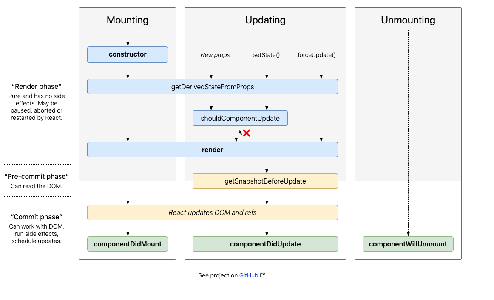

## React Lifecycle Methods
You can think of React lifecycle methods as the series of events that happen from the birth of a React component to its death.

Every component in React goes through a lifecycle of events. I like to think of them as going through a cycle of birth, growth, and death.

* **Mounting** – Birth of your component
* **Update** – Growth of your component
* **Unmount** – Death of your component

Now that we understand the series of lifecycle events let’s learn more about how they work.

## Common React Lifecycle Methods
### render()
The render() method is the most used lifecycle method. You will see it in all React classes. This is because render() is the only required method within a class component in React.

As the name suggests it handles the rendering of your component to the UI. It happens during the mounting and updating of your component.

Below is an example of a simple render() in React.
```
class Hello extends Component{
   render(){
      return <div>Hello {this.props.name}</div>
   }
}
```
As you can see in the example above, the render() method returns JSX that is displayed in the UI. A render() can also return a null if there is nothing to render for that component.

**A render() method has to be pure with no side-effects.**

React requires that your render() is pure. Pure functions are those that do not have any side-effects and will always return the same output when the same inputs are passed. This means that you can not setState() within a render().

*You cannot modify the component state within the render().*

If you do need to modify state that would have to happen in the other lifecycle methods, therefore keeping render() pure.

Furthermore, keeping your render() simple and clean without state updates makes your app maintainable.

### componentDidMount()
Now your component has been mounted and ready, that’s when the next React lifecycle method componentDidMount() comes in play.

*componentDidMount()* is called as soon as the component is mounted and ready. This is a good place to initiate API calls, if you need to load data from a remote endpoint.

Unlike the render() method, componentDidMount() allows the use of setState(). Calling the setState() here will update state and cause another rendering but it will happen before the browser updates the UI. This is to ensure that the user will not see any UI updates with the double rendering.

*You can modify the component state within the componentDidMount(), but use it with caution.*

**Caution**: It is recommended that you use this pattern with caution since it could lead to performance issues. The best practice is to ensure that your states are assigned in the constructor(). The reason React allows the setState() within this lifecycle method is for special cases like tooltips, modals, and similar concepts when you would need to measure a DOM node before rendering something that depends on its position.

### componentDidUpdate()
This lifecycle method is invoked as soon as the updating happens. The most common use case for the componentDidUpdate() method is updating the DOM in response to prop or state changes.

You can call setState() in this lifecycle, but keep in mind that you will need to wrap it in a condition to check for state or prop changes from previous state. Incorrect usage of setState() can lead to an infinite loop.

**You can modify the component state within the componentDidUpdate(), but use it with caution.**

Take a look at the example below that shows a typical usage example of this lifecycle method.
```
componentDidUpdate(prevProps) {
 //Typical usage, don't forget to compare the props
 if (this.props.userName !== prevProps.userName) {
   this.fetchData(this.props.userName);
 }
}
```
Notice in the above example that we are comparing the current props to the previous props. This is to check if there has been a change in props from what it currently is. In this case, there won’t be a need to make the API call if the props did not change.

### componentWillUnmount()
As the name suggests this lifecycle method is called just before the component is unmounted and destroyed. If there are any cleanup actions that you would need to do, this would be the right spot.

**You cannot modify the component state in componentWillUnmount lifecycle.**

This component will never be re-rendered and because of that we cannot call setState() during this lifecycle method.
```
componentWillUnmount() {
 window.removeEventListener('resize', this.resizeListener)
}
```
Common cleanup activities performed in this method include, clearing timers, cancelling api calls, or clearing any caches in storage.

## Uncommon React Lifecycle Methods
We now have a good idea of all the commonly used React lifecycle methods. Besides that, there are other lifecycle methods that React offers which are sparingly used or not used at all.

### shouldComponentUpdate()
This lifecycle can be handy sometimes when you don’t want React to render your state or prop changes.

Anytime *setState*() is called, the component re-renders by default. The *shouldComponentUpdate*() method is used to let React know if a component is not affected by the state and prop changes.

Keep in mind that this lifecycle method should be sparingly used, and it exists only for certain performance optimizations. You cannot update component state in *shouldComponentUpdate*() lifecycle.

**Caution**: Most importantly, do not always rely on it to prevent rendering of your component, since it can lead to several bugs.
```
shouldComponentUpdate(nextProps, nextState) {
 return this.props.title !== nextProps.title ||
  this.state.input !== nextState.input }
  ```
As shown in the example above, this lifecycle should always return a boolean value to the question, *“Should I re-render my component?”*

### static getDerivedStateFromProps()
This is one of the newer lifecycle methods introduced very recently by the React team.

This will be a safer alternative to the previous lifecycle method *componentWillReceiveProps*().

It is called just before calling the *render*() method.

This is a static function that does not have access to “this“.  *getDerivedStateFromProps*() returns an object to update state in response to prop changes. It can return a null if there is no change to state.

This method also exists only for rare use cases where the state depends on changes in props in a component.
```
static getDerivedStateFromProps(props, state) {
    if (props.currentRow !== state.lastRow) {
      return {
        isScrollingDown: props.currentRow > state.lastRow,
        lastRow: props.currentRow,
      };
    }
    // Return null to indicate no change to state.
    return null;
  }
  ```
Keep in mind that this lifecycle method is fired on **every** render.

An example use case where this method may come in handy would be a <Transition> component that compares its previous and next children to decide which ones to animate in and out.

### getSnapshotBeforeUpdate()
*getSnapshotBeforeUpdate*() is another new lifecycle method introduced in React recently. This will be a safer alternative to the previous lifecycle method *componentWillUpdate*().
```
getSnapshotBeforeUpdate(prevProps, prevState) {
    // ...
  }
  ```
It is called right before the DOM is updated. The value that is returned from *getSnapshotBeforeUpdate*() is passed on to *componentDidUpdate*().

Keep in mind that this method should also be used rarely or not used at all.

Resizing the window during an async rendering is a good use-case of when the *getSnapshotBeforeUpdate*() can be utilized.

## React Component Lifecycle Diagram



>>>>> REVIEW EX <<<<<<>>>>>>
**EXERCISE**
[Complete exercises 4](https://github.com/Euricom/frontend-bootcamp-2016Q1/blob/master/topics/8.%20react-and-flux/exercises/Chapter%201%20The%20basics/exercise.md#exercises)
