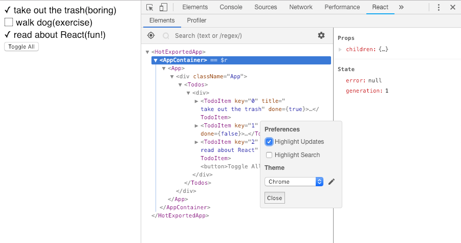

# React

## Dev Tools

<br>

<small>
Copyright (c) 2018-2019 Euricom nv.
</small>

<!-- markdownlint-disable -->
<br>
<style type="text/css">
.reveal section img {
    background:none;
    border:none;
    box-shadow:none;
}
.reveal h1 {
    font-size: 3.0em;
}
.reveal h2 {
    font-size: 2.00em;
}
.reveal h3 {
    font-size: 1.00em;
}
.reveal p {
    font-size: 70%;
}
.reveal blockquote {
    font-size: 100%;
}
.reveal pre code {
    display: block;
    padding: 5px;
    overflow: auto;
    max-height: 800px;
    word-wrap: normal;
    font-size: 100%;
}
</style>

---

# Console.log

> Console logging is your friend

<!-- prettier-ignore -->
***

## Simple log

console logging is your friend

```js
// you can log an object
console.log(user);
```

```js
// log multiple vars
console.log(name + " " + age); // don't use this
console.log(name, age); // both are logged
console.log({ name, age }); // with names
```

```js
// log in table form
const users = [{ id: 1, name: "peter" }, { id: 2, name: "bob" }];
console.table(users);
```

<!-- prettier-ignore -->
***

## Power logging

others

```js
// timing
console.time("myTiming");
longRunningTask();
console.endTime("myTiming"); // OUTPUT: myTiming xxxxms
```

```js
// grouping
console.group("URL Details");
console.log("Scheme: ", schema);
console.log("Host: ", host);
console.groupEnd();
```

<!-- prettier-ignore -->
***

## No console.log in production

eslint config

```js
// .eslintrc.js
module.exports = {
  rules: {
    // ...

    // only allowed in development
    "no-console": process.env.NODE_ENV === "production" ? "error" : "off",
    "no-debugger": process.env.NODE_ENV === "production" ? "error" : "off"
  }
};
```

package.json

```json
{
  "scripts": {
    "lint": "eslint src/**/*.js",
    "lint:prod": "NODE_ENV=production eslint src/**/*.js"
  }
}
```

---

# Debugger

> When thinks getting harder

<!-- prettier-ignore -->
***

## Debugger

The chrome debugger is your best friend.


<!-- prettier-ignore -->
***

## Debugger

```js
function goForIt() {
  const user = {};
  // ...
  debugger; // <------- debugger will stop here
  console.log(user);
}
```

Don't forget to remove it after your debug session.

<!-- prettier-ignore -->
***

### Debugger

Make sure to generate source maps to view source in debugger

```js
// webpack.config.js
module.exports = {
  mode: "development",
  output: {
    // ...
  },
  // eval: fast build & generated code
  // cheap-module-eval-source-map: slower build & orginal code
  // source-map: full source map files
  devtool: "cheap-module-eval-source-map"
};
```

More info see
[WebPack DevTool](https://webpack.js.org/configuration/devtool/#devtool)

<!-- prettier-ignore -->
***

### VSCode Debugging

Install [Debugger for Chrome](https://marketplace.visualstudio.com/items?itemName=msjsdiag.debugger-for-chrome)

Configure Launch Config (.vscode/launch.json)

```json
{
  "version": "0.2.0",
  "configurations": [
    {
      "name": "Chrome",
      "type": "chrome",
      "request": "launch",
      "url": "http://localhost:8080",
      "webRoot": "${workspaceFolder}"
    }
  ]
}
```

<!-- prettier-ignore -->
***

### Debugging Jest Unit Testing

```json
{
  "version": "0.2.0",
  "configurations": [
    {
      "type": "node",
      "request": "launch",
      "name": "Jest All",
      "program": "${workspaceFolder}/node_modules/.bin/jest",
      "args": ["--runInBand"],
      "console": "integratedTerminal",
      "internalConsoleOptions": "neverOpen",
      "disableOptimisticBPs": true,
      "windows": {
        "program": "${workspaceFolder}/node_modules/jest/bin/jest"
      }
    },
    {
      "type": "node",
      "request": "launch",
      "name": "Jest Current File",
      "program": "${workspaceFolder}/node_modules/.bin/jest",
      "args": ["${relativeFile}"],
      "console": "integratedTerminal",
      "internalConsoleOptions": "neverOpen",
      "disableOptimisticBPs": true,
      "windows": {
        "program": "${workspaceFolder}/node_modules/jest/bin/jest"
      }
    }
  ]
}
```

---

## React Dev Tools

> Get insights in your app

<!-- prettier-ignore -->
***

## React Dev Tools


[React Developer Tools](https://chrome.google.com/webstore/detail/react-developer-tools/fmkadmapgofadopljbjfkapdkoienihi)

<!-- prettier-ignore -->
***

## Highlight updates



Check it out with the `react-pure` sample

---

# Ready to debug you React Apps
