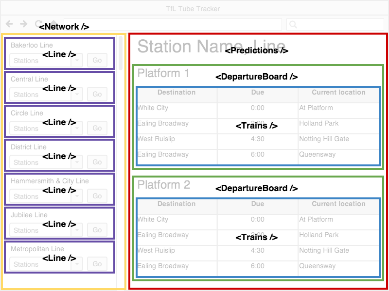
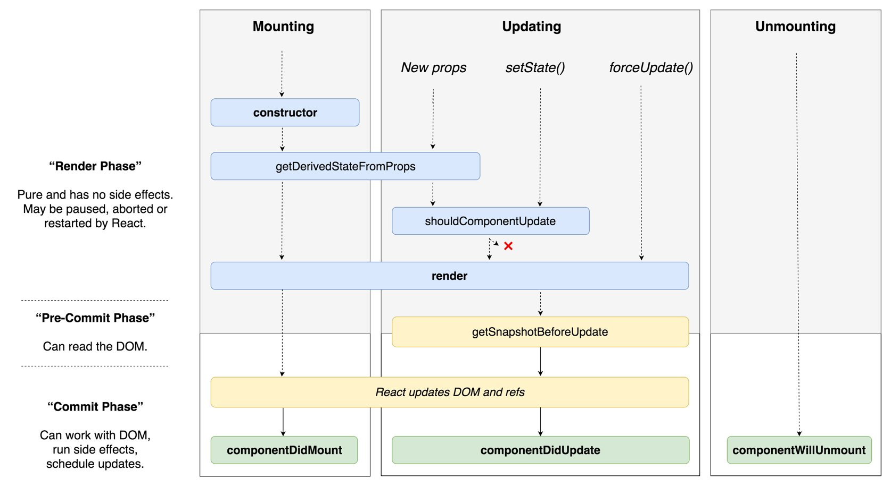

# React

## Introduction

<br>

<small>
Copyright (c) 2018-2019 Euricom nv.
</small>

<!-- markdownlint-disable -->
<br>
<style type="text/css">
.reveal section img {
    background:none;
    border:none;
    box-shadow:none;
}
.reveal h1 {
    font-size: 2.5em;
}
.reveal h2 {
    font-size: 2em;
}
.reveal h3 {
    font-size: 1em;
}
.reveal p {
    font-size: 0.7em;
}
.reveal blockquote {
    font-size: 1em;
}
</style>

---

# Prepare yourself

> It's not your jquery anymore

<!-- prettier-ignore -->
***

## Learn JavaScript

> A large part of knowning React is knowing JavaScript. <br>
> React is using the latest ES features

### Make sure you know:

- ES Modules
- (Arrow) Functions & Classes
- Promises
- Spread operators, destructering
- This reference
- Linting with ESlint & VSCode

<br>

<!-- prettier-ignore -->
***

## Training

### JavaScript

- [Deep JavaScript Foundations V2](https://frontendmasters.com/courses/javascript-foundations/) @FrontEndMasters
- [ES6 for Everyone](es6.io) from @wesbos
- [Let’s Learn ES6](https://www.youtube.com/watch?v=LTbnmiXWs2k&list=PL57atfCFqj2h5fpdZD-doGEIs0NZxeJTX) at @YouTube

<br>

### Tooling

- [Building a JavaScript Development Environment](https://app.pluralsight.com/library/courses/javascript-development-environment/table-of-contents)

---

# You first react app

> It's easy

<!-- prettier-ignore -->
***

## Getting started

```bash
npm init
```

src/public/index.html

```html
<!DOCTYPE html>
<html lang="en" dir="ltr">
  <head>
    <meta charset="utf-8" />
    <meta
      name="viewport"
      content="width=device-width, initial-scale=1, shrink-to-fit=no"
    />
    <title>My first react app</title>
  </head>

  <body>
    <noscript>
      <h1>This application requires Javascript</h1>
    </noscript>
    <div id="root"></div>
  </body>
</html>
```

<!-- prettier-ignore -->
***

Install dependencies

```bash
npm i --save react react-dom
```

src/js/index.jsx

```jsx
// import dependencies
import React from 'react';
import { render } from 'react-dom';

// create your app component
function App() {
  return <h1>My react app</h1>;
}

// mount the react app
render(<App />, document.getElementById('root'));
```

<!-- prettier-ignore -->
***

## babel

Install dependencies

```bash
 npm i --save-dev @babel/core @babel/preset-env @babel/preset-react
```

.babelrc

```json
{
  "presets": ["@babel/preset-env", "@babel/react"]
}
```

<!-- prettier-ignore -->
***

## webpack

Install

```bash
npm i --save-dev webpack webpack-cli babel-loader webpack-dev-server html-webpack-plugin
```

webpack.conf.js

```js
const path = require('path');
const HtmlWebpackPlugin = require('html-webpack-plugin');

// Constant with our paths
const paths = {
  DIST: path.resolve(__dirname, 'dist'),
  SRC: path.resolve(__dirname, 'src')
};

const mainEntry = path.join(paths.SRC, '/js/index.jsx');

// Webpack configuration
module.exports = (env, args) => {
  const config = {
    entry: [mainEntry],
    resolve: {
      extensions: ['.js', '.jsx']
    },
    module: {
      rules: [
        {
          test: /\.(js|jsx)$/,
          loader: 'babel-loader'
        }
      ]
    },
    plugins: [
      new HtmlWebpackPlugin({
        template: path.join(paths.SRC, '/public/index.html')
      })
    ]
  };

  return config;
};
```

<!-- prettier-ignore -->
***

## Build and startup

package.json

```json
{
  "scripts": {
    "build": "webpack --mode development",
    "build:prod": "NODE_ENV=production webpack --mode production",
    "start": "webpack-dev-server --mode development --open"
  }
}
```

commands

```bash
# run in development
npm start

# build (development)
npm run build

# build for production
npm run build:prod
```

---

# CreateReactApp

> Set up a modern web app by running one command

<!-- prettier-ignore -->
***

## Setup

```bash
# create app
npx create-react-app my-app

# Run it
cd my-app
yarn start
```

<!-- prettier-ignore -->
***

Initial project structure

```
my-app
├── README.md
├── node_modules
├── package.json
├── .gitignore
├── public
│   ├── favicon.ico
│   ├── index.html
│   └── manifest.json
└── src
    ├── App.css
    ├── App.js
    ├── App.test.js
    ├── index.css
    ├── index.js
    ├── logo.svg
    └── serviceWorker.js
```

<!-- prettier-ignore -->
***

Commands

```bash
# startup web app
yarn start

# build for production
yarn build

# run unit tests
yarn test
```

---

# JSX

> Writing HTML with JSX

<!-- prettier-ignore -->
***

## It's Javascript ++

```jsx
// import the dependencies
import React from 'react';
import { render } from 'react-dom';

// Create a template with JSX
const template = <h1>My first react app</h1>;

// mount the app
render(template, document.getElementById('root'));
```

<!-- prettier-ignore -->
***

## CreateElement

This

```jsx
const template = <h1>My First React App</h1>;
render(template, document.getElementById('root'));
```

is translated into

<!-- prettier-ignore -->
```js
var template = React.createElement(
  "h1",
  null,
  "My First React App"
);
ReactDom.render(template, document.getElementById("root"));
```

See also [Babel REPL](https://babeljs.io/repl#?babili=false&browsers=&build=&builtIns=false&spec=false&loose=false&code_lz=MYewdgzgLgBFCmBbADgGwIYJgXhgHgAsBGAPgFkBPGAMQEsAnaGAJXnWFgEFlk8B6YiQDcAKHrwwAE3j0AFAhQYEAGhiSQwAK6IJUAHQBzeFACiqJLoBCFAJKTZAcnogQUBwEp3QoA&debug=false&forceAllTransforms=false&shippedProposals=false&circleciRepo=&evaluate=false&fileSize=false&timeTravel=false&sourceType=module&lineWrap=true&presets=es2015%2Creact%2Cstage-2&prettier=false&targets=&version=7.4.4&externalPlugins=)

<!-- prettier-ignore -->
***

## One Root Element

```jsx
const template = <h1>My Title</h1><p>May the Force</p>;
```

```bash
ERROR: Adjacent JSX elements must be wrapped in an enclosing tag.
Did you want a JSX fragment <>...</>
```

> Valid JSX has only one root element

<!-- prettier-ignore -->
***

### Wrap it in a div

The container div will be in the DOM.

```js
const template = (
  <div>
    <h1>My Title</h1>
    <p>May the Force be with you</p>
  </div>
);
```

> Use Parentheses for readability

<!-- prettier-ignore -->
***

### Wrap it in a fragment

The fragment has no footprint in the DOM.

```js
import { Fragment } from 'react';

const template = (
  <Fragment>
    <h1>My Title</h1>
    <p>May the Force be with you</p>
  </Fragment>
);
```

OR

```js
const template = (
  <>
    <h1>My Title</h1>
    <p>May the Force be with you</p>
  </>
);
```

<!-- prettier-ignore -->
***

## Embedding Expressions (<---HERE>)

```jsx
const name = 'peter';
const url = 'https://placeimg.com/200/200/animals';
const imageWidth = 500;
const customer = {
  name: 'euricom',
  location: 'mechelen',
};
function formatCustomer(customer) {
    return `${customer.name}: ${customer.location}`;
}
const template = (
  <div>
    <p>{user}</p>
    <p>{customer.name}</p>
    <p>{user.toUpperCase()}</p>
    <p>{formatCustomer(customer)</p>
    
  </div>
);
```

Everything between `{ .... }` is JavaScript code.

<!-- prettier-ignore -->
***

## Not everything is rendered

Booleans, Null, and Undefined Are Ignored

```jsx
<div />
<div></div>
<div>{false}</div>
<div>{null}</div>
<div>{undefined}</div>
<div>{true}</div>
```

A comment

```jsx
<!-- This wont work -->
{ /* Single line: Single line */ }
{ /* Multi line: this will work also :)
    <div>

    </div>
 */}
```

An object can't be rendered

```jsx
<p>customer</p>    { /* this throws an error */ }
```

<!-- prettier-ignore -->
***

## Conditional rendering

ternary operator

```jsx
const template = <p>User: {user.name ? user.name : 'no-name'}</p>;
```

logical and operator

```jsx
const template = (
	{user.age && user.age >= 18 && <p>Age: user.age</p>}
)
```

<!-- prettier-ignore -->
***

### Conditional rendering

switch

```jsx
const template = notification({ text: 'hello', state: 'info' });

function notification({ text, state }) {
  switch (state) {
    case 'info':
      return <Info text={text} />;
    case 'warning':
      return <Warning text={text} />;
  }
  return null;
}
```

<!-- prettier-ignore -->
***

### Conditional rendering

inline switch (with iife)

```jsx
const template = (
  <div>
    {(function() {
      switch (state) {
        case 'info':
          return <Info text={text} />;
        case 'warning':
          return <Warning text={text} />;
      }
      return null;
    })()}
  </div>
);
```

need more?

[All the Conditional Renderings in React](https://www.robinwieruch.de/conditional-rendering-react/)

<!-- prettier-ignore -->
***

## Arrays

Render a Array

```jsx
const names = ['john', 'peter', 'bob'];
const template = (
	names: { names }
)
```

Ouput

```
names: johnpeterbob
```

Identical to

```jsx
const template = (
	names: {'john'}{'peter'}{'bob'}
)
```

<!-- prettier-ignore -->
***

### Arrays

You can render JSX in JSX

```jsx
const template = (
  <ul>
    {<li>item1</li>}
    {<li>item1</li>}
  </ul>
);
```

Ouptut

```html
<ul>
  <li>item1</li>
  <li>item2</li>
</ul>
```

<!-- prettier-ignore -->
***

### Arrays

create array of jsx (reactElements)

```jsx
const names = ['john', 'peter', 'bob'];
const listItems = names.map(name => {
  return <li>{name}</li>;
});
```

<!-- prettier-ignore -->
```jsx
const template = (
  <ul>{listItems}</ul>
)
```

or

```jsx
const names = ['john', 'peter', 'bob'];
const template = (
  <ul>
    {names.map(name => {
      return <li>{name}</li>;
    })}
  </ul>
);
```

<!-- prettier-ignore -->
***

### Arrays

Oops, we have an error


fix

```jsx
const names = ['john', 'peter', 'bob'];
const template = (
  <ul>
    {names.map(((name, index) => {
      return <li key={index}>{name}</li>;
    })}
  </ul>
);
```

<!-- prettier-ignore -->
***

### Arrays

Typical use

<!-- prettier-ignore -->
```jsx
const users = [
    { id: 1, name: 'john' }
    { id: 2, name: 'peter' }
    { id: 3, name: 'bob' }
]
const template = (
  <ul>
    {users.map(user => <li key={user.id}>{user.name}</li>)}
  </ul>
);
```

> Try to avoid map index when possible!

[More info](https://reactjs.org/docs/lists-and-keys.html#keys)

<!-- prettier-ignore -->
***

## JSX vs DOM elements

```jsx
const template = (
  <div>
    <
    <button type="button" id="btn1" class="btn" tabindex="2">
      Click me
    </button>
  </div>
);
```

Oops errors


JSX is still JavaScript, can't use reserved keywords.

ESLint will also capture these errors.

<!-- prettier-ignore -->
***

### JSX vs DOM elements

class vs className

<!-- prettier-ignore -->
```jsx
const template = (
  <div>
    <button type="button" id="btn1"
            className="btn" tabIndex="2">
      Click me
    </button>
  </div>
);
```

> Some attributes have customized names.

See [React Supported DOM Elements](https://reactjs.org/docs/dom-elements.html)

<!-- prettier-ignore -->
***

## Event Handling

```jsx
let counter = 0;
const addOne = event => {
  console.log('clicked', event);
};
const template = (
  <div>
    <button onClick={addOne}>+</button>
  </div>
);
```

Event are camel-cased.

The event handler will receive a [SyntheticEvent](https://reactjs.org/docs/events.html) <br> (a cross-browser wrapper around the browser’s native event)

Almost all browser [events](https://reactjs.org/docs/events.html#supported-events) are supported.

<!-- prettier-ignore -->
***

### Event Handling

This doesn't work

```jsx
let counter = 0;
const addOne = () => {
  console.log('clicked');
  counter = counter + 1;
};
const template = (
  <div>
    <p>{counter}</p>

    <button onClick={addOne}>+</button>
    <button onClick={() => counter--}>-</button>
  </div>
);
```

The `counter` is NOT automatically updated in the page.

> JSX doesn't support data binding! <br>Its just rendering the value.

<!-- prettier-ignore -->
***

### Event Handling

Fix

```jsx
let counter = 0;
const addOne = () => {
  console.log('clicked');
  counter = counter + 1;
};
render();

function render() {
  const template = (
    <div>
      <p>{counter}</p>

      <button onClick={addOne}>+</button>
      <button onClick={() => counter--}>-</button>
    </div>
  );
  ReactDOM.render(template, document.getElementById('root'));
}
```

The (virtual) DOM is rendered on every change!

<!-- prettier-ignore -->
***

## Virtual DOM vs DOM


Direct DOM manipulation is slow. Through the virtual DOM we only apply a patch for the diff.

<!-- prettier-ignore -->
***

## Reconciliation

Reconciliation is the process through which React updates the DOM. When a component's state changes,
React has to calculate if it is necessary to update the DOM. It does this by creating a virtual
DOM and comparing it with the current DOM

See also: [How React Reconciliation Works](https://css-tricks.com/how-react-reconciliation-works/)

---

# Exercise 1

### User List (JSX)

- Use raw JSX (no react)
- Show list of users in table
- Use users list from user.js
- Styling with bootstrap

<br>
### Tips

```bash
# install bootstrap 3.x
yarn add bootstrap@3

#import bootstrap
import 'bootstrap/dist/css/bootstrap.css';

# doc: styling
https://www.w3schools.com/bootstrap/bootstrap_tables.asp
```

---

# Components

> The building blocks of React

<!-- prettier-ignore -->
***

## App Components



<!-- prettier-ignore -->
***

## App Components

Abstract component tree

```html
<App>
    <Header/>
    <Navigation>
    <div>
        <Network>
            <Line />
        </Network>
        <Predictions>
            <DepartureBoard />
            <DepartureBoard />
        </Predictions>
    </div>
</App>
```

<!-- prettier-ignore -->
***

## Functional Component

```jsx
function Welcome() {
  return <h1>Welcome</h1>;
}
```

```jsx
const Welcome = () => {
  return <h1>Welcome</h1>;
};
```

> Most component should be functional component

<!-- prettier-ignore -->
***

## Functional Or Stateless Component

You can use the component in any JSX expression

```jsx
const template = (
  <div>
    <h1>Title</h1>
    <Welcome />
  </div>
);
```

<!-- prettier-ignore -->
***

## Class Component

User-Defined Components names are Capitalized

```
// Welcome.js
import React, { Component } from 'react';

export default class Welcome extends Component {
  render() {
    return <h1>Hello</h1>;
  }
}
```

JSX assumes a React object is available, so make sure to import it.

Place all components in separated files (capitalized)

---

# State

> No behavior without state

<!-- prettier-ignore -->
***

## State

Class Components can have state

```jsx
// app.js
import React, { Component } from 'react';

export default class App extends Component {
  state: {
    message: 'world'
  };
  render() {
    return <h1>Hello {this.state.message}</h1>;
  }
}
```

<!-- prettier-ignore -->
***

## Default state

```jsx
export default class MyComponent extends Component {
  constructor() {
    super();
    state = {
      counter: 0
    };
  }
  // ...
}
```

<!-- prettier-ignore -->
***

## Default state

Default state with class property

```jsx
export default class MyComponent extends Component {
  state = {
    title: 'My Component Title'
    counter: this.props.initialValue || 0,
  };
  // ...
}
```

> static class members requires @babel/plugin-proposal-class-properties

<!-- prettier-ignore -->
***

### Calculated fields

Don't use state for calculated fields

```jsx
export default class MyComponent extends Component {
  constructor(props) {
    this.state = {
      fullName: `${props.firstName} ${props.lastName}`
    };
  }
  render() {
    return <p>{this.state.fullName}</p>;
  }
}
```

Better

```jsx
export default class MyComponent extends Component {
  render() {
    const fullName = `${this.props.firstName} ${this.props.lastName}`;
    return <p>{fullName}</p>;
  }
}
```

<!-- prettier-ignore -->
***

## SetState callback

Set state via callback

```js
this.setState((state, props) => ({
  ...state
  counter: 1,
}));
```

Via callback the previous state & props are available.

<!-- prettier-ignore -->
***

## SetState is async

```js
this.setState({
  ...this.state,
  counter: 1
});
console.log(this.state); // State is not updated yet
```

Fix: result callback

```js
this.setState(
    (state, props) => ({
        ...state
        counter: 1,
    }),
    (state) => {
        // now the state is changed
        consoler.log('new state: ', state)
    }
);
```

<!-- prettier-ignore -->
***

## Events

```jsx
class MyComponent extends React {
  onClick() {
    console.log('clicked');
  }
  render() {
    return (
      <div>
        <h1>Title</h1>
        <button onClick={this.onClick}>Click Me</button>
      </div>
    );
  }
}
```

<!-- prettier-ignore -->
***

### Event Handlers

Be aware of the this reference

```jsx
class MyComponent extends React {
  constructor(props) {
    super(props);
    this.onClickFix1 = this.onClickFix1.bind(this);
  }

  onClick() {
    // BAD: this is not referencing the component
    console.log('props', this.props);
  }

  onClickFix1() {
    console.log('props', this.props);
  }

  onClickFix2 = () => {
    console.log('props', this.props);
  };
}
```

---

# Exercise 2

### Toggle Text (Component State & Event)

- App Component
- Toggle visibility of some text with a button
- Try to have multiple solutions

<br>
### Tip

```
<!-- toggle text solution 1 -->
<p>This is some text</p>

<!-- toggle text solution 2 -->
<p>This is some other text</p>

<button>Toggle Text</button>
```

---

# Props

> The in and outs of the components

<!-- prettier-ignore -->
***

## Compose Components

```jsx
// App.js
import React, { Component } from 'react';
import ReactDOM from 'react-dom';
import Welcome from './Welcome';

class App extends Component {
  render() {
    return (
      <div>
        <h1>Title</h1>
        <Welcome />
      </div>
    );
  }
}
ReactDOM.render(<App />, document.getElementById('root'));
```

<!-- prettier-ignore -->
***

## Props

With props we can pass data from parent to client component

```jsx
class App extends Component {
  render() {
    return <Greeting firstName="peter" lastName="jansens" />;
  }
}
```

<!-- prettier-ignore -->
***

## Props

Accessing props in class component

```jsx
class Greeting extends Component {
  constructor(props) {
    super(props)
  }
  render() {
    return <h3>{this.props.title}<h3>
  }
}
```

Accessing props in functional component

```jsx
const Greeting = (props) => {
  <h3>
    {props.title}
  <h3>
}
```

<!-- prettier-ignore -->
***

## Props

Prefer to destructor your props

```jsx
class Greeting extends Component {
  render() {
    const { title } = this.props;
    return <h3>{title}<h3>
  }
}
```

```jsx
const Greeting = ({title}) => {
  <h3>
    {title}
  <h3>
}
```

<!-- prettier-ignore -->
***

### Props as events to parent

```jsx
class App extends React {
  render() {
    return (
      MyComponent onUpdate={handleUpdate} />
    )
  }
}
```

```jsx
const MyComponent = props => {
  return (
    <div>
      <h1>{props.title}</h1>
      <button onClick={props.onUpdate} />
      <button onClick={() => props.onUpdate('hello')} />
    </div>
  );
};
```

<!-- prettier-ignore -->
***

## Children props

```js
const Panel = props => (
  <div className="panel">
    <h1>{props.title}</h1>
    <div>{props.children}</div>
  </div>
);
```

```js
const App = () => (
  <Panel title="Hello world">
    <p>Lorem ipsum dolor sit amet</p>
    <strong>Finibus Bonorum</strong>
  </Panel>
);
```

<!-- prettier-ignore -->
***

## Spreading props

```jsx
class App extends Component {
  const obj = { firstName="peter", lastName="jansens" }
  render() {
    return (
        <Greeting firstName={obj.firstName}
                  lastName={obj.lastName} />
        )
  }
}
```

with spreading props

```jsx
class App extends Component {
  const obj = { firstName="peter", lastName="jansens" }
  render() {
    return <Greeting {...obj} />;
  }
}
```

<!-- prettier-ignore -->
***

### Passing down props

```
const App = () => (
  <Layout
    title="I'm here to stay"
    language="JavaScript"
    name="Alex"
  />
);
```

```js
const Layout = ({ title, ...props }) => (
  <div>
    <h1>{title}</h1>
    <Details {...props} />
  </div>
);
```

```js
const Details = ({ name, language }) => (
  <p>
    {name} works with {language}
  </p>
);
```

<!-- prettier-ignore -->
***

## Props are Read-only

```jsx
class MyComponent extends Component {
  constructor(props) {
    super(props);
    // BAD: Error is thrown
    props.title = `-- ${props.title} --`;
  }
}
```

Copy it over to state

```jsx
class MyComponent extends Component {
  constructor(props) {
    super(props);
    this.state = {
        title: `-- ${props.title} --`;
    }
  }
}
```

<!-- prettier-ignore -->
***

## Props as function

```jsx
const MyComponent = props => (
  <Fragment>
    <p>{name}</p>
    <button disabled={!props.isActive(props.name)}>Close</button>
  </Fragment>
);
```

```jsx
class App extends Component {
  isActive = (name) => {
    return (name === 'default')
  }
  render() {
    return (
      <MyComponent name="default" isActive={this.isActive} />
      <MyComponent name="primary" isActive={this.isActive} />
    )
  }
}
```

<!-- prettier-ignore -->
***

## Props Validating

Validate props

```jsx
import PropTypes from 'prop-types';

function MyComponent(props) {
  return (
    <h3>{this.props.title}<h3>
  );
}

MyComponent.propTypes = {
  title: PropTypes.string.isRequired,
  count: PropTypes.number,
};

MyComponent.defaultProps = {
  count: 10
};
```

[React prop-types](https://github.com/facebook/prop-types)

This syntax can also be used on class components

<!-- prettier-ignore -->
***

## Props Validating

Validate with static members

```jsx
import PropTypes from 'prop-types';

class MyComponent extends Component {

  static propTypes = {
    title:PropTypes.string.isRequired,
    count:PropTypes.number,
  };

  static defaultProps = {
    count: 10
  };

  render() {
    const { title } = this.props;
    return (
       <h3>{title}<h3>
       <p>{count * 100}</p>
    );
  }
}
```

> static class members requires @babel/plugin-proposal-class-properties

<!-- prettier-ignore -->
***

## Exercise 3

Create a Button component with specific style

<!-- prettier-ignore -->
```html
<!-- bootstrap default button; class="btn btn-default" -->
<Button>Default</Button>

<!-- bootstrap primary button; class="btn btn-primary" -->
<Button primary>Primary</Button>

<!-- bootstrap danger button; class="btn btn-danger" -->
<Button danger>Don't click me</Button>
```


Optionally you can add validation

---

# Live Cycle

> It's alive

<!-- prettier-ignore -->
***

## Live Cycle Methods

```jsx
export default class MyComponent extends Component {
  constructor(props) {
    console.log('construction', props);
  }
  componentDidMount() {
    console.log('mounted');
  }
  shouldComponentUpdate() {
    console.log('should update');
    return true; // decide here if the component need an update (default true!)
  }
  componentDidUpdate(oldProps) {
    console.log('props changed', { oldProps, props: this.props });
  }
  componentWillUnmount() {
    console.log('bye-bye');
  }
  render() {
    return <p>Hello</p>;
  }
}
```

<!-- prettier-ignore -->
***

### Live Cycle



[React lifecycle methods diagram](http://projects.wojtekmaj.pl/react-lifecycle-methods-diagram/)

<!-- prettier-ignore -->
***

## Pure Components

```js
// Classic Component
class Welcome extends React.Component {
  render() {
    return <h1>Welcome</h1>;
  }
}
```

```
// Pure Component
class Welcome extends React.PureComponent {
  render() {
    return <h1>Welcome</h1>;
  }
}
```

A pure component will only re-render if the props or state is changed.

React is using a shallowEqual.

See Todo's sample
See [A checklist for eliminating common React performance issues](https://logrocket.com/blog/death-by-a-thousand-cuts-a-checklist-for-eliminating-common-react-performance-issues/)

---

# Exercise 4

### Alert Component (Props)

- Create alert component with [bootstrap styling](https://www.w3schools.com/bootstrap/bootstrap_alerts.asp)

```
<Alert>This is information message</Alert>
<Alert type="danger">We have a problem</Alert>
<Alert type="warning" onClosed={alertClosed}>
    <strong>Warning!</strong> Better check yourself, you're not looking too good.
</Alert>
```

---

# Resources

> Get the extra information

<!-- prettier-ignore -->
***

## Resources

Training

- [REACT FOR BEGINNERS](https://reactforbeginners.com/)
  from @wesbos
- [The Beginner’s Guide to React](https://egghead.io/courses/the-beginner-s-guide-to-react) from @kentcdodds
- [React.js cheatsheet](https://devhints.io/react)

<!-- prettier-ignore -->
***

## Resources

#### Libraries

- [React Helmet](https://github.com/nfl/react-helmet) - A document head manager
- [React Toastify](https://github.com/fkhadra/react-toastify) - Notification for your app
- [Enzyme](https://github.com/airbnb/enzyme/) - JavaScript Testing utilities
  for React
- [React virtualized](https://bvaughn.github.io/react-virtualized) - Data Grid
- [Recat-bootstrap](https://github.com/react-bootstrap/react-bootstrap) - Bootstrap 3 components
- [Grommet](http://grommet.io/) - Design system for React
- [MATERIAL-UI](https://material-ui.com/) - Google's Material Design in React

---

# Ready to build you React Apps
