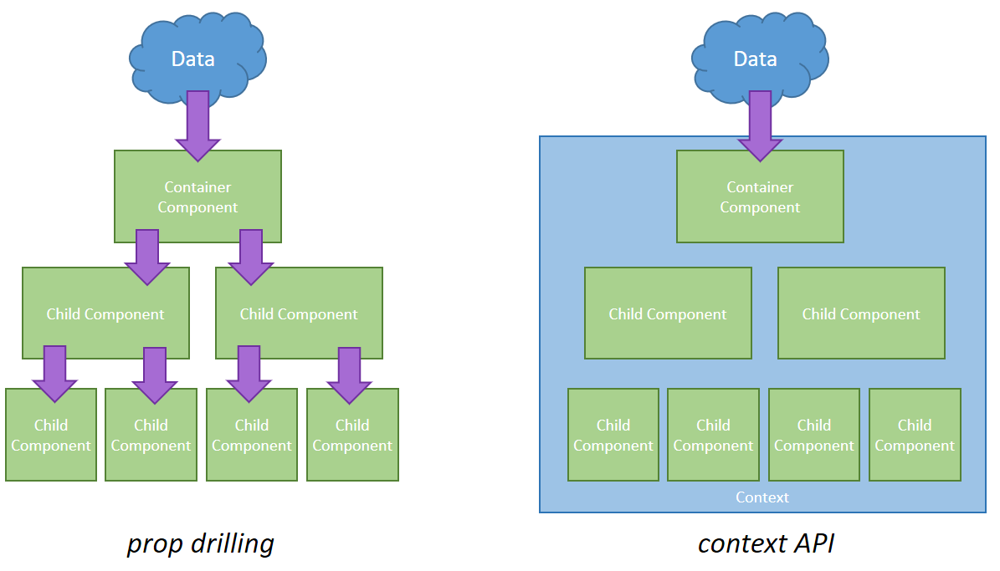

# React Patterns

<br>

<small>
by Peter Cosemans<br>
Copyright (c) 2018 Euricom nv.
</small>

<!-- markdownlint-disable -->
<br>
<style type="text/css">
.reveal section img {
    background:none;
    border:none;
    box-shadow:none;
}
.reveal h1 {
    font-size: 3.0em;
}
.reveal h2 {
    font-size: 2.00em;
}
.reveal h3 {
    font-size: 1.00em;
}
.reveal p {
    font-size: 70%;
}
.reveal blockquote {
    font-size: 100%;
}
.reveal pre code {
    display: block;
    padding: 5px;
    overflow: auto;
    max-height: 800px;
    word-wrap: normal;
    font-size: 100%;
}
</style>

---

# Higher-Order Components

> A higher-order component is a function that takes a component and returns a new component.

<!-- prettier-ignore -->
***

### Simple Component

```jsx
import React from "react";

const SimpleComponent = props => {
  return <p>SecretToLife: {props.secretToLife}</p>;
};

export default SimpleComponent;
```

<!-- prettier-ignore -->
***

### Higher-Order Component (HOC)

A sample

<!-- prettier-ignore -->
```jsx
import React from 'react';

const withSecretToLife = (WrappedComponent) => {
  const HigherOrderComponent = props => {
      const msg = 'If it feels good, do it';
      return (
        <WrappedComponent secretToLife={msg} {...props} />
      );
    }
  }
  return HigherOrderComponent;
};
export default withSecretToLife;
```

<!-- prettier-ignore -->
***

### Using HOC

<!-- prettier-ignore -->
```js
import React from 'react';
import withSecretToLife from './withSecretToLife';

const App = props => (
  <div>
    Hi {props.name}, the secret to life is {props.secretToLife}.
  </div>
)

export default withSecretToLife(App);
```

And use as a normal app component

```js
import App from "./app.js";
render(<App name="peter" />, element);
```

<!-- prettier-ignore -->
***

### Class based HOC

<!-- prettier-ignore -->
```jsx
import React from 'react';

const withSecretToLife = (WrappedComponent) => {
  return class HOC extends Component {
    constructor(props) {
      super(props)
      this.msg = 'If it feels good, do it';
    }
    render() {
      return (
        <WrappedComponent secretToLife={this.msg}
                          {...this.props} />
      );
    }
  }
};

export default withSecretToLife;
```

[More Samples](https://medium.com/dailyjs/react-composing-higher-order-components-hocs-3a5288e78f55)

<!-- prettier-ignore -->
***

## Practical usecase

The HOC

```js
const withLogger = (prefix = "") => WrappedComponent => {
  const WithLogger = props => {
    console.log(`${prefix}[Props]:`, props);
    return <WrappedComponent {...props} />;
  };

  return HasLogger;
};
export default withLogger;
```

Enhance the component

```js
import withLogger form './withLogger';

const MyComponent = (props) => <h1>MyComponent</h1>

export default withLogger(MyComponent)
```

Logs props to the console on every render of the WrappedComponent.

[More Samples](https://medium.com/dailyjs/react-composing-higher-order-components-hocs-3a5288e78f55)

<!-- prettier-ignore -->
***

## Exercise

Create a HOC to logs all props to the console on every render of the WrappedComponent.

```js
const Button = () => (
  ...
)
export default withLogger(Button);
```

Optional: make if configurable

```js
export default withLogger("prefix")(Button);
```

---

# Context

> Using context, we can avoid passing props through intermediate elements:

<!-- prettier-ignore -->
***

## Context

Provide a value

```jsx
const { Provider, Consumer } = React.createContext("");
class App extends React.Component {
  render() {
    return (
      <Provider value="dark">
        <Toolbar />
      </Provider>
    );
  }
}
```

A component in the middle doesn't have to pass the theme down explicitly anymore

```jsx
const Toolbar = props => <ThemedButton />;
```

Use a Consumer to read the current theme context. <br>React will find the closest theme Provider above and use its value.

```jsx
const ThemedButton = props => <Consumer>{theme => <Button {...props} theme={theme} />}</Consumer>;
```

<!-- prettier-ignore -->
***

## Context

Context can be a complex object

```jsx
export const ThemeContext = React.createContext({
  theme: "dark",
  maxWidth: "800px",
  font: "Helvetica",
  toggleTheme: () => {}
});
```

<!-- prettier-ignore -->
***

## Context

You can consuming Context with a HOC

```js
const ThemeContext = React.createContext("light");

export default (withTheme = Component => {
  // ...and returns another component...
  return props => {
    // ... and renders the wrapped component with the context theme!
    // Notice that we pass through any additional props as well
    return <ThemeContext.Consumer>{theme => <Component {...props} theme={theme} />}</ThemeContext.Consumer>;
  };
});
```

```js
const Button = ({ theme, ...rest }) => {
  return <button className={theme} {...rest} />;
};

const ThemedButton = withTheme(Button);
```

---

# Error<br>Boundery

> Error boundaries are React components that catch JavaScript errors anywhere in their child component tree, log those errors, and display a fallback UI

<!-- prettier-ignore -->
***

### ErrorBoundery

```jsx
export default class ErrorBoundery extends Component {
  state = {
    hasError: false
  };

  static getDerivedStateFromError(error) {
    // Update state so the next render will show the fallback UI.
    return { hasError: true, error };
  }

  componentDidCatch(error, info) {
    console.log("Error:", error, info);
  }

  render() {
    if (this.state.hasError) {
      return <div className="error">Oops, error occured</div>;
    }
    return this.props.children;
  }
}
```

<!-- prettier-ignore -->
***

## Use of ErrorBoundery

```jsx
import ErrorBoundery from './errorBoundery';

const App = () => (
  <ErrorBoundary>
    <MyForm />
  </ErrorBoundary>;
)

export default App;
```

Error Bounderies can be placed on any level

<!-- prettier-ignore -->
***

## Log your exceptions to the server

> Stop hoping your users will report errors

- [Rollbar](https://rollbar.com/)
- [sentry.io](https://sentry.io/welcome/)
- [TrackJS](https://trackjs.com/)

---

# Render Prop

> A component with a render prop takes a function that returns a React element and calls it instead of implementing its own render logic.

<!-- prettier-ignore -->
***

## Basic Sample

<!-- prettier-ignore -->
```js
const App = () => (
  <ShareSecretToLife render={({ secretToLife }) => (
      <h1>
        <b>{secretToLife}</b>
      </h1>
    )}
  />
);
```

<!-- prettier-ignore -->
```jsx
const SECRET_TO_LIFE = 'If it feels good, do it';

default export class ShareSecretToLife extends Component {
  render() {
    return <div>
        {this.props.render({ secretToLife: SECRET_TO_LIFE })}
    </div>;
  }
}
```

<!-- prettier-ignore -->
***

### Render props - children

<!-- prettier-ignore -->
```jsx
const SECRET_TO_LIFE = 42;

default export class ShareSecretToLife extends Component {
  render() {
    return <div>
        {this.props.children({ secretToLife: SECRET_TO_LIFE })}
    </div>;
  }
}
```

<!-- prettier-ignore -->
```js
const ShareSecretWithWorld = () => (
  <ShareSecretToLife>
    {({ secretToLife }) => (
      <h1>
        <b>{secretToLife}</b>
      </h1>
    )}
  </ShareSecretToLife>
);
```

[More Samples](https://levelup.gitconnected.com/understanding-react-render-props-by-example-71f2162fd0f2)

<!-- prettier-ignore -->
***

## Exercise

Modify the ErrorBoudery with an render prop so we can have an optional customized error rendering

Optional: Create Repeat component

```html
<Repeat numTimes={10} render={
  (total, index) => <p>number {index} of {total}</p>
}
</Repeat>
```

Optional: Create ForEach component

```html
<ul>
  <ForEach data="{myArray}">
    {(item) =>
    <li>{item.name}</li>
    }
  </ForEach>
</ul>
```

<!-- prettier-ignore -->
***

## Solution

ErrorBoundery with custom rendering

<!-- prettier-ignore -->
```jsx
export default class ErrorBoundery extends Component {
  static propTypes = {
    children: PropTypes.onOfType([
      PropTypes.node,
      PropTypes.arrayOf(PropTypes.node),
    ]),
    render: PropTypes.func.isRequired,
  };

  // ...

  render() {
    if (this.state.hasError) {
      // allow custom rendering of the error
      return this.props.render(
        this.state.error,
        this.state.errorInfo
      );
    }
    return this.props.children;
  }
}
```

<!-- prettier-ignore -->
***

### Solution

Use of ErrorBoundery

```jsx
import ErrorBoundery from './errorBoundery';

ReactDOM.render(
  <ErrorBoundery render={() => <p>Oops!</p>}>
    <App />
  </ErrorBoundery>,
  document.getElementById('root');
);
```

---

# Context

Using context, we can avoid passing props through intermediate elements

<!-- prettier-ignore -->
***

## Context



<!-- prettier-ignore -->
***

## Context Provider

Provide a value

```jsx
// Create the context
export const ThemeContext = React.createContext("light");

// Component providing the context value
export default class App extends React.Component {
  render() {
    return (
      <ThemeContext.Provider value="dark">
        <Toolbar />
      </ThemeContext.Provider>
    );
  }
}
```

<!-- prettier-ignore -->
***

### Context Consumer

Some component deeper in the hierarchy...

Use a Consumer to read the current theme context. <br>React will find the closest theme Provider above and use its value.

```jsx
import { ThemeContext } from "./app";

const ThemedButton = props => (
  <ThemeContext.Consumer>{theme => <Button {...props} theme={theme} />}</ThemeContext.Consumer>
);
```

A "render prop" is used to get the value.

<!-- prettier-ignore -->
***

### contextType

Context simplified (available on React 16.6)

```jsx
import { ThemeContext } from "./app";
```

```jsx
class ThemedButton2 extends React.Component {
  static contextType = ThemeContext;
  render() {
    <Button {...this.props} theme={this.context.theme} />}
  }
}
```

This method only allows you to consume one context.

<!-- prettier-ignore -->
***

### Context

Context can be a complex object

```jsx
export const ThemeContext = React.createContext({
  theme: "dark",
  maxWidth: "800px",
  font: "Helvetica",
  toggleTheme: () => {}
});
```

<!-- prettier-ignore -->
***

## Exercise

Avoid prop drilling by using StateProvider

From

```html
<div>
  <Red number="{this.state.number}" />
  <Green number="{this.state.number}" onIncrement="{this.handleIncrement}" />
</div>
```

To

```html
<StateProvider initialValue={10}>
  <Red>
  <Green>
</StateProvider>
```

<!-- prettier-ignore -->
***

### Consume Context with a HOC

```js
const ThemeContext = React.createContext('light');

export default withTheme = Component => {
  return props => {
    return (
      <ThemeContext.Consumer>
        {theme => <Component {...props} theme={theme} />}
      </ThemeContext.Consumer>
    );
  };
});
```

```js
const Button = ({ theme, ...rest }) => {
  return <button className={theme} {...rest} />;
};

const ThemedButton = withTheme(Button);
```

<!-- prettier-ignore -->
***

Unstaged: Simplified state managment

### Unstated

```js
import { Provider, Subscribe, Container } from "unstated";
class CounterContainer extends Container {
  state = {
    count: 0
  };
  increment() {
    this.setState({ count: this.state.count + 1 });
  }
}
```

```js
<Subscribe to={[CounterContainer]}>
  {counter => (
    <div>
      <button onClick={() => counter.decrement()}>-</button>
      <span>{counter.state.count}</span>
    </div>
  )}
</Subscribe>
```

```html
<Provider> <Counter /> </Provider>
```

---

# Hooks

> Hooks are a new feature proposal that lets you use state and other React features without writing a class

for React 16.8 (Alpha) 🙁

<!-- prettier-ignore -->
***

### A Classic component

```js
import React, { Component } from "react";

export class Users extends Component {
  state = {
    users: []
  };

  async componentDidMount() {
    const res = await axios.get("users.json");
    this.setState({
      users: res.data
    });
  }

  render() {
    return (
      <ul>
        {this.state.users.map(user => {
          return <li key={user.id}>{user.name}</li>;
        })}
      </ul>
    );
  }
}
```

<!-- prettier-ignore -->
***

### Using hooks

```js
import React, { Component, useState } from "react";

export const Users = () => {
  const [users, setUsers] = useState([]);

  useEffect(async () => {
    const res = await axios.get("users.json");
    setUsers(res.data);
  });

  return (
    <ul>
      {users.map(user => {
        return <li key={user.id}>{user.name}</li>;
      })}
    </ul>
  );
};
```

<!-- prettier-ignore -->
***

### Render Props vs Hooks

```jsx
<ScrollPosition>
  {position => (
    <div>
      <p>You are at {position}</p>
    </div>
  )}
</ScrollPosition>
```

vs

```js
const MyComp = () => {
  let position = useScrollPosition();
  return (
    <div>
      <p>You are at {position}</p>
    </div>
  );
};
```

See also [awesome-react-hooks](https://github.com/rehooks/awesome-react-hooks)

---

# Portals

T.B.D

---

# Lazy and Suspense

T.B.D

---

# Resources

> Get the extra information

<!-- prettier-ignore -->
***

## Resources

Info

- [Use a Render Prop!](https://cdb.reacttraining.com/use-a-render-prop-50de598f11ce)
- [How to fetch data in React](https://www.robinwieruch.de/react-fetching-data/)
- [Never Write Another HoC](https://www.youtube.com/watch?v=BcVAq3YFiuc)
- [8 no-Flux strategies for React component communication](https://www.javascriptstuff.com/component-communication/)
- [Beware: React setState is asynchronous!](https://medium.com/@wereHamster/beware-react-setstate-is-asynchronous-ce87ef1a9cf3)

Patterns

- [React component patterns](https://medium.com/teamsubchannel/react-component-patterns-e7fb75be7bb0)
- [Reusable Code Patterns](https://benmccormick.org/2016/01/08/reusable-code-patterns/)
- [ReactJS: Code Reuse Patterns](https://www.youtube.com/watch?v=0BNgi9vofaw)
- [React Patterns in a Nutshell](https://www.youtube.com/watch?v=C6w7R501oug)
- [Simple React Patterns](https://lucasmreis.github.io/blog/simple-react-patterns/)

---

# Ready to build you React Apps
