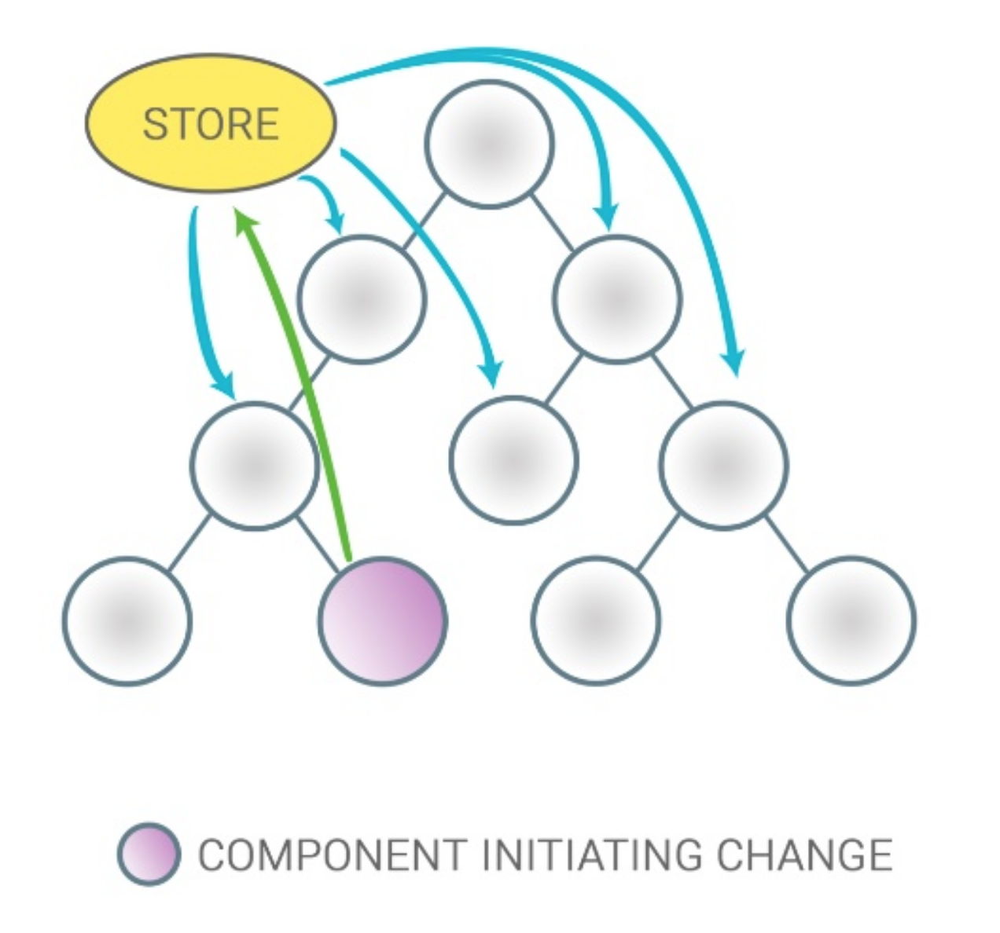

# React

## State Management

<br>

<small>
by Peter Cosemans<br>
Copyright (c) 2018 Euricom nv.
</small>

<!-- markdownlint-disable -->
<br>
<style type="text/css">
.reveal section img {
    background:none;
    border:none;
    box-shadow:none;
}
.reveal h1 {
    font-size: 3.0em;
}
.reveal h2 {
    font-size: 2.00em;
}
.reveal h3 {
    font-size: 1.00em;
}
.reveal p {
    font-size: 70%;
}
.reveal blockquote {
    font-size: 100%;
}
.reveal pre code {
    display: block;
    padding: 5px;
    overflow: auto;
    max-height: 800px;
    word-wrap: normal;
    font-size: 100%;
}
</style>

---

## State Patterns

> State management is hard

<!-- prettier-ignore -->
***

## MVC / MVP


<!-- prettier-ignore -->
***

### More MVC


<!-- prettier-ignore -->
***

### MVC in reality


<!-- prettier-ignore -->
***

### Component Composition


<!-- prettier-ignore -->
***

### With global store



<!-- prettier-ignore -->
***

### Flux/redux pattern


<!-- prettier-ignore -->
***

### Redux


<!-- prettier-ignore -->
***

### mobx


---

## State in react

> Where to keep the data

<!-- prettier-ignore -->
***

### State in react


<!-- prettier-ignore -->
***

### State in react


<!-- prettier-ignore -->
***

### Overview

| Type      | Use                 | Library                                                                                     |
| --------- | :------------------ | :------------------------------------------------------------------------------------------ |
| Component | simple state        | react                                                                                       |
| Relative  | component tree      | react                                                                                       |
| Provider  | complex tree        | react, [unstated](https://goo.gl/xFvwUE), [react-waterfall](https://goo.gl/LdnCZ3)          |
| Global    | simple interaction  | [mobx](http://mobx.js.org)                                                                  |
| Global    | complex interaction | [redux](https://redux.js.org), [mobx-state-tree](https://github.com/mobxjs/mobx-state-tree) |

---

## Local state

> Local state is fine.

<!-- prettier-ignore -->
***

## Local state

```js
import React, { Component } from 'react';

class Counter extends Component {
  state = { value: 0 };

  increment = () => {
    this.setState(prevState => ({
      value: prevState.value + 1,
    }));
  };

  render() {
    return (
      <div>
        {this.state.value}
        <button onClick={this.increment}>+</button>
      </div>
    );
  }
}
```

<!-- prettier-ignore -->
***

## Container state

```js
import React, { Component } from 'react';

class ProductsContainer extends Component {
  state: {
      products = [];
  }

  async componentDidMount() {
    const products = await api.getProducts();
    this.setState({
      products,
    });
  }

  render() {
    // the actual rendering is done in another component
    return <ProductList products={this.state.products}
                        onDelete={this.handleDelete} />;
  }
}
```

---

## Global state

> When you want to share state

<!-- prettier-ignore -->
***

## Redux

State & Reducers

```js
// state
const initialState = {
  counter: 10,
};

// reducers
const counter = (state = initialState, action) => {
  switch (action.type) {
    case 'INCREMENT':
      return { counter: state.counter + 1 };
    case 'DECREMENT':
      return { counter: state.counter - 1 };
    default:
      return state;
  }
};
```

<!-- prettier-ignore -->
***

### Redux

Actions

```js
// action types
export const INCREMENT = 'INCREMENT';
export const DECREMENT = 'DECREMENT';

// actions
export const increment = () => ({
  type: INCREMENT,
});

export const decrement = () => ({
  type: INCREMENT,
});
```

<!-- prettier-ignore -->
***

### Redux

Container

<!-- prettier-ignore -->
```js
class Counter extends Component {
  render() {
    return (
      <div>
        {this.props.counter}
        <button onClick={this.props.actions.increment}>
            Inc
        </button>
      </div>
    );
  }
}

export default connect(mapStateToProps,
                       mapDispatchToProps)(Counter);
```

<!-- prettier-ignore -->
***

### Redux

Store is passed via Provider

```js
import { Provider } from 'react-redux';
import { createStore } from 'redux';
import reducer from './store/reducer';

const store = createStore(reducer);
render(
  <Provider store={store}>
    <App />
  </Provider>,
  document.getElementById('root')
);
```

<!-- prettier-ignore -->
***

### Mobx

Store

```js
import { observable, action } from 'mobx';

class AppStore {
  // state
  @observable counter = 10;

  // actions
  @action.bound
  increment() {
    this.counter += 1; // this can be a mutable change
  }
}
const store = new AppStore();
```

<!-- prettier-ignore -->
***

### Mobx

<!-- prettier-ignore -->
```js
import { observer } from 'mobx-react';

@observer // make component re-render to state changes
class Counter extends Component {
  render() {
    return (
      <div>
        {this.props.store.counter}
        <button onClick={this.props.actions.increment}>
            Inc
        </button>
      </div>
    );
  }
}

<Counter store={store} />;
```

<!-- prettier-ignore -->
***

### Mobx

Provider setup

```
import { Provider } from 'mobx-react';
import AppStore from './store/appstore';

const store = new AppStore();
render(
   <Provider store={store}>
     <App />
   </Provider>,
   document.getElementById('root'),
);
```

Inject into components

```
import { inject, observer } from 'mobx-react';

@observer
class MyComponent extends Component {
    render() {
        return (
            <p>{this.props.store.counter}</p>
        )
    }
}

export default inject('store')(MyComponent);
```

<!-- prettier-ignore -->
***

### Mobx

Required setup to use 'Decorators'

```bash
yarn add babel-plugin-transform-decorators-legacy --dev
```

```json
// .babelrc
{
  ...
  "plugins": ["transform-decorators-legacy"]
}
```

<!-- prettier-ignore -->
***

### Mobx

Async action

```js
import { observable, runInAction } from 'mobx';

class MyStore {
  @observable products = {};

  @action
  loadProducts() {
    api.getProducts().then(res => {
      // need to wrap async result
      runInAction(() => {
        this.products = res.data;
      });
    });
  }
}
```

Simplify async action
[babel-plugin-mobx-deep-action](https://github.com/mobxjs/babel-plugin-mobx-deep-action)

---

# Resources

> Get the extra information

<!-- prettier-ignore -->
***

### Resources

Redux

- [Awesome Redux](https://github.com/xgrommx/awesome-redux)
- [The Ugly Side Of Redux](https://codeburst.io/the-ugly-side-of-redux-6591fde68200)
- [Redux vs MobX: Which Is Best for Your Project?](https://www.sitepoint.com/redux-vs-mobx-which-is-best/)

<!-- prettier-ignore -->
***

### Resources

Mobx

- [Awesome MobX](https://github.com/mobxjs/awesome-mobx)
- [Mobx React — Best Practices](https://medium.com/dailyjs/mobx-react-best-practices-17e01cec4140)
- [Creating a Mobx-State-Tree Store in React](http://www.palador.com/2017/09/19/creating-mobx-state-tree-store-react/)

<!-- prettier-ignore -->
***

### Resources

Other

- [unstated](https://github.com/jamiebuilds/unstated)
- [react-waterfall](https://github.com/didierfranc/react-waterfall)
- [mobx-state-tree](https://github.com/mobxjs/mobx-state-tree)
- [parket](https://github.com/ForsakenHarmony/parket)
